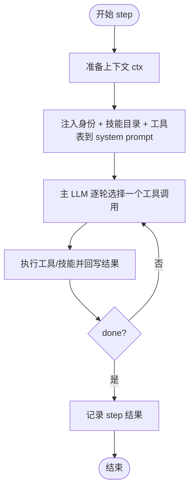
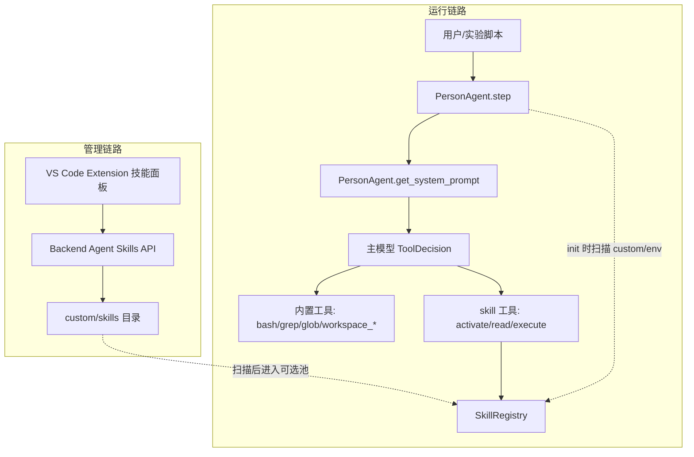
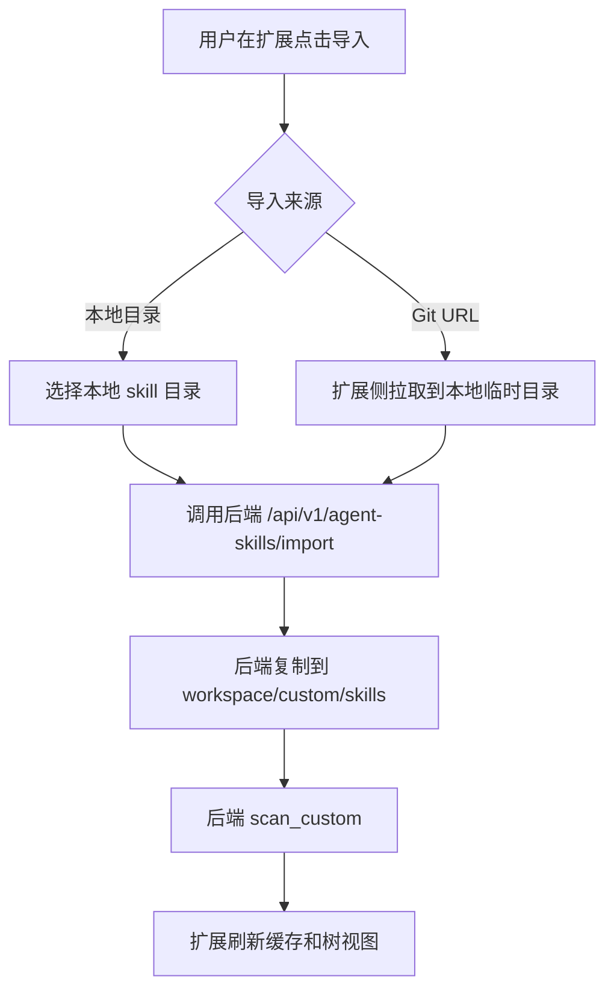
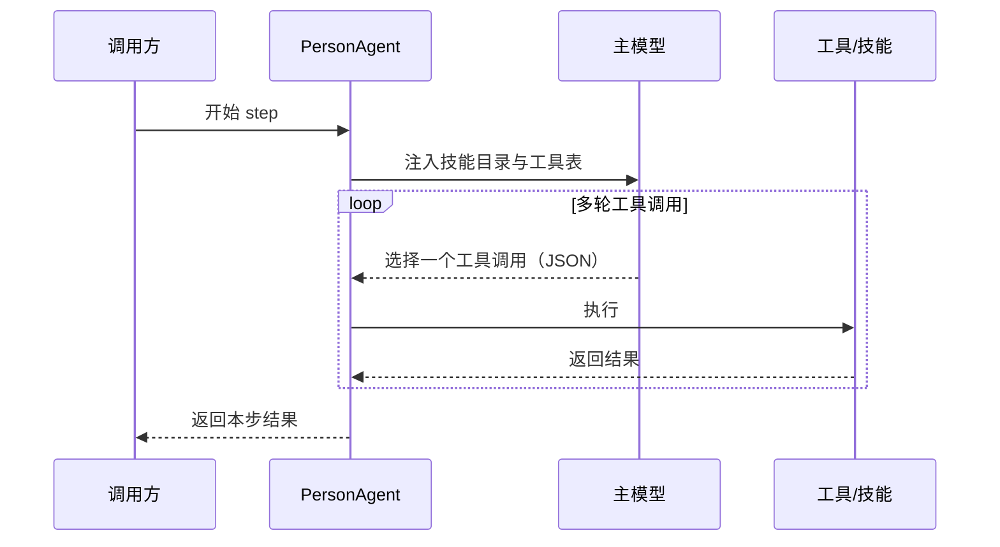
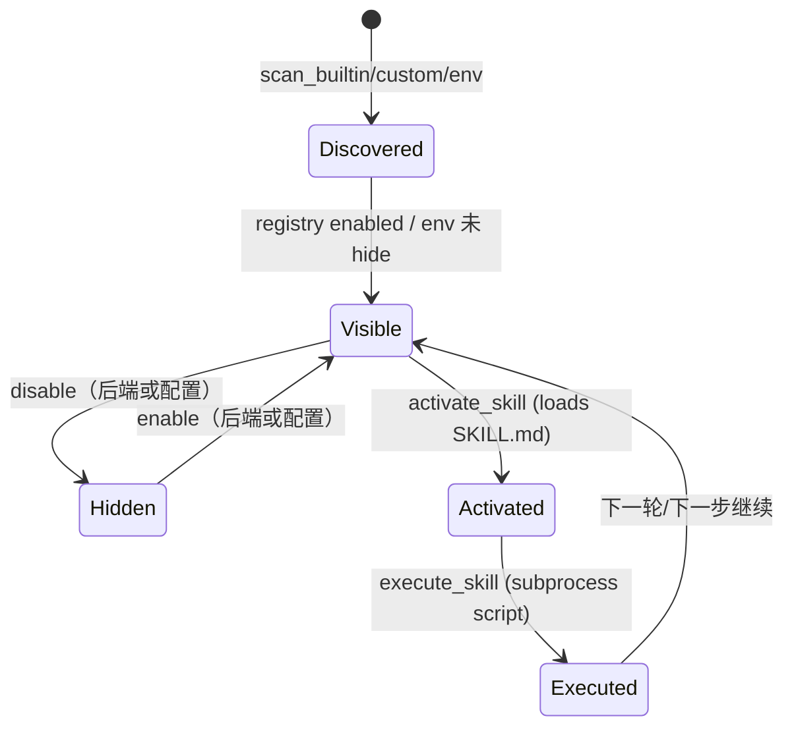

# Agent Skills 工作流程说明

## 快速了解

1. `PersonAgent` 是 **skills-first / tool-using** agent：通过工具调用来激活与执行技能。
2. 默认只暴露少量 `core_skills`（渐进式披露），其余技能需显式启用/激活。
3. 技能说明来自 `SKILL.md`；执行入口由 skill 自己提供（通常是脚本/子流程）。
4. 自定义技能可从 `custom/skills` 或环境模块（`env:*`）扫描进入可用目录。

## 0. 一句话先讲清楚

当前 Agent Skills 的原则是“像 Claude Code 一样用工具”：

1. 先看到技能目录（catalog），再按需激活技能说明。
2. 激活后严格按 `SKILL.md` 指导去执行技能。
3. 执行结果回写到 thread 与工作目录文件，形成可复现的轨迹。

---

## 1. 这套机制解决了什么问题

1. 大幅减少 LLM 的计算压力。
2. 提升多 Agent 协同的灵活性。
3. 便于个性化自定义技能的导入和使用。

---

## 2. 每个 step 到底发生了什么



### 2.1 关键入口函数（对齐源码）

以 `packages/agentsociety2/agentsociety2/agent/person.py` 为准，关键链路是：

- `PersonAgent.step(tick, t)`: 一步的主入口（内部驱动工具循环）
- `PersonAgent.get_system_prompt(tick, t)`: **每轮**注入身份信息 + Skill Catalog + Tools 表
- `PersonAgent._tool_loop(tick, t)`: 多轮循环（生成 ToolDecision -> 执行工具 -> 回写 thread）
- `PersonAgent._append_tool_result_to_thread(...)`: 把工具执行结果写为 `TOOL_RESULT_JSON:` 供下一轮参考
- `PersonAgent._compact_thread_if_needed(...)`: thread 过长时做滑动摘要（保留最近 N 条）

### 2.2 ToolDecision 输出契约（主模型必须输出的 JSON）

`ToolDecision`（Pydantic）字段：

- `tool_name`:  
  `activate_skill | read_skill | execute_skill | workspace_read | workspace_write | workspace_list | enable_skill | disable_skill | bash | glob | grep | codegen | done`
- `arguments`: 工具参数 dict（各工具参数见 system prompt 的 Tools 表）
- `done`: 是否结束当前 step
- `summary`: 对当前 step 的简短总结（用于日志/UI）

---

## 3. 目录和文件结构

### 3.0 架构关系图



### 3.1 核心代码结构

```text
packages/agentsociety2/agentsociety2/
├── agent/
│   ├── person.py                      # Claude-like tool loop + skills runtime
│   └── skills/
│       ├── __init__.py                # SkillRegistry（扫描/加载/依赖解析）
│       ├── observation/
│       ├── needs/
│       ├── cognition/
│       ├── plan/
│       └── memory/
├── backend/routers/
│   └── agent_skills.py                # /api/v1/agent-skills 路由
└── ...

extension/
└── src/
    ├── apiClient.ts                   # 调用后端 skill API
    └── projectStructureProvider.ts    # UI 导入/扫描/刷新逻辑
```

### 3.2 单个 Skill 目录结构

```text
<skill-name>/
├── SKILL.md
└── scripts/
    └── <entry>.py            # 可选：子进程执行脚本（由 frontmatter.script 指定）
```

约定：

1. `SKILL.md` 放 frontmatter（仅 ``name`` / ``description``）和行为说明。
2. `execute_skill` 默认以 **子进程**方式执行 `script`（见 `SkillRegistry.execute`），不是 import `run(agent, ctx)`。

---

## 4. 加载机制（Loading）

### 4.1 初始化：创建技能目录快照

可见技能集合由注册表与实验配置决定：

- ``SkillRegistry``：builtin/custom/env 扫描；已发现的技能均参与运行时（除非从磁盘移除或用环境 ``hide_skills`` 约束）
- 环境模块可通过 ``person_step_constraints`` 隐藏部分技能（``hide_skills``）
- ``_selectable_skill_names``：当前步对模型可见的 skill 名集合（enabled 且未被环境隐藏）

### 4.2 init：扫描 custom 与 env skills

`PersonAgent.init(env)` 会在运行时扫描：

1. `custom/skills`（来自 workspace）
2. 环境模块提供的 skills（`env:*`），并默认加入核心可见集合（对该环境下的 agent 默认可见）

对应关键实现：

- `SkillRegistry.scan_custom(workspace_path)`
- `SkillRegistry.scan_env_skills(skills_dir, env_name)`
- `PersonAgent._refresh_selectable_skills()`

---

## 5. 选择机制（Selection）

当前版本仍然有一个非常轻量的 “L0 catalog”：

- `SkillRegistry.list_selection_metadata(...)`：仅返回 `name` / `description`
- `AgentSkillRuntime.skill_list(names)`：返回该 L0 catalog（供 `get_system_prompt()` 注入）

工具循环中的用法是：

1. 先看 L0 catalog（决定是否需要某个技能）
2. 需要时调用 `activate_skill(skill_name)` 加载完整 `SKILL.md`（全文指令）
3. 需要执行时调用 `execute_skill(skill_name, args)` 运行脚本并产生 artifacts

---

## 6. 依赖与顺序

技能之间的先后关系不在 frontmatter 中声明：在 SKILL.md 正文说明前置条件，由主模型在工具循环里按需 ``activate_skill``。

---

## 7. memory 行为

记忆属于 skill 语义的一部分：由 `memory` 技能决定何时写入、写入什么文件/存储，以及与其他技能（如 `cognition`）的配合方式。

与“可复现/可审计”直接相关的是 agent workspace 的标准日志文件（由 `AgentSkillRuntime` 维护）：

- `run_dir/agents/agent_XXXX/thread_messages.jsonl`
- `run_dir/agents/agent_XXXX/tool_calls.jsonl`
- `run_dir/agents/agent_XXXX/step_replay.jsonl`
- `run_dir/agents/agent_XXXX/session_state.json`、`session_state_history.jsonl`

---

## 8. 自定义技能导入与刷新

### 8.1 流程图（导入/扫描）



### 8.2 后端能力

`/api/v1/agent-skills`：

1. `POST /scan`
2. `POST /import`（目录导入）
3. `POST /reload`
4. `GET /list` / `GET /{name}/info`
5. `POST /remove`（仅 custom）

### 8.3 前后端边界

1. 后端 import 只收“本地目录路径”。
2. Git URL 方式由 extension 先拉取落地，再调用目录导入 API。

---

## 9. 内置技能职责速览

### 9.1 observation

1. 做环境观测。
2. 若环境返回 `in_progress`，可短路当前 step。
3. 是否先运行哪个 skill 由主模型在工具循环里决定；catalog 仅提供 ``name`` / ``description``。

### 9.2 needs

1. 调整需求满足度（satiety/energy/safety/social）。
2. 产出当前主需求 `current_need`。
3. 常见依赖：`observation`。

### 9.3 cognition

负责“思考/情绪/意图”等认知产物的生成与落盘（具体由该技能的 `SKILL.md` 定义）。

### 9.4 plan

1. 基于意图生成计划并执行。
2. 通过 ReAct 循环与环境交互。
3. 常见依赖：`observation + cognition`。

### 9.5 memory

负责记忆的写入/检索/压缩（具体由该技能的 `SKILL.md` 定义）。

---

## 10. 开发建议

1. 新 Skill 至少提供：`name` / `description`；需要确定性计算时再添加 ``scripts/<name>.py``。
2. `description` 写“什么时候该选我”，不要只写“我能做什么”。
3. 硬依赖写在正文，引导先激活其它 skill。
4. 子进程入口为约定路径 ``scripts/<name>.py``；helper 需由入口脚本 import。
5. 上传新 skill 后，记得触发 scan/import 刷新，不要等每步自动发现。

---

## 11. Step 小白版（先看这个）

把一个 step 想成“点菜 + 下单 + 做菜”：

1. Agent 把“技能目录 + 工具表”塞进 system prompt。
2. 主模型每轮只做一件事：输出一个 `ToolDecision`（JSON）。
3. Agent 执行该工具，把结果写回 thread（`TOOL_RESULT_JSON`）。
4. 重复直到 `done=true` 或达到 `max_tool_rounds`。



一句话记忆：像 Claude Code 一样，多轮工具调用，直到 done。

---

## 12. Skill 生命周期图



---

## 13. 最小实操示例

下面给一个最小可运行的自定义 skill 示例，验证 `activate_skill -> execute_skill` 子进程链路。

目录：

```text
custom/skills/hello-memory/
├── SKILL.md
└── scripts/
    └── hello_memory.py
```

SKILL.md：

```yaml
---
name: hello-memory
description: 写入一条 hello_memory.txt 到 agent workspace，用于验证 execute_skill 子进程链路。
---

# Hello Memory

用于验证自定义 skill 导入、选择、执行链路是否正常。
```

scripts/hello_memory.py：

```python
from __future__ import annotations
import argparse
import json
import os
from pathlib import Path


def main() -> int:
    parser = argparse.ArgumentParser()
    parser.add_argument("--args-json", required=True)
    ns = parser.parse_args()
    args = json.loads(ns.args_json)

    agent_work_dir = Path(os.environ["AGENT_WORK_DIR"])
    (agent_work_dir / "hello_memory.txt").write_text(
        f"hello-memory executed. args={json.dumps(args, ensure_ascii=False)}\n",
        encoding="utf-8",
    )
    print("ok: wrote hello_memory.txt")
    return 0


if __name__ == "__main__":
    raise SystemExit(main())
```

在工具循环中使用：

1. `activate_skill` 读取 `SKILL.md`（让主模型知道怎么用）
2. `execute_skill` 传入 `args`（会变成脚本的 `--args-json`）

示例 `ToolDecision`：

```json
{"tool_name":"execute_skill","arguments":{"skill_name":"hello-memory","args":{"foo":"bar"}},"done":false,"summary":""}
```

执行后的可观测结果：

- `TOOL_RESULT_JSON` 中会出现 `exit_code/stdout/stderr/artifacts`
- `hello_memory.txt` 会作为 artifact 出现在结果里（由 `SkillRegistry.execute` 的 before/after diff 计算）

验证步骤（端到端）：

1. 在扩展中执行导入（本地目录或 Git URL）。
2. 执行扫描技能。
3. 查看技能列表确认出现 hello-memory。
4. 让 agent 执行 `execute_skill`。
5. 在对应 agent workspace 下检查 `hello_memory.txt` 是否生成。

---