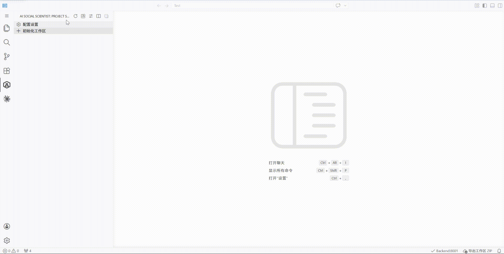
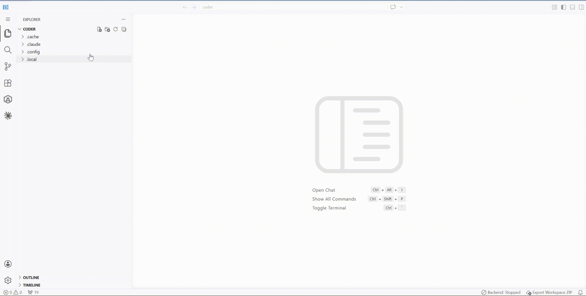

## Initialize a Research Project

Before you start, you need a research project directory.

---

### Option 1: Initialize a New Project

Run **Initialize Research Project** in an empty workspace to auto-create the directory structure:



```
your-project/
├── custom/skills/          # Agent runtime skills (installed from marketplace)
├── .claude/skills/         # Claude Code skills
├── papers/                 # Literature
│   ├── pdf/               # PDF papers
│   └── md/                # Markdown notes
├── experiment/             # Experiment configs & results
├── output/                 # Output files
├── TOPIC.md               # Research topic description
└── init/
    └── init_config.json   # Project initialization config
```

### Option 2: Open an Existing Project

Simply open an existing research workspace folder in VS Code. The plugin will automatically detect the directory structure.

If you do not have a project folder yet, create an empty folder first and then open it in VS Code:



---

### 🔧 What is the Command Palette?

The VS Code **Command Palette** is the quick-access hub for all actions:

- Press `Ctrl+Shift+P` (Mac: `Cmd+Shift+P`) to open it
- Type `AI Social Scientist` to see all plugin commands
- Common commands are also accessible via sidebar buttons or the status bar

> 💡 We recommend memorizing this shortcut — many operations start from here.

[Initialize Project](command:aiSocialScientist.initProject)
