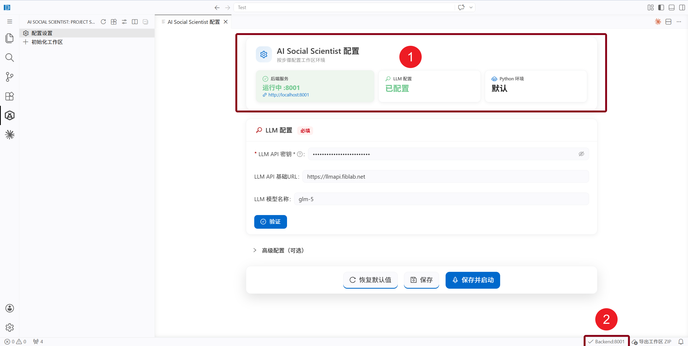

## Configure Your LLM API

AI Social Scientist needs a Large Language Model (LLM) API for literature understanding, experiment planning, agent reasoning, analysis, and writing. The configuration is written to the current workspace `.env` file and is not uploaded automatically.

---

### 🔧 What is an API Key?

An **API Key** is like a "key" that lets the plugin call AI services. Each provider gives you a unique key.

The **API Base URL** is the provider's "address" — it tells the plugin where to send requests.

### Required Fields

Fill in these two fields on the configuration page:

| Number | Meaning                                                                                                        |
| ------ | -------------------------------------------------------------------------------------------------------------- |
| 1      | Configuration status overview: quickly checks backend, LLM configuration, and Python environment availability. |
| 2      | Bottom status bar: shows the current backend port; click it to start, stop, restart, or view logs.             |

| Field        | Description                 | Example                     |
| ------------ | --------------------------- | --------------------------- |
| **API Key**  | Your service provider's key | `sk-xxx` or `sk-ant-xxx`    |
| **API Base** | API service URL             | `https://api.openai.com/v1` |

Start with only the required fields and verify the connection. After it works, you can tune model names, embeddings, or code-generation models.

---

### 💡 Don't have an API Key yet? Choose a provider

Click the links below to sign up and get your key:

#### International Providers

| Provider                                       | Get Key               | API Base URL                | Notes                               |
| ---------------------------------------------- | --------------------- | --------------------------- | ----------------------------------- |
| [OpenAI](https://platform.openai.com/api-keys) | platform.openai.com   | `https://api.openai.com/v1` | GPT series, powerful                |
| [Anthropic](https://console.anthropic.com/)    | console.anthropic.com | `https://api.anthropic.com` | Claude series, great with long text |

#### Chinese Providers

| Provider                                                                             | Get Key               | API Base URL                                        | Notes                             |
| ------------------------------------------------------------------------------------ | --------------------- | --------------------------------------------------- | --------------------------------- |
| [Tongyi Qianwen](https://bailian.console.aliyun.com/)                                | Alibaba Cloud         | `https://dashscope.aliyuncs.com/compatible-mode/v1` | Generous free tier, fast in China |
| [DeepSeek](https://platform.deepseek.com/api_keys)                                   | platform.deepseek.com | `https://api.deepseek.com`                          | Great value, strong reasoning     |
| [Zhipu GLM](https://bigmodel.cn/usercenter/proj-mgmt/apikeys)                        | bigmodel.cn           | `https://open.bigmodel.cn/api/paas/v4`              | Coding Plan available             |
| [Kimi](https://platform.moonshot.cn/console/api-keys)                                | platform.moonshot.cn  | `https://api.moonshot.cn/v1`                        | Excellent long-text handling      |
| [MiniMax](https://platform.minimaxi.com/user-center/basic-information/interface-key) | platform.minimaxi.com | `https://api.minimax.chat/v1`                       | Multimodal capabilities           |

> 💡 **New user tip**: Start with one OpenAI-compatible provider, then fill in `API Base` and `API Key` and verify the connection. Model names differ by provider, so copy them from the provider console.

---

### Advanced settings

| Setting         | Description                                  | Default                  |
| --------------- | -------------------------------------------- | ------------------------ |
| Model           | Default model name                           | `gpt-5.5`                |
| Coder Model     | Model for code generation                    | Same as default          |
| Nano Model      | Lightweight model for frequent operations    | Same as default          |
| Embedding Model | Vector embedding model (for semantic search) | `text-embedding-3-large` |

> 💡 Leave fields blank to reuse defaults. Adjust later as needed.

### Common checks

| Symptom                              | Check first                                                                           |
| ------------------------------------ | ------------------------------------------------------------------------------------- |
| Validation fails                     | Is the API Key complete? Does the API Base need `/v1`?                                |
| Model not found                      | Does the Model name match your provider console?                                      |
| Backend fails to start               | Was `.env` saved, and do you need to restart the backend?                             |
| Literature or analysis feels slow    | Consider configuring faster Nano/Coder models                                         |
| Academic literature validation fails | Use `https://llmapi.fiblab.net/mcp/` and a key with academic literature search access |

### Academic literature search

In the config page **Advanced** section, set the MCP gateway URL and API key:

| Field   | Example                                             |
| ------- | --------------------------------------------------- |
| MCP URL | `https://llmapi.fiblab.net/mcp/`                    |
| API Key | `sk-...` with academic literature search permission |

Workspace `.env` is enough. You do **not** need Claude `mcp.json`.

[Open Configuration Page](command:aiSocialScientist.openConfigPage)
