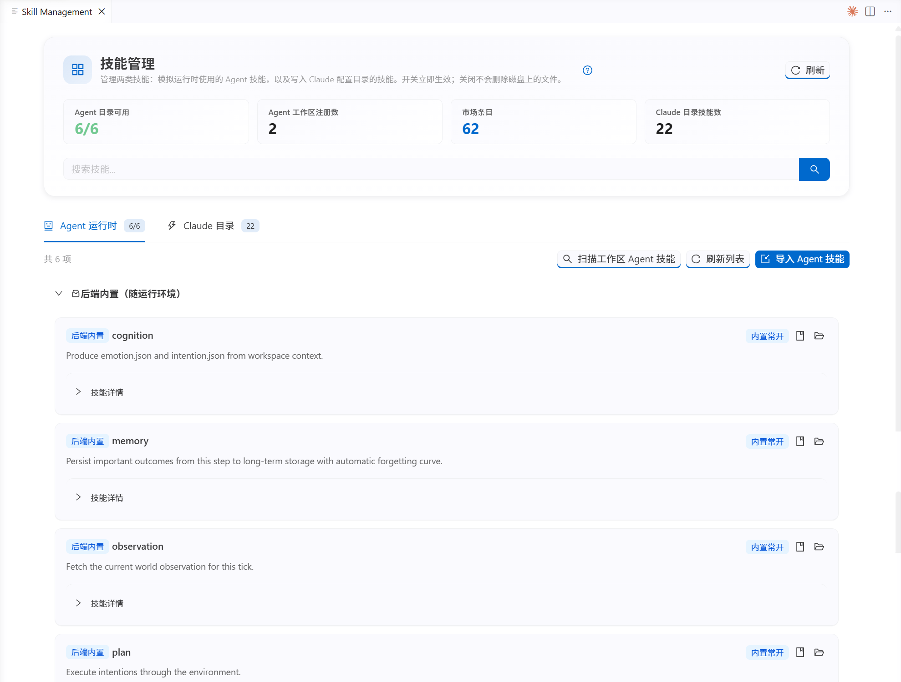

## Explore the Skill Marketplace

**Skills** are capability modules for agents and Claude Code. They determine what context they can read, what tools they can use, and what research tasks they can complete.

---

### 🔧 What are Skills?

Think of skills as a research toolbox. Each skill you install gives an agent or Claude Code a reusable capability:

- Install "Literature Search" → Agent can search and read papers
- Install "Data Analysis" → Agent can run Python scripts and generate charts
- No skills installed → Agent can only chat, not perform real actions

### Built-in Research Skills

| Skill | Function | When You Need It |
|-------|----------|-----------------|
| 📚 Academic literature search | Search academic papers, extract key info | Literature review (set MCP URL + API key under **Advanced** in config) |
| 💡 Hypothesis Generation | Derive testable hypotheses from literature | Formulating research hypotheses |
| 🔬 Experiment Design | Generate experiment configs, design research flows | Designing experiments |
| 📊 Data Analysis | Run analysis scripts, generate visual reports | Analyzing experiment data |
| ✍️ Paper Writing | Assist with writing paper sections | Writing papers |

---

### Two Skill Types

| Type | Install Location | Purpose | Management |
|------|-----------------|---------|------------|
| **Agent Runtime Skills** | `custom/skills/` | Used by agents during simulation runs | Install via Skill Marketplace |
| **Claude Code Skills** | `.claude/skills/` | Used by Claude Code by default for configuration, experiment checks, code work, and result analysis | Install via Skill Marketplace |

> 💡 Not sure which to choose? **Agent Runtime Skills** are for agents inside simulations, while **Claude Code Skills** are for the default IDE collaborator. They do not affect each other and can be installed per task.

The **Agent Runtime** tab shows skills available to agents during simulation runs. You can scan workspace skills, import Agent skills, and enable or disable individual skills.

The **Claude Directory** tab shows Claude Code skills available to the current project. **Copy built-in templates to current project** syncs bundled skills into `.claude/skills/`, while **Import Claude Skill** adds your own skill directory.

### How to Use

1. Open the Skill Marketplace and browse available skills
2. Click a skill card to see its details
3. Click **Install** to add it to your project
4. Installed skills appear in the sidebar's project structure view

### Skill Management

| Action | Agent Skills | Claude Skills |
|--------|-------------|---------------|
| Disable | Archive (moves to archive dir) | Turn off (files kept) |
| Re-enable | Restore from archive | Re-enable |
| Delete permanently | Delete from disk | Delete from disk |

> 💡 You can also configure `agentSkills.skillSources` in VS Code settings to install community skills from GitHub repos.

[Open Skill Marketplace](command:aiSocialScientist.openSkillMarketplace)
