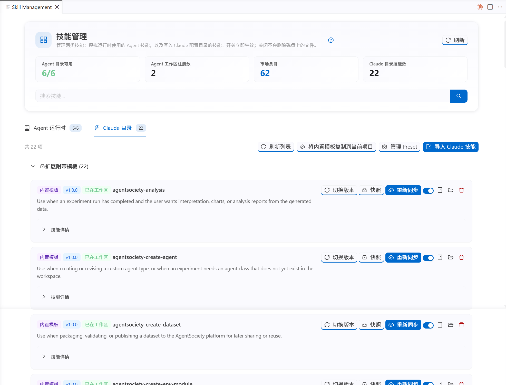
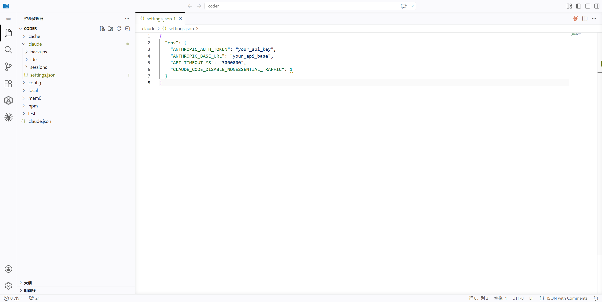
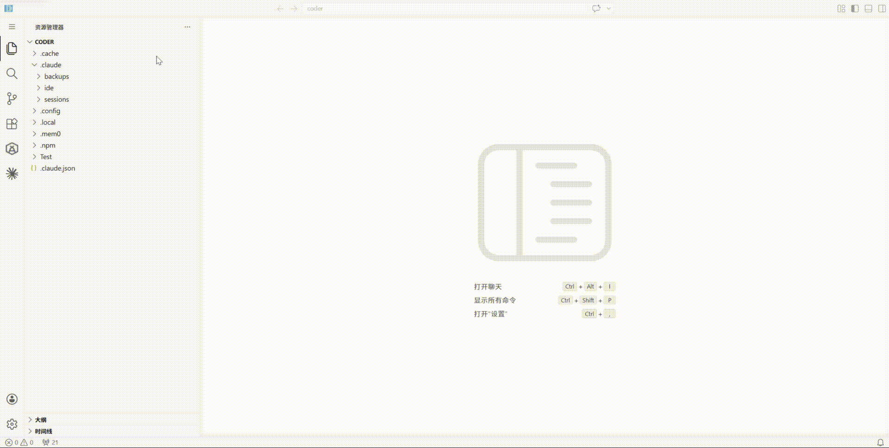
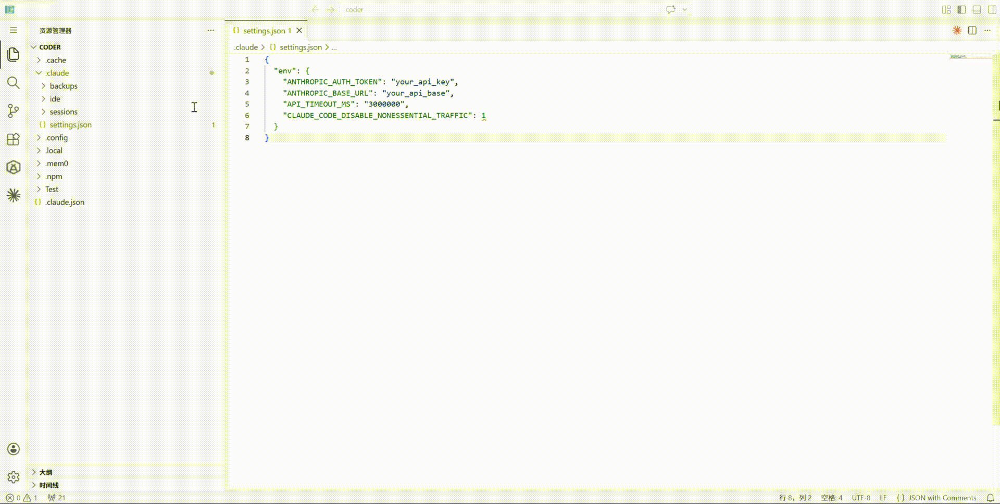

## Connect Claude Code

**Claude Code** is the recommended default coding and research collaboration entry point for AI Social Scientist. Once connected, it can read this project's research skills and reach the local backend through MCP, which makes it useful for generating configs, checking experiments, analyzing results, or editing custom modules.

> 💡 If you mostly use the graphical interface, you can finish the basic setup first; keeping Claude Code connected will still make experiment debugging and skill extension much smoother later.

---

### What Claude Code reads from this project

After project initialization, the extension syncs bundled development skills into your workspace:

```text
your-project/
├── .claude/skills/      # Development skills used by Claude Code
├── CLAUDE.md            # Project instructions for Claude Code
└── AGENTS.md            # Project instructions for general coding assistants
```

These are project-level files and are safe to maintain with the project. Put personal secrets in user-level or local ignored configuration files.



[Open Claude Skill Sources Settings](command:aiSocialScientist.openClaudeSkillSourcesSettings)

---

### Configure the model service used by Claude Code

Claude Code uses Anthropic by default. If you route requests through a proxy or compatible gateway, configure environment variables in **`~/.claude/settings.json`**, or use the extension config page under **Advanced → Claude Code**:

[Open Claude Code settings (config page)](command:aiSocialScientist.openClaudeCodeConfig)



Edit `~/.claude/settings.json` (Mac/Linux) or `UserDir/.claude/settings.json` (Windows):

If the file does not exist yet, create the `.claude` folder and `settings.json` first:



```json
{
  "env": {
    "ANTHROPIC_BASE_URL": "https://your-api-endpoint.com",
    "ANTHROPIC_AUTH_TOKEN": "your-api-key",
    "ANTHROPIC_MODEL": "your-model-name"
  }
}
```

> 💡 `ANTHROPIC_AUTH_TOKEN` is sent as a Bearer token. If your provider expects `x-api-key`, use `ANTHROPIC_API_KEY` instead. Gateway compatibility varies, so follow your provider's documentation.

If your gateway supports the Anthropic Messages format and you want models to appear in `/model`, add:

```json
{
  "env": {
    "CLAUDE_CODE_ENABLE_GATEWAY_MODEL_DISCOVERY": "1"
  }
}
```

After starting Claude Code, use `/status` to check the connection and `/model` to switch models.

---

### Configure MCP for External Services

**MCP** (Model Context Protocol) lets Claude Code connect to external tools, databases, knowledge bases, and remote services. Prefer remote HTTP MCP services when available; use SSE when a provider only exposes an SSE endpoint. Use local stdio mainly for local tools, development, or resources that must run on your machine.

Common connection types:

| Type | Best for | Configuration |
|------|----------|---------------|
| Remote HTTP | Cloud MCP, team services, external platform integrations | `claude mcp add --transport http ...` |
| Remote SSE | Older or provider-specific services that only expose SSE | `claude mcp add --transport sse ...` |
| Local stdio | Local scripts, development, files, or intranet resources | `claude mcp add --transport stdio ...` |

Prefer adding remote MCP servers with commands instead of hand-writing config:

```bash
# Private to this project by default
claude mcp add --transport http agentsociety https://your-mcp-server.example.com/mcp

# Shared with the team through .mcp.json
claude mcp add --transport http agentsociety --scope project https://your-mcp-server.example.com/mcp

# If the provider only exposes an SSE endpoint
claude mcp add --transport sse agentsociety-sse https://your-mcp-server.example.com/sse
```

If the remote MCP server requires a token, pass it as a header:

```bash
claude mcp add --transport http agentsociety https://your-mcp-server.example.com/mcp \
  --header "Authorization: Bearer YOUR_TOKEN"
```

For team-shared configuration, create or edit `.mcp.json` in the project root. Do not hard-code personal secrets; use environment variables:

```json
{
  "mcpServers": {
    "agentsociety": {
      "type": "http",
      "url": "${AGENTSOCIETY_MCP_URL:-https://your-mcp-server.example.com/mcp}",
      "headers": {
        "Authorization": "Bearer ${AGENTSOCIETY_MCP_TOKEN}"
      }
    }
  }
}
```

For local backend development, you can still use stdio. Make sure the backend is running, then create or edit `.mcp.json` in the project root:

```json
{
  "mcpServers": {
    "agentsociety": {
      "command": "uv",
      "args": ["run", "python", "-m", "agentsociety2.mcp"],
      "env": {
        "AGENTSOCIETY_BACKEND_URL": "http://localhost:8001"
      }
    }
  }
}
```

> 💡 `.mcp.json` is project-scoped and can be shared with a team. Keep personal secrets in environment variables or user-level configuration. Claude Code asks for approval before using project-scoped MCP servers; that is a normal safety check.

---

### Verify the connection



1. Start `claude` from the project root.
2. Use `/status` to check the model connection.
3. Use `/mcp` to check the `agentsociety` MCP server.
4. If it fails, check the remote MCP URL, authentication header, or local backend port.

Restart the terminal or Claude Code session after changing configuration.

[Open Claude Skill Sources Settings](command:aiSocialScientist.openClaudeSkillSourcesSettings)
