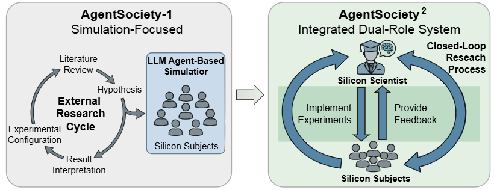
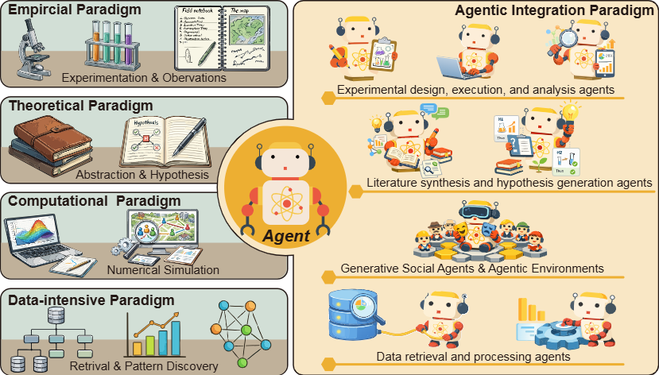

## 欢迎使用 AI Social Scientist

**AI Social Scientist** 是面向下一代计算社会科学研究的 VS Code 工作台。它把研究项目管理、LLM 配置、AgentSociety² 仿真、技能市场、实验回放和分析写作放在同一个工作区里。

_AgentSociety² 从单纯的模拟器扩展为集成式研究系统：Agent 既可以作为被研究对象，也可以作为协助研究的助手。_

### AgentSociety 适合解决什么问题

AgentSociety² 的目标不是把 LLM 放进聊天框，而是把社会科学研究组织成一个可运行、可复查、可扩展的研究环境。在这个环境里，Agent 有两种角色：

| 角色 | 含义 | 典型用途 |
|------|------|----------|
| **被研究对象** | 被模拟、被观察的社会行动者 | 行为游戏、社交互动、城市活动、网络扩散 |
| **研究助手** | 协助研究设计、执行和分析的智能助手 | 文献综合、假设生成、实验配置、数据分析、论文写作 |

两类 Agent 共同形成闭环：科学家 Agent 提出假设、设计实验、组织分析；主体 Agent 在环境中行动并产生数据；人类研究者保留研究判断、理论选择和最终解释权。

_AgentSociety² 将经验研究、理论建构、计算模拟和数据密集型分析放到同一个研究工作区中。_

### 四类研究范式如何被整合

| 研究范式 | 在 AgentSociety² 中对应什么 |
|----------|-----------------------------|
| **经验范式** | 设计观察、问卷、行为实验和可复现实验流程 |
| **理论范式** | 从文献和机制中形成概念、假设和解释框架 |
| **计算范式** | 通过 Agent、环境和规则实例化机制并运行模拟 |
| **数据密集型范式** | 检索、整理、分析数据，发现模式并生成可视化证据 |

这个插件负责把这些能力放到 VS Code 里，让你不用在命令行、配置文件和结果目录之间来回找。

### 你可以用它完成什么

| 研究环节 | 插件能帮你做什么 |
|----------|------------------|
| 文献综述 | 检索论文、整理文献索引、沉淀 Markdown 笔记 |
| 假设生成 | 从研究问题和文献中形成可检验的假设 |
| 实验设计 | 生成 AgentSociety2 的初始化配置和实验步骤 |
| Agent 模拟 | 启动本地后端，运行多智能体社会模拟和机制实验 |
| 回放分析 | 查看实验过程、检查 agent 行为、环境变化和结果数据 |
| 论文写作 | 把结果、图表和论证组织成论文材料 |

### 最短上手路径

1. 打开左侧 **AI Social Scientist** 侧边栏。
2. 初始化一个研究项目，或打开已有项目。
3. 填写 LLM 的 `API Key` 与 `API Base`。
4. 启动本地后端服务。
5. 根据任务安装需要的研究技能。

后面的步骤会按这个顺序带你完成配置。

### 需要配置哪些东西

| 配置 | 用途 | 何时需要 |
|------|------|----------|
| LLM API | 驱动文献、规划、分析和 Agent 推理 | 首次使用必填 |
| 后端服务 | 在本地运行仿真、技能和 API | 使用实验、回放、技能时需要 |
| 技能市场 | 安装研究技能和开发技能 | 按任务选择 |
| Claude Code / MCP | 让编码助手接入项目技能和本地后端 | 推荐作为默认研究协作入口 |

### AgentSociety 和本插件的关系

[AgentSociety](https://github.com/tsinghua-fib-lab/agentsociety) 是清华大学 FibLab 开发的 LLM 原生智能体研究平台。这个 VS Code 插件是它的研究工作台：

- **VS Code 插件**：提供项目树、配置页、技能管理、回放和帮助页面。
- **FastAPI 后端**：在本地运行，负责调用 LLM、管理实验和服务 API。
- **AgentSociety2 核心**：负责 PersonAgent、环境模块、实验执行和 replay 数据。
- **Skills**：把文献、实验、分析、写作等能力封装成可安装的研究模块。

欢迎页不要求你先记住所有术语。先把项目跑起来；如果遇到不熟悉的概念，可以在后面的“术语附录”里查。
