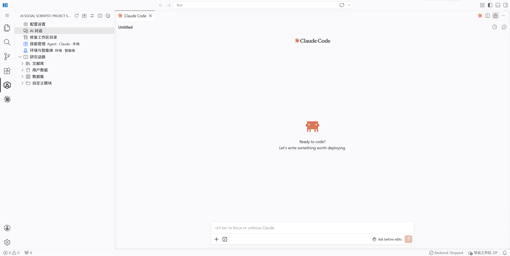

## 下一步 🚀

配置完成！你已经准备好开始使用 AI Social Scientist 了。

---

### 核心功能速览



| 功能                                               | 怎么打开                  | 什么时候用                     |
| -------------------------------------------------- | ------------------------- | ------------------------------ |
| [AI Chat](command:aiSocialScientist.openChat)      | 命令面板 → `Open AI Chat` | 想和 AI 助手对话、提问研究问题 |
| [模拟回放](command:aiSocialScientist.openReplay)   | 侧边栏 → 右键实验目录     | 想回看和分析 Agent 模拟的过程  |
| [使用指南](command:aiSocialScientist.openHelpPage) | 侧边栏 📖 按钮             | 想查看完整的功能说明           |
| 术语附录                                           | 本快速入门最后一步         | 不确定某个概念是什么意思时     |

---

### 典型研究工作流

```
📚 文献综述 → 💡 假设生成 → 🔬 实验设计 → 🤖 Agent 模拟 → 📊 数据分析 → ✍️ 论文写作
```

每个环节都有对应的技能支持。建议按顺序安装技能，逐步探索。

---

### 插件设置说明

在 VS Code 设置中搜索 `AI Social Scientist`，可以调整以下选项：

| 设置项               | 作用                        | 建议值                 |
| -------------------- | --------------------------- | ---------------------- |
| `backend.autoStart`  | 插件启动时自动启动后端      | 日常使用建议开启       |
| `chat.viewColumn`    | Chat 面板打开的位置         | `beside`（默认）即可   |
| `githubToken`        | GitHub Token，避免 API 限流 | 频繁使用技能市场时填写 |
| `skillSources`       | Agent 技能的 GitHub 源      | 按需添加               |
| `claudeSkillSources` | Claude 技能的 GitHub 源     | 已内置常用源           |

---

### 📚 学习资源

| 资源       | 链接                                                                     |
| ---------- | ------------------------------------------------------------------------ |
| 📖 在线文档 | [agentsociety2.readthedocs.io](https://agentsociety2.readthedocs.io/)    |
| 📚 使用指南 | [打开帮助页面](command:aiSocialScientist.openHelpPage)                   |
| 🐛 问题反馈 | [GitHub Issues](https://github.com/tsinghua-fib-lab/agentsociety/issues) |
| 💬 源码仓库 | [GitHub](https://github.com/tsinghua-fib-lab/agentsociety)               |

遇到任何问题，欢迎在 GitHub Issues 中反馈！
