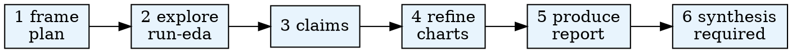

# Analysis

Use this skill for interactive experiment analysis. **You (Claude Code) own orchestration, scientific judgment, and user dialogue.** The harness CLI enforces **structural** reproducibility and **phase gates**; it does not replace your reasoning.

**Quality before gates:** Read `references/analysis-quality.md` at the start of each phase. A `validate-*` PASS with weak science is a failure — improve claims, evidence, and prose first, then attest.

## Harness vs LLM (read first)

| Layer           | Who                          | What                                                                                 |
| --------------- | ---------------------------- | ------------------------------------------------------------------------------------ |
| **Structural**  | Python `validate-*`          | Files exist, JSON schemas valid, DB/tables/artifacts consistent                      |
| **Attestation** | You via `record-attestation` | Phase-complete judgment: findings, limitations, user alignment (schema-checked only) |
| **Narrative**   | You                          | Reports, synthesis, claim wording, chart design, caveats                             |

After each phase: (1) do the analytical work with the user, (2) run `validate-<phase>`, (3) run `record-attestation` with rubric from `references/phase-attestation.md`, (4) `gate-status` or `advance`.

References: `references/harness-contract.md`, `references/phase-attestation.md`, `references/analysis-quality.md`, `references/json-payloads.md`.

**JSON payloads:** `--payload` accepts a JSON object or a `.json` file path. The CLI repairs minor syntax issues via `json-repair` before Pydantic validation — still fix wrong fields, not escaping.

## Overview

Analyze experiment results from AgentSociety simulations. Explore data interactively, produce targeted visualizations or composite figures, and write bilingual reports with optional cross-experiment synthesis.

The plotting and figure-assembly parts of this skill follow a contract-first structure adapted to the `agentsociety2` analysis stack: fixed Python backend, SQLite-first evidence tracking, `ags.py analysis` tool surface, and report asset management under `presentation/` and `synthesis/`.

## When to Use

- An experiment run has completed and `sqlite.db` exists in the run directory.
- The user asks to analyze results, explore data, visualize data, combine multiple assets into one figure, create charts, or write analysis reports.
- The user references a hypothesis or experiment ID and wants to understand outcomes.

**Do NOT use when:**

- The experiment run has not completed (no `sqlite.db`).
- The user only wants to configure or launch experiments (use run-experiment instead).

## Quick Reference

| Command                                                                                                                                 | Purpose                                                                            |
| --------------------------------------------------------------------------------------------------------------------------------------- | ---------------------------------------------------------------------------------- |
| `$PYTHON_PATH .agentsociety/bin/ags.py analysis load-context --workspace . --hypothesis-id ID --experiment-id ID`                       | Load experiment context                                                            |
| `$PYTHON_PATH .agentsociety/bin/ags.py analysis list-tables --db-path PATH`                                                             | List tables in SQLite DB                                                           |
| `$PYTHON_PATH .agentsociety/bin/ags.py analysis data-summary --db-path PATH`                                                            | Full data summary                                                                  |
| `$PYTHON_PATH .agentsociety/bin/ags.py analysis query-data --db-path PATH --sql "SELECT ..."`                                           | Read-only SQL query                                                                |
| `$PYTHON_PATH .agentsociety/bin/ags.py analysis run-code --db-path PATH --code FILE`                                                    | Execute analysis code                                                              |
| `$PYTHON_PATH .agentsociety/bin/ags.py analysis run-eda --db-path PATH --output-dir DIR --type TYPE [--workspace . --hypothesis-id ID]` | Generate EDA; auto-registers explore artifacts when hypothesis id is set           |
| `$PYTHON_PATH .agentsociety/bin/ags.py analysis compose-figure --spec FILE`                                                             | Combine multiple raster charts/images into one labeled figure                      |
| `$PYTHON_PATH .agentsociety/bin/ags.py analysis collect-assets --workspace . --hypothesis-id ID --experiment-id ID --output-dir DIR`    | Collect report assets from experiment artifacts                                    |
| `$PYTHON_PATH .agentsociety/bin/ags.py analysis sync-report-assets --workspace . --hypothesis-id ID --experiment-id ID`                 | Copy images referenced in reports from `charts/` → `assets/`                       |
| `$PYTHON_PATH .agentsociety/bin/ags.py analysis intake --workspace . --hypothesis-id ID --experiment-id ID`                             | Initialize harness state                                                           |
| `$PYTHON_PATH .agentsociety/bin/ags.py analysis write-plan --workspace . --hypothesis-id ID --payload '{...}'`                          | Persist `analysis_plan.yaml`                                                       |
| `$PYTHON_PATH .agentsociety/bin/ags.py analysis validate-plan` / `validate-explore` / …                                                 | Structural + attestation gate per phase                                            |
| `$PYTHON_PATH .agentsociety/bin/ags.py analysis record-attestation --payload '{...}'`                                                   | LLM phase sign-off (required for gate pass)                                        |
| `$PYTHON_PATH .agentsociety/bin/ags.py analysis record-phase-artifacts --phase explore --artifacts '["path"]'`                          | Register EDA/output paths (feeds `build-report-context`)                           |
| `$PYTHON_PATH .agentsociety/bin/ags.py analysis build-report-context --workspace . --hypothesis-id ID`                                  | Merge EDA/charts/claims → `data/report_context.md` (orchestrator / subagent input) |
| `$PYTHON_PATH .agentsociety/bin/ags.py analysis validate-report-quality` / `record-report-review` / `record-synthesis-review`           | Mechanical quality + independent review records                                    |
| `$PYTHON_PATH .agentsociety/bin/ags.py analysis validate`                                                                               | Workspace complete = `validate-synthesis` pass                                     |
| `$PYTHON_PATH .agentsociety/bin/ags.py analysis advance --phase PHASE`                                                                  | After **prior** phase `gate_pass`                                                  |
| `$PYTHON_PATH .agentsociety/bin/ags.py analysis gate-status` / `run-loop`                                                               | Checkpoint dashboard / next steps                                                  |

Use the Python interpreter from `.env`. See `CLAUDE.md` for setup.

## First Move: Analysis Contract Before Plotting

Before generating any chart code or combining existing assets, establish the contract below:

1. Core finding: what specific claim should the next visual defend?
2. Evidence source: which table, query, aggregation, or prior chart supports it?
3. Figure scope: is the artifact a `single chart` or `composite figure`?
4. Figure archetype: choose the simplest structure that carries the message.
5. Output contract: decide filenames, export bundle, and where the artifact will appear in the report.

The highest-priority rule is: each visual artifact must strengthen an already identified analytical finding. Generic EDA should stay in Stage 2 unless it is promoted into Stage 3 by an explicit finding.

## Common Mistakes

| Mistake                                                                     | Fix                                                                                                              |
| --------------------------------------------------------------------------- | ---------------------------------------------------------------------------------------------------------------- |
| Skipping context loading and going straight to charts                       | Always start with Stage 1 (`intake` + `write-plan`)                                                              |
| Skipping synthesis                                                          | Stage 6 is required; run `validate-synthesis` before pipeline `analysis completed`                               |
| Starting from a favorite plot type before defining the message              | Write a figure contract first: finding, scope, evidence source, and expected takeaway                            |
| Decorative charts without a claim or figure contract                        | Each chart must defend one finding; skip charts when prose/EDA is enough                                         |
| Writing analysis output to wrong directory                                  | Single-experiment goes to `presentation/hypothesis_{id}/`, synthesis goes to `synthesis/`                        |
| Running EDA on all tables indiscriminately                                  | Only run EDA for tables explicitly selected during Stage 2                                                       |
| Inventing helper scripts instead of using the analysis CLI                  | Use `.agentsociety/bin/ags.py analysis ...` for all mechanical operations                                        |
| Chart without description                                                   | Every chart in the report must have a one-line description directly below it                                     |
| Overloaded colors, repeated legends, or weak panel hierarchy                | Reuse the chart contract and `references/chart-guide.md` before regenerating                                     |
| Leaving a multi-view finding as several disconnected screenshots            | Generate atomic charts first, then assemble a single `figure_{nn}_{slug}.png` with labeled panels                |
| Treating simulation output as direct real-world proof                       | Downgrade the claim strength and record the caveat in the figure contract or report text                         |
| Using ad hoc matplotlib defaults in one script and styled output in another | Reuse `references/api.md` and `references/common-patterns.md` so colors, fonts, and export rules stay consistent |

## Workflow



## Pipeline Position

**Predecessors:** run-experiment (completed run with `sqlite.db`)
**Optional inputs:** web-research (supplementary context for interpretation), use-dataset (external datasets for comparison)
**Successors:** agentsociety-paper-orchestrator
**Also feeds:** hypothesis (refinement cycle when analysis informs hypothesis revision)

## Stage Notes

- `stages/01_frame.md`: intake, write-plan, validate-plan
- `stages/02_data_explore.md`: narrow exploration + `run-eda` + validate-explore
- `stages/03_claims.md`: record-claim, validate-claims
- `stages/04_refine.md`: figure contracts, run-code, validate-chart
- `stages/05_produce.md`: bilingual report, validate-release
- `stages/06_synthesis.md`: required workspace synthesis, validate-synthesis
## Shared References

- Figure contract: `references/figure-contract.md`
- Python backend rule: `references/backend-selection.md`
- Chart selection: `references/chart-guide.md`
- Plot API and palettes: `references/api.md`
- Design rationale: `references/design-theory.md`
- Plot layout patterns: `references/common-patterns.md`
- Chart families: `references/chart-types.md`
- Composite figure assembly: `references/composite-figures.md`
- Chart QA and export checks: `references/qa-contract.md`
- Analysis methods: `references/analysis-methods.md`
- Worked examples: `references/tutorials.md`
- Demo routing: `references/demos.md`
- Output layout: `references/output-conventions.md`
- Report self-check: `checklists/quality.md`
- Harness contract: `references/harness-contract.md`
- Phase attestation rubrics: `references/phase-attestation.md`
- Quality standard (LLM-owned): `references/analysis-quality.md`
- JSON templates: `references/json-payloads.md`
- EDA → report integration: `references/report-integration.md`
- Independent review: `references/report-review.md`
- Embeddings (figures, tables, EDA): `references/report-embeddings.md`
- Interactive EDA in HTML reports: `references/html-interactive-eda.md`
- HTML design cues: `references/html-design-inspiration.md`
- Bundled HTML support: `references/support-skills.md`; polish via `support/frontend-design/` + `support/frontend-design/references/analysis-reports.md`
- Simulation report template: `references/report-template-simulation.md`
- Progressive assembly: `references/report-assembly.md`
- HTML (LLM-authored): `references/html-export.md`, `assets/report-shell.reference.html`
- External index: `references/report-writing-inspiration.md`

## CLI Tool

Use `$PYTHON_PATH .agentsociety/bin/ags.py analysis` for all mechanical operations:

- `load-context`, `data-summary`, `list-tables`, `query-data`, `run-code`, `run-eda`, `compose-figure`, `collect-assets`

## Subagent Delegation

| Phase           | Subagent prompt                                     | Orchestrator keeps                                           |
| --------------- | --------------------------------------------------- | ------------------------------------------------------------ |
| explore, refine | `subagent-prompts/data-explorer.md`                 | `record-phase-artifacts`, `record-contract`, gates           |
| produce         | `report-producer` + `report-reviewer` (independent) | `record-report-review`, `validate-release`, attestation      |
| synthesis       | `synthesis-producer` + `synthesis-reviewer`         | `record-synthesis-review`, `validate-synthesis`, attestation |

Subagents return file paths and `key_findings`; they **do not** call `advance`, `record-attestation`, or pipeline `update-stage`.

**Orchestrator-only:** frame (user intent), claims approval with user, final attestation wording.

Produce flow:

1. Orchestrator: `build-report-context` after refine gate passes.
2. Dispatch **report-producer** with paths to `report_context.md`, `evidence_index.json`, claims, charts/assets.
3. Dispatch **report-reviewer** (independent subagent). On REVISE/FAIL, loop producer → reviewer until PASS.
4. `record-report-review` then `validate-release` (includes mechanical quality + review fingerprint).
5. Orchestrator `record-attestation` only after review PASS and user-aligned narrative.

HTML (if requested) is written inside report-producer as native HTML using `assets/report-shell.reference.html` — **never** mechanical Markdown conversion.

## Runtime Contract

- Start with Stage 1 (`intake` + `write-plan`) for every new analysis request.
- Do not mark analysis complete until `validate-synthesis` passes.
- Do not skip directly to charting before the relevant tables and questions are clear.
- Use `.agentsociety/bin/ags.py analysis ...` instead of inventing parallel helper scripts.
- Keep intermediate reasoning in the conversation, not inside generated helper code.
- Stage 6 synthesis is **required**; write `synthesis_brief.json` plus bilingual synthesis reports.
- Produce stage: write `report_outline.json` (sections + figure captions) — harness does not grep report headings.
- Use the Python toolchain exclusively for analysis plotting and figure assembly in this skill.

## Hard Constraints

- No default chart cap (`max_charts: 0` in harness state = unlimited). Set `max_charts` in `state.yaml` only when the user wants a hard budget.
- Prefer fewer strong charts over many weak ones — quality bar, not a fixed count.
- Every chart plan starts from a finding contract before code generation.
- Every chart that appears in the report must have a one-line description directly below it.
- When one finding requires multiple coordinated views or pre-rendered assets, assemble them into a single `figure_{nn}_{description}.png` with panel labels instead of pasting separate screenshots into the report.
- Run EDA only for tables explicitly selected during Stage 2.
- Write single-experiment output to `presentation/hypothesis_{id}/` (`data/`, `charts/`, `assets/` only — no `analysis/`, `figures/`, or `eda/` folders there).
- Harness state goes to `.agentsociety/analysis/hypothesis_{id}/` (created by `intake`).
- Write synthesis output only to the dedicated `synthesis/` root directory, never under `presentation/`.
- Reports are bilingual, Chinese-first by default. **Required for gate pass:** `report_zh.md`, `report_en.md`, `report_zh.html`, and `report_en.html` under `presentation/hypothesis_{id}/`. Embed images only via `assets/` (run `sync-report-assets` or `collect-assets` before `validate-release`).
- Generated matplotlib charts must use the `Agg` backend, English-only legend text, and a publication-safe rcParams block that keeps SVG text editable.
- Final charts and reports must pass `references/qa-contract.md` before being described as complete.
- Scripts are mechanical helpers only; Claude Code remains the orchestrator.

## Progress Tracking

Only after `validate-synthesis` passes:
```bash
$PYTHON_PATH .agentsociety/bin/ags.py research-pipeline update-stage analysis completed
```
