# Analysis

Use this skill as guidance for interactive experiment analysis. Claude Code stays responsible for orchestration, judgment, and user communication. The CLI is only for mechanical operations.

## Overview

Analyze experiment results from AgentSociety simulations. Explore data interactively, produce targeted visualizations, and write bilingual reports with optional cross-experiment synthesis.

## When to Use

- An experiment run has completed and `sqlite.db` exists in the run directory.
- The user asks to analyze results, explore data, visualize data, create charts, or write analysis reports.
- The user references a hypothesis or experiment ID and wants to understand outcomes.

**Do NOT use when:**

- The experiment run has not completed (no `sqlite.db`).
- The user only wants to configure or launch experiments (use run-experiment instead).

## Quick Reference

| Command | Purpose |
|---------|---------|
| `$PYTHON_PATH .agentsociety/bin/ags.py analysis load-context --workspace . --hypothesis-id ID --experiment-id ID` | Load experiment context |
| `$PYTHON_PATH .agentsociety/bin/ags.py analysis list-tables --db-path PATH` | List tables in SQLite DB |
| `$PYTHON_PATH .agentsociety/bin/ags.py analysis data-summary --db-path PATH` | Full data summary |
| `$PYTHON_PATH .agentsociety/bin/ags.py analysis query-data --db-path PATH --sql "SELECT ..."` | Read-only SQL query |
| `$PYTHON_PATH .agentsociety/bin/ags.py analysis run-code --db-path PATH --code FILE` | Execute analysis code |
| `$PYTHON_PATH .agentsociety/bin/ags.py analysis run-eda --db-path PATH --output-dir DIR --type TYPE` | Generate EDA report |
| `$PYTHON_PATH .agentsociety/bin/ags.py analysis collect-assets --workspace . --hypothesis-id ID --experiment-id ID --output-dir DIR` | Collect report assets |

Use the Python interpreter from `.env`. See `CLAUDE.md` for setup.

## Common Mistakes

| Mistake | Fix |
|---------|-----|
| Skipping context loading and going straight to charts | Always start with Stage 1 (`load-context`) |
| Generating more than 5 charts without approval | Cap at 5 per single-experiment analysis; ask the user for more |
| Writing analysis output to wrong directory | Single-experiment goes to `presentation/hypothesis_{id}/`, synthesis goes to `synthesis/` |
| Running EDA on all tables indiscriminately | Only run EDA for tables explicitly selected during Stage 2 |
| Inventing helper scripts instead of using the analysis CLI | Use `.agentsociety/bin/ags.py analysis ...` for all mechanical operations |
| Chart without description | Every chart in the report must have a one-line description directly below it |

## Workflow

```dot
digraph analysis_flow {
    rankdir=LR;
    node [shape=box, style=filled, fillcolor="#E8F4FD"];
    load [label="load-context"];
    scope [label="confirm analysis\nquestion"];
    explore [label="inspect tables\nand data shape"];
    findings [label="propose findings"];
    charts [label="generate approved\ncharts only"];
    report [label="write report"];
    synth [label="cross-experiment\nsynthesis"];

    load -> scope -> explore -> findings -> charts -> report;
    report -> synth [style=dashed, label="user requests comparison"];
}
```



## Pipeline Position

**Predecessors:** run-experiment (completed run with `sqlite.db`)
**Optional inputs:** web-research (supplementary context for interpretation), use-dataset (external datasets for comparison)
**Successors:** agentsociety-paper-orchestrator
**Also feeds:** hypothesis (refinement cycle when analysis informs hypothesis revision)

## Stage Notes

- `stages/01_context.md`: always first
- `stages/02_data_explore.md`: after context is confirmed
- `stages/03_insight_and_viz.md`: after the data shape is understood
- `stages/04_report.md`: after findings and charts are approved
- `stages/05_synthesis.md`: only when the user requests comparison

## Shared References

- Chart selection: `references/chart-guide.md`
- Analysis methods: `references/analysis-methods.md`
- Output layout: `references/output-conventions.md`
- Report self-check: `checklists/quality.md`

## CLI Tool

Use `$PYTHON_PATH .agentsociety/bin/ags.py analysis` for all mechanical operations:

- `load-context`, `data-summary`, `list-tables`, `query-data`, `run-code`, `run-eda`, `collect-assets`

## Subagent Delegation

Stages 2-3 (data exploration + visualization) are the most context-intensive steps, especially with large SQLite databases. Delegate to a subagent when:

- The database has many tables and extensive data exploration is needed
- Complex visualizations require iterative SQL querying and chart refinement
- You are mid-pipeline and context is becoming a concern

**How to delegate:**

1. Complete Stage 1 yourself (`load-context`). Confirm the analysis direction with the user.
2. Dispatch a subagent with the context, DB path, and analysis questions. Instruct it to read `subagent-prompts/data-explorer.md` and follow it.
3. After the subagent returns findings and chart paths, you write the report (Stage 4) yourself with user collaboration.

**Do NOT delegate:** simple analyses with 1-2 tables and straightforward queries.

## Runtime Contract

- Start with Stage 1 for every new analysis request.
- Do not skip directly to charting before the relevant tables and questions are clear.
- Use `.agentsociety/bin/ags.py analysis ...` instead of inventing parallel helper scripts.
- Keep intermediate reasoning in the conversation, not inside generated helper code.
- Treat Stage 5 as optional and only enter it when the user explicitly asks for cross-experiment or cross-hypothesis comparison.

## Hard Constraints

- Maximum 5 charts per single-experiment analysis unless the user explicitly approves a trade-off.
- Every chart that appears in the report must have a one-line description directly below it.
- Run EDA only for tables explicitly selected during Stage 2.
- Write single-experiment output to `presentation/hypothesis_{id}/`.
- Write synthesis output only to the dedicated `synthesis/` root directory, never under `presentation/`.
- Reports are bilingual, Chinese-first by default. Write `report_zh.md` + `report_zh.html` and `report_en.md` + `report_en.html` under `presentation/hypothesis_{id}/`.
- Scripts are mechanical helpers only; Claude Code remains the orchestrator.

## Progress Tracking

After analysis report is written:
```bash
$PYTHON_PATH .agentsociety/bin/ags.py research-pipeline update-stage analysis completed
```
