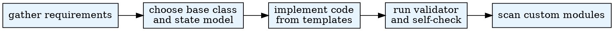

# Create Agent

Add Python modules under **`custom/agents/`** relative to the **workspace root** (the directory that contains `custom/`). The backend scanner loads every `*.py` under that tree **except** paths under an **`examples/`** segment.

- Nested folders are allowed (e.g. `custom/agents/research/lab_agent.py`).
- Prefer **one primary agent class per file** for clarity; the scanner can surface multiple `AgentBase` subclasses in the same file if you define them.

## When to Use
- User asks to create a new agent type (e.g., "student agent", "donor agent")
- Designing agent behaviors or implementing AgentBase/PersonAgent subclasses
- experiment-config needs an agent class that does not yet exist in the workspace
- Extending an existing agent with custom logic
- The simulation size, step budget, or runtime budget needs to shape the agent design

**Do NOT use when:**
- You only need to discover existing agents (use scan-modules)
- The task is about environment modules, not agents

## Quick Reference

Use the Python interpreter from `.env`. See `CLAUDE.md` for setup.

## Scale Budget

Collect the simulation scale budget before locking the agent design:

- target agent count or range
- expected step budget
- runtime or compute budget
- preferred complexity tier, such as lean, balanced, or rich

If the budget is still open, ask a single round of clarifying questions. Present 2-3 approaches with trade-offs and a recommendation, then choose the option that keeps per-agent logic proportional to the simulation size.

| Action | Command |
|--------|---------|
| Validate agent file | `$PYTHON_PATH .agentsociety/bin/ags.py create-agent --file /path/to/workspace/custom/agents/my_agent.py` |
| Validate (JSON output) | `$PYTHON_PATH .agentsociety/bin/ags.py create-agent --file ... --json` |
| Register | VS Code: **Scan Custom Modules** (and **Test Custom Modules** if needed) |

## Workflow



## Stage Notes

- `stages/intake.md`: gather requirements and clarify open questions
- `stages/design.md`: choose base class, workspace, profile, and state shape
- `stages/generate.md`: implement code with `artifacts/templates.md`
- `stages/validate.md` and `checklists/compatibility.md`: final validation

## Base Class

| Class | When to use |
|-------|-------------|
| `AgentBase` | Simple behavior, games/benchmarks, you manage state yourself |
| `PersonAgent` | Skills, tool loops, workspace, checkpoint/WAL, heavier runtime |

Required and optional methods, LLM/env APIs, config: use **`references/agent-base-interface.md`** as the single detailed source (avoids duplicating it here).

## Environment and Profile

- Env call patterns: `references/environment-interaction.md`
- **Common pitfalls (read before writing `ask_env` code): `references/pitfalls.md`**
- Profile fields: `references/profile-design.md`
- In-repo examples: `references/examples.md`

## Validation

```bash
$PYTHON_PATH .agentsociety/bin/ags.py create-agent --file /path/to/workspace/custom/agents/my_agent.py
$PYTHON_PATH .agentsociety/bin/ags.py create-agent --file ... --json
```

The script checks: AST shows a **direct** base named **`AgentBase`** or **`PersonAgent`**, all four required methods are **`async def`**, the module imports, and the class is not abstract. That is **stricter** than **Scan Custom Modules**: the scanner treats any in-file class with `issubclass(cls, AgentBase)` as a candidate and only verifies `hasattr` for the four names (no `async` check). Intermediate bases (`class MyAgent(MyMiddle, AgentBase)`) are fine at runtime but may fail this skill's AST rule -- fix by satisfying the import/MRO note in `stages/validate.md` or adjust the inheritance shape.

`AgentBase` already defines a default `mcp_description`; overriding it is still recommended for real modules.

For the full human checklist see `stages/validate.md` and `checklists/compatibility.md`.

## Common Mistakes

| Mistake | Fix |
|---------|-----|
| Using intermediate base classes that fail the AST validation rule | Ensure direct inheritance from `AgentBase` or `PersonAgent`, or follow the MRO note in `stages/validate.md` |
| Forgetting to make required methods async | All four required methods must be `async def` |
| Not running the validator after creating the agent | Always run `.agentsociety/bin/ags.py create-agent --file ...` as the final step |
| Adding files under an `examples/` path | The scanner skips any path containing an `examples/` segment; place files directly under `custom/agents/` |
| Phrasing `ask_env` message as a Python call literal (`"tool(arg=val)"`) | Use natural language `"Please call tool_name() using <args> from ctx['variables'] ..."` — see `references/pitfalls.md` P2 |
| Using `template_mode=True` for `readonly=False` writes without checking idempotency / argument-name collisions | Default to `template_mode=False` for writes; only enable when the env tool is verified idempotent AND argument names don't collide with other writes — see `references/pitfalls.md` P3 |
| Calling the same write tool more than once per `step()` "to be safe" | Trust the `status` return; retry only on `fail`/`error` — see `references/pitfalls.md` P4 |

## Subagent Delegation

Stages 2-3 (design + code generation) can consume significant context. Delegate to subagents when:

- The agent design involves complex logic (multi-step reasoning, state machines, nested tool calls)
- The profile has many custom fields that need careful mapping
- The hypothesis requires non-trivial agent behaviors tied to experiment variables
- The target simulation size is high enough that the design needs a leaner reasoning or state strategy
- You are in a long research pipeline session and context is at a premium

**How to delegate (planner → generator → reviewer):**

1. Complete Stage 1 yourself (intake). Collect user requirements.
2. **Planner**: Dispatch a subagent with the user requirements + hypothesis context, instructing it to read `subagent-prompts/planner.md` and follow it. The planner produces a structured DesignSpec JSON — what methods to implement, what state to track, what persistence is needed, all tied to the hypothesis.
3. **Generator**: Dispatch a subagent with the DesignSpec, instructing it to read `subagent-prompts/implementer.md` and follow it. The generator writes code from the spec.
4. **Reviewer**: Dispatch a subagent with the file path + DesignSpec, instructing it to read `subagent-prompts/reviewer.md` and follow it. The reviewer checks the code against the spec with fresh context.
5. After all subagents return, run `$PYTHON_PATH .agentsociety/bin/ags.py create-agent --file ...` yourself and fix any remaining issues from the reviewer report.

**Do NOT delegate:** simple agents that inherit from `AgentBase` with trivial `ask`/`step` overrides. For those, do Stages 1-4 yourself.

## Pipeline Position

**Optional helpers:** scan-modules (to check existing agents before creating a new one)
**Successors:** experiment-config (when custom agents are needed)
**Required Sub-Skills:** None

Called by experiment-config as an optional branch when the required agent class does not already exist.
