# Create Dataset

## Overview
Create, validate, package, and upload datasets to the AgentSociety platform. Produces a ZIP package conforming to the platform's schema for sharing or admin review.

Use the Python interpreter from `.env`. See `CLAUDE.md` for setup.

## When to Use
- User wants to publish or share a dataset on the AgentSociety platform
- Packaging survey results, agent profiles, or simulation outputs for upload
- User says "create dataset", "upload dataset", or "publish data"

**Do NOT use when:**
- User wants to *download* or *browse* datasets (use `agentsociety-use-dataset`)
- User is working with experiment config files only (use `experiment-config`)

## Quick Reference

| Command | Auth | Description |
|---------|:----:|-------------|
| `login` | No | Casdoor Device Code Flow authentication |
| `logout` | No | Clear saved credentials |
| `init <name>` | No | Create dataset directory structure |
| `validate <path>` | No | Validate dataset dir or ZIP |
| `pack <dir>` | No | Package directory into ZIP |
| `upload <zip>` | Yes | Upload to AgentSociety platform |
| `submit <dataset_id>` | Yes | Submit for admin review |

Run commands from the workspace root through `.agentsociety/bin/ags.py`.

## Workflow

```dot
digraph create_dataset_flow {
    rankdir=LR;
    node [shape=box, style=filled, fillcolor="#E8F4FD"];
    login [label="login\nif upload needed"];
    init [label="init dataset dir"];
    add [label="add data files"];
    meta [label="edit README.md\nand dataset.json"];
    validate [label="validate"];
    pack [label="pack zip"];
    upload [label="upload"];
    submit [label="submit for review"];

    login -> init -> add -> meta -> validate -> pack -> upload -> submit;
}
```



## Dataset Format

A valid dataset is a directory containing:

```
<name>/
├── README.md         # Required. Describes the dataset.
├── dataset.json      # Required. Metadata (id, name, description, category, etc.)
└── data/             # Recommended. Dataset files (CSV, JSON, etc.)
```

**Constraints:**
- `id` must match `^[a-z0-9_-]+$` and be unique on the platform
- `category`: one of `agent_profiles`, `surveys`, `experiments`, `literature`, `simulation_results`, `other`
- Total package size: max 5TB (files ≥200MB use multipart direct-to-OSS upload)

For the full dataset.json schema, see `references/dataset-schema.md`.

## Common Mistakes

| Mistake | Fix |
|---------|-----|
| Using invalid slug format in `id` | Must match `^[a-z0-9_-]+$` (lowercase, digits, hyphens, underscores) |
| Exceeding 5TB package size | Split into multiple datasets or compress data files |
| Missing README.md or dataset.json | Both are required at the package root |
| Not running validate before pack | Always `validate` then `pack` to catch errors early |
| Skipping login before upload/submit | Run `login` first; credentials persist in `~/.agentsociety/` |

## Pipeline Position
**Predecessors:** None (standalone)
**Successors:** `experiment-config` (when external data needed), `agentsociety-use-dataset` (for download after upload)
