# Create Environment Module

## Overview
Create or repair a custom `EnvBase` environment module under `custom/envs`. Guides requirements intake through validation, producing a single `.py` file with properly decorated tools.

## When to Use
- User asks to create a new environment or simulation module (e.g. "social media module", "voting environment", "market simulation")
- `experiment-config` needs an environment module that does not yet exist in the workspace
- User wants to add or modify `@tool`-decorated methods on an existing custom env

**Do NOT use when:**
- The env module already exists and only needs registration (use `scan-modules` instead)
- The task is about agent skills, not environment modules

## Workflow

```dot
digraph create_env_flow {
    rankdir=LR;
    node [shape=box, style=filled, fillcolor="#E8F4FD"];
    intake [label="collect requirements"];
    clarify [label="clarify missing\nconstraints"];
    design [label="structured design"];
    generate [label="write custom/envs/<module>.py"];
    validate [label="run create-env-module-validate"];
    archive [label="optional run artifacts"];

    intake -> clarify -> design -> generate -> validate -> archive;
}
```

## Stage Notes

- `stages/intake.md`: requirements intake
- `stages/clarify.md`: resolve missing constraints
- `stages/design.md`: structured design
- `stages/generate.md`: code generation
- `stages/validate.md`: validation and failure mapping

## Shared References
- Compatibility contract: `checklists/compatibility.md`
- **Common pitfalls (read before writing tool bodies): `references/pitfalls.md`**
- Artifact schema: `artifacts/schema.md`
- Persistence patterns: `references/persistence-patterns.md`
- Runtime source guide: `references/runtime-sources.md`
- Runtime source resolver: `$PYTHON_PATH .agentsociety/bin/ags.py create-env-module-resolve-sources`
- Validation CLI: `$PYTHON_PATH .agentsociety/bin/ags.py create-env-module-validate` (flags: `--file`, `--workspace`, `--class-name`, `--run-id`, `--json`, `--no-refresh-metadata`)

## Runtime Contract
- Final generated env code must land in `custom/envs/*.py`.
- The class must be defined in that file directly and registered by its `class_name`.
- Do not invent a package-style output format for the generated environment.
- Prefer validating through `.agentsociety/bin/ags.py create-env-module-validate`, and use run artifacts only when they add review value.

Use the Python interpreter from `.env`. See `CLAUDE.md` for setup.

## Common Mistakes
| Mistake | Fix |
|---------|-----|
| Creating package-style directory output (`__init__.py` + submodules) | Write a single `custom/envs/<module>.py` file |
| Skipping validation after code generation | Always run `.agentsociety/bin/ags.py create-env-module-validate` before finishing |
| Forgetting `@tool` decorator on environment methods | Every public method agents can call needs `@tool(readonly=...)` |
| Defining class in `__init__.py` instead of the module file | Define the class directly in `custom/envs/<module>.py` |
| `@tool` returning `bool` or `{"success": bool}` | Return a dict / Pydantic model with `status: str` ∈ `{success, fail, in_progress, error}` — see `references/pitfalls.md` P1 |
| `mcp_description` / `description` phrasing operations as Python call literals | Use prose with bold function names and parameter descriptions — see `references/pitfalls.md` P2 |
| `readonly=False` tool not idempotent within one step (counter `+= 1`, list `.append`) | Use last-write-wins, set-based dedup, or explicit dedup-key — see `references/pitfalls.md` P3 |
| 2+ write tools sharing argument names (`post_id` on both `read_post` and `share_post`) | Rename to distinct argument names or document the agent-side cache-collision mitigation — see `references/pitfalls.md` P4 |

## Subagent Delegation

Stages 3-4 (design + code generation) are the most context-intensive steps. Delegate to subagents when:

- The env module has complex state persistence (replay tables, dump/load, agent state tracking)
- Multiple `@tool` methods with intricate parameter validation are needed
- The hypothesis requires specific env behaviors tied to experiment variables
- You are mid-pipeline and context is becoming a concern

**How to delegate (planner → generator → reviewer):**

1. Complete Stages 1-2 yourself (intake + clarification). Collect user requirements.
2. **Planner**: Dispatch a subagent with the user requirements + hypothesis context, instructing it to read `subagent-prompts/planner.md` and follow it. The planner produces a structured DesignSpec JSON — what tools to expose, what state to track, persistence classification for every variable, all tied to the hypothesis.
3. **Generator**: Dispatch a subagent with the DesignSpec, instructing it to read `subagent-prompts/implementer.md` and follow it. The generator writes code from the spec.
4. **Reviewer**: Dispatch a subagent with the file path + DesignSpec, instructing it to read `subagent-prompts/reviewer.md` and follow it. The reviewer checks the code against the spec with fresh context.
5. After all subagents return, run `$PYTHON_PATH .agentsociety/bin/ags.py create-env-module-validate ...` yourself and fix any remaining issues from the reviewer report.

**Do NOT delegate:** simple stateless env modules with 1-2 trivial tools. For those, do Stages 1-5 yourself.

## Pipeline Position
**Optional helpers:** `scan-modules` (to check existing envs before creating a new one)
**Successors:** `experiment-config` (when custom envs are needed)
**Called by:** `experiment-config` as an optional branch
