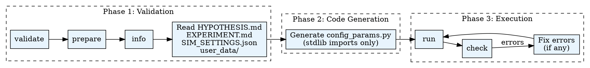

# Experiment Config

Generate and validate experiment configuration (`init_config.json` + `steps.yaml`) for AgentSociety2 simulations.

## When to Use

- User says "set up experiment", "configure simulation", "prepare experiment run"
- Hypothesis and `SIM_SETTINGS.json` exist and need `init_config.json` + `steps.yaml`
- User wants to validate, check, or fix an existing experiment configuration

**Do NOT use when:**
- No hypothesis or `SIM_SETTINGS.json` exists yet (use **hypothesis** skill first)
- User wants to *run* the experiment (use **run-experiment** skill)

## Quick Reference

| Action | Command | Purpose |
|--------|---------|---------|
| validate | `$PYTHON_PATH .agentsociety/bin/ags.py experiment-config validate --hypothesis-id ID --experiment-id ID` | Check setup and module selection |
| prepare | `$PYTHON_PATH .agentsociety/bin/ags.py experiment-config prepare --hypothesis-id ID --experiment-id ID` | Create `init/` directory and template |
| info | `$PYTHON_PATH .agentsociety/bin/ags.py experiment-config info --hypothesis-id ID --experiment-id ID` | Display selected module details |
| run | `$PYTHON_PATH .agentsociety/bin/ags.py experiment-config run --hypothesis-id ID --experiment-id ID` | Execute `config_params.py` to generate files |
| check | `$PYTHON_PATH .agentsociety/bin/ags.py experiment-config check --hypothesis-id ID --experiment-id ID` | Validate generated config by instantiating modules |

Use the Python interpreter from `.env`. See `CLAUDE.md` for setup.

## Entry Conditions

- `HYPOTHESIS.md` and `SIM_SETTINGS.json` already exist for the target experiment
- module names are already known, or can be confirmed with `scan-modules` when needed
- `user_data/` has been reviewed before generating defaults

## Common Mistakes

| Mistake | Fix |
|---------|-----|
| Using snake_case for agent/env types | Use class names: `PersonAgent`, `SimpleSocialSpace` |
| Putting params outside `kwargs` | All parameters must go in the `kwargs` dict |
| `agent_id` differs from `kwargs.id` | They must match exactly |
| Generating config without reading `user_data/` | Always read `user_data/` files first for parameter defaults |
| Missing `choices` on a `choice` question | Every `response_type: "choice"` question must have a `choices` list |
| Empty `questions` list in questionnaire step | Must contain at least one question with `id` and `prompt` |

## Pipeline Position

**Predecessors:** hypothesis
**Optional helpers:** scan-modules (when module names are unknown or need validation)
**Successors:** run-experiment
**Optional branches:** create-agent, create-env-module, create-dataset, use-dataset

## Directory Structure

```
hypothesis_{id}/
├── HYPOTHESIS.md              # Hypothesis description
├── SIM_SETTINGS.json          # Agent classes and env modules selection
└── experiment_{id}/
    ├── EXPERIMENT.md          # Experiment description
    └── init/
        ├── config_params.py      # Claude Code generates this
        ├── init_config.json      # Generated configuration
        └── steps.yaml            # Generated steps
```

## Workflow



### Phase 1 -- Validation

1. Run `validate` to confirm experiment setup and selected modules.
2. Run `prepare` to create `init/` directory and `config_params.py` template.
3. Run `info` to display selected module details.
4. Read `HYPOTHESIS.md`, `EXPERIMENT.md`, `SIM_SETTINGS.json`, and `user_data/` files.

### Phase 2 -- Code Generation

Generate `config_params.py` that:
- Uses **only** standard library imports (`json`, `pathlib`, `csv`)
- Reads from `user_data/` directory
- Outputs valid `init_config.json` and `steps.yaml` to stdout

**Delegate to subagent when:** the config involves many agents (10+) or complex step sequences (questionnaires, multi-phase interventions). Dispatch a subagent with all gathered Phase 1 context, instructing it to read `subagent-prompts/config-generator.md` and produce the script.

**Do NOT delegate:** simple configs with 1-3 agents and standard run/ask/intervene steps.

### Phase 3 -- Execution

1. Run `run` to execute `config_params.py` and write output files.
2. Run `check` to validate generated files (instantiates modules to verify).
3. Fix any validation errors and re-run.

## Configuration Structure

See [`references/config-structure.md`](references/config-structure.md) for the full schema of `init_config.json`, `steps.yaml`, and the `questionnaire` step type.

## Important Notes

1. Use class names as type identifiers (`PersonAgent`, not `person_agent`).
2. All parameters go in `kwargs`.
3. `agent_id` must equal `kwargs.id`.
4. Read `user_data/` files before generating configuration.
5. Questionnaire steps must include a non-empty `questions` list; each question needs `id` and `prompt`.
6. Choice questions must provide `choices`; validation will fail otherwise.

## Documentation Sync

After generating configuration, update `EXPERIMENT.md` with configuration parameters and agent selection criteria.

## Progress Tracking

After `config.py check` passes:
```bash
$PYTHON .agentsociety/bin/ags.py research-pipeline update-stage experiment_config completed
```
