# Hypothesis Management

Manage research hypotheses for AgentSociety experiments. Each hypothesis defines experiment groups (control/treatment) and specifies required agent classes and environment modules.

## When to Use

- User says "hypothesis", "research question", "experiment groups", or "control vs treatment"
- Literature search is done and user wants to formulate testable claims
- User needs to define what to compare in a simulation experiment

**Do NOT use when:**

- No literature search has been done yet (use literature-search first)
- User wants to run an existing experiment (use experiment-config)

## Quick Reference

Use the Python interpreter from `.env`. See `CLAUDE.md` for setup.
Run commands from the workspace root through `.agentsociety/bin/ags.py`.

| Action | Command |
|--------|---------|
| List hypotheses | `$PYTHON_PATH .agentsociety/bin/ags.py hypothesis list [--workspace PATH] [--json]` |
| Add hypothesis | `$PYTHON_PATH .agentsociety/bin/ags.py hypothesis add --description TEXT --rationale TEXT --groups JSON... --agent-classes TYPE... --env-modules TYPE... [--skip-module-validation] [--json]` |
| Get hypothesis | `$PYTHON_PATH .agentsociety/bin/ags.py hypothesis get --hypothesis-id ID [--json]` |
| Delete hypothesis | `$PYTHON_PATH .agentsociety/bin/ags.py hypothesis delete --hypothesis-id ID` |
| Discover modules if needed | `$PYTHON_PATH .agentsociety/bin/ags.py scan-modules list --short` |
| Inspect one module | `$PYTHON_PATH .agentsociety/bin/ags.py scan-modules info --type agent --name PersonAgent` |

## Workflow

```dot
digraph hypothesis_flow {
    rankdir=LR;
    node [shape=box, style=filled, fillcolor="#E8F4FD"];
    topic [label="read TOPIC.md\nand literature index"];
    clarify [label="clarify question\nand comparison goal"];
    names [label="agent/env names known?"];
    scan [label="scan-modules\noptional helper"];
    groups [label="define control\nand treatment groups"];
    write [label="write HYPOTHESIS.md\nand SIM_SETTINGS.json"];
    sync [label="sync TOPIC.md"];

    topic -> clarify -> names;
    names -> groups [label="yes"];
    names -> scan [label="no"];
    scan -> groups;
    groups -> write -> sync;
}
```



## Module Selection

Every hypothesis must specify at least one agent class and one environment module. If the exact names are uncertain, use `scan-modules` to discover or validate them before writing `SIM_SETTINGS.json`.

**Group JSON Format:**
```json
{
  "name": "treatment",
  "group_type": "treatment",
  "description": "Agents with high social capital scores",
  "agent_selection_criteria": "agents whose social_connections > median"
}
```

**Common Module Combinations:**

| Domain | Agent Classes | Environment Modules |
|--------|--------------|-------------------|
| Social simulation | `PersonAgent` | `SimpleSocialSpace GlobalInformationEnv` |
| Economic behavior | `LLMDonorAgent` | `EconomySpace` |
| Game theory | `PrisonersDilemmaAgent` | `PrisonersDilemmaEnv` |

## Output Structure

```
hypothesis_{id}/
  HYPOTHESIS.md         # Hypothesis description and groups
  SIM_SETTINGS.json     # Agent and environment module configuration
  experiment_1/
    EXPERIMENT.md
  experiment_2/
    EXPERIMENT.md
```

After adding/modifying/deleting a hypothesis, update `TOPIC.md` with the hypothesis overview and link.

## Common Mistakes

| Mistake | Fix |
|---------|-----|
| Writing `SIM_SETTINGS.json` with uncertain module names | Run `scan-modules` to confirm valid class and module names |
| Omitting agent classes or env modules | Both are required -- hypothesis creation will fail |
| Using invalid module names | Copy exact names from `ags.py scan-modules list --short` output |
| Forgetting to update TOPIC.md after changes | Always sync TOPIC.md with hypothesis overview |
| Defining only one group | Define at least a control and a treatment group for comparison |
| Not providing rationale | `--rationale` grounds the hypothesis in literature; do not skip it |

## Pipeline Position

**Predecessors:** literature-search
**Optional inputs:** web-research (supplementary non-academic context)
**Optional helpers:** scan-modules (when module names are unknown or need validation)
**Successors:** experiment-config

## Progress Tracking

After adding a hypothesis successfully:
```bash
$PYTHON .agentsociety/bin/ags.py research-pipeline update-stage hypothesis completed --metadata '{"hypotheses_count": N}'
```
