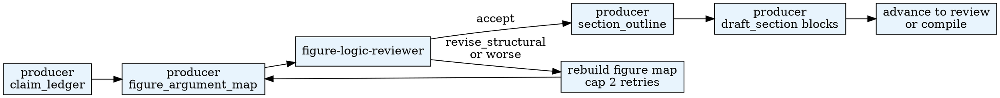

# Paper Architecture

Turn the storyline_map and research_pack into a structured argumentative
architecture — claim tree, figure-argument map, section outline — and
then draft manuscript sections block by block.

## When to Use

- `paper_state.current_phase = manuscript-build`
- `storyline_map.json` exists
- (Phase 4) `evidence_backlog.json` has been audited

**Do NOT use when:**

- `storyline_map.json` does not exist (run framing first)
- The phase is `skeptical-review` or later (re-architect only through revision-router)

## Quick Reference

| Action | CLI |
|--------|-----|
| Persist claim_ledger | `$PYTHON_PATH .agentsociety/bin/ags.py paper-orchestrator architecture --workspace <ws> --artifact claim_ledger --payload '<ClaimLedger JSON>'` |
| Persist figure_argument_map | `$PYTHON_PATH .agentsociety/bin/ags.py paper-orchestrator architecture --workspace <ws> --artifact figure_argument_map --payload '<FigureArgumentMap JSON>'` |
| Persist review round | `$PYTHON_PATH .agentsociety/bin/ags.py paper-orchestrator review --workspace <ws> --payload '<Review JSON>' --round <N>` |
| Compile PDF | `$PYTHON_PATH .agentsociety/bin/ags.py paper-orchestrator compile --workspace <ws>` |

Aliases: `paper-architecture`, `paper_architecture`.

## Workflow

## Subagent Delegation

| Role | Prompt file | Writes? |
|------|-------------|---------|
| producer (claim_tree) | `subagent-prompts/producer.md` | No — orchestrator persists |
| producer (figure_argument_map) | `subagent-prompts/producer.md` | No — orchestrator persists |
| producer (section_outline) | `subagent-prompts/producer.md` | No — outline in envelope only |
| producer (draft_section) | `subagent-prompts/producer.md` | YES — writes .md directly to disk |
| figure-logic-reviewer | `subagent-prompts/figure-logic-reviewer.md` | No — read-only reviewer |

## Pipeline Position

- **Predecessors:** `agentsociety-paper-framing` (Phase 3) or `agentsociety-paper-evidence-expansion` (Phase 4)
- **Successors:** `agentsociety-paper-skeptical-review` (Phase 4) or direct compile (Phase 3)

## Important Exception: Direct File Writes

The `draft_section` producer is the only subagent in the entire paper
harness that writes files directly to disk instead of returning content
in its envelope. This exception exists because shipping multi-KB markdown
through stdout JSON is fragile and error-prone.

**Contract:**
- The producer receives file paths in its input (`target_paths`).
- The producer writes the .md files at those paths.
- The producer emits its envelope as the **last line of stdout** after
  all writes complete.
- `artifacts_written` in the envelope lists the written paths.
- The orchestrator does NOT call a CLI persist subcommand for draft_section.
- The orchestrator verifies the files exist after the subagent returns.

## Common Mistakes

1. **Wrong CITE sentinel:** Always `[CITE:key]`, never `\cite{}` or
   `\supercite{}`. The compose pipeline handles conversion.
2. **Figure-argument map referencing phantom claims:** Every
   `claim_supported` in a figure must reference a claim ID that exists
   in the claim_ledger.
3. **Draft section inventing claims:** Each block may only use claims
   from `claims_for_block`. New claims must go through the claim_tree
   producer first.
4. **Workflow-ordered results:** Results sections must be ordered by
   argumentative strength, not by analysis chronology.
5. **Skipping figure-logic-reviewer:** Always run after
   figure_argument_map is persisted. Decorative figures kill papers.
6. **Overloading paragraphs:** Each paragraph must have one dominant
   function. Multi-purpose paragraphs create congestion.
