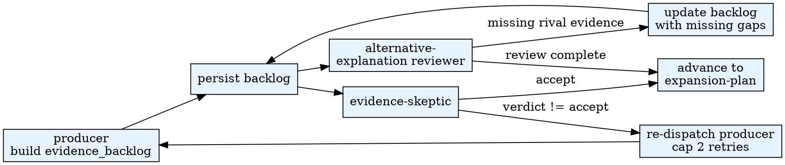

# Paper Evidence Expansion

Audit the claim_ledger against the research_pack evidence, identify
unsupported claims, and produce an `evidence_backlog` of prioritized
gaps — analyses, controls, robustness checks, figures, and experiments
needed to stabilize the paper.

## When to Use

- `paper_state.current_phase = evidence-audit`
- `storyline_map.json` AND `claim_ledger.json` both exist
- (Phase 4 full path) After framing, before manuscript-build

**Do NOT use when:**

- `claim_ledger.json` does not exist (run architecture/claim_tree first)
- The phase is `manuscript-build` or later (evidence expansion only
  through revision-router)

**Phase 3 short path skips this skill.** It is only invoked in Phase 4's
full pipeline: `intake → framing → evidence-audit → expansion-plan →
manuscript-build → skeptical-review → revision-router → release-gate`.

## Quick Reference

| Action | CLI |
|--------|-----|
| Persist evidence_backlog | `$PYTHON_PATH .agentsociety/bin/ags.py paper-orchestrator evidence --workspace <ws> --payload '<EvidenceBacklog JSON>'` |
| Persist review round | `$PYTHON_PATH .agentsociety/bin/ags.py paper-orchestrator review --workspace <ws> --payload '<Review JSON>' --round <N>` |

Aliases: `paper-evidence-expansion`, `paper_evidence_expansion`.

## Workflow

## Subagent Delegation

| Role | Prompt file | Writes? |
|------|-------------|---------|
| producer | `subagent-prompts/producer.md` | No — orchestrator persists |
| evidence-skeptic | `subagent-prompts/evidence-skeptic.md` | No — read-only reviewer |
| alternative-explanation-reviewer | `subagent-prompts/alternative-explanation-reviewer.md` | No — read-only reviewer |

## Pipeline Position

- **Predecessors:** `agentsociety-paper-framing` (storyline_map) + `agentsociety-paper-architecture` (claim_ledger from Phase 3 or Phase 4)
- **Successors:** `agentsociety-paper-architecture` (Phase 4 full path)

## Common Mistakes

1. **Running evidence-audit without claim_ledger** — the audit needs claims to check against evidence.
2. **Skipping alternative-explanation-reviewer** — unaddressed rival explanations are the most common reviewer objection.
3. **Marking everything as auto_executable** — be conservative; only analyses that can run without human judgment should be auto-executed.
4. **Ignoring low-provenance evidence** — claims built on low-provenance evidence are effectively unsupported.
