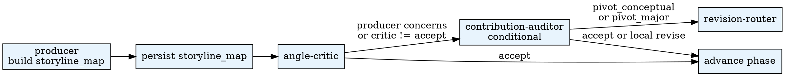

# Paper Framing

Translate the raw research pack into a **storyline_map**: one sharp
question, one defensible angle, one honest contribution type, and
explicit kill criteria that future reviewers can test. Framing is the
single highest-leverage step — errors here propagate through every
downstream artifact.

## When to Use

- `paper_state.current_phase = framing`
- `storyline_map.json` is missing, OR
- Latest review round targets `framing` with verdict >= `revise_structural`

**Do NOT use when:**

- `research_pack.json` does not exist (run `build-pack` first)
- The phase is `manuscript-build` or later (re-frame only through the revision-router)

## Quick Reference

| Action | CLI |
|--------|-----|
| Persist storyline_map | `$PYTHON_PATH .agentsociety/bin/ags.py paper-orchestrator framing --workspace <ws> --payload '<storyline_map JSON>'` |
| Persist review round | `$PYTHON_PATH .agentsociety/bin/ags.py paper-orchestrator review --workspace <ws> --payload '<Review JSON>' --round <N>` |

Aliases: `paper-framing`, `paper_framing`.

## Workflow

## Subagent Delegation

| Role | Prompt file | Writes? |
|------|-------------|---------|
| producer | `subagent-prompts/producer.md` | No — orchestrator persists |
| angle-critic | `subagent-prompts/angle-critic.md` | No — read-only reviewer |
| contribution-auditor | `subagent-prompts/contribution-auditor.md` | No — read-only reviewer |

## Pipeline Position

- **Predecessors:** `agentsociety-paper-adapter` (must produce `research_pack.json`)
- **Successors:** `agentsociety-paper-architecture` (Phase 3 short path) or `agentsociety-paper-evidence-expansion` (Phase 4 full path)

## Common Mistakes

1. **Running framing without research_pack** — the producer needs hypotheses, analysis summaries, and literature. Run `build-pack` first.
2. **Skipping angle-critic** — the producer's own angle always looks reasonable to itself. Always run the critic.
3. **Accepting a diffuse question** — "how does X affect Y" is not a question. It must be specific enough to kill.
4. **Allowing multiple contribution types** — one dominant type. Others are supporting.
5. **Empty kill_criteria** — if you cannot state what would falsify the angle, the angle is not sharp enough.
