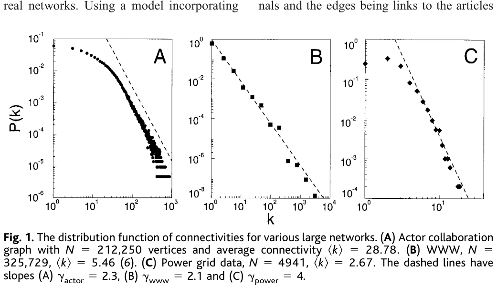
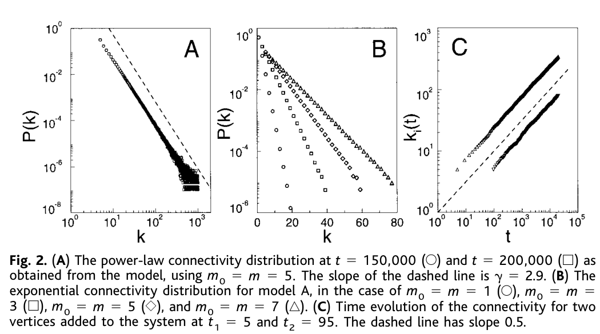

# Emergence of Scaling in Random Networks

**Authors:** Albert-László Barabási and Réka Albert

## 摘要（Abstract）

Systems as diverse as genetic networks or the World Wide Web are best described as networks with complex topology. A common property of many large networks is that the vertex connectivities follow a scale-free power-law distribution. This feature was found to be a consequence of two generic mechanisms: (i) networks expand continuously by the addition of new vertices, and (ii) new vertices attach preferentially to sites that are already well connected. A model based on these two ingredients reproduces the observed stationary scale-free distributions, which indicates that the development of large networks is governed by robust self-organizing phenomena that go beyond the particulars of the individual systems.

## 正文：引言、结果与讨论（不含方法）

The inability of contemporary science to describe systems composed of nonidentical elements that have diverse and nonlocal interactions currently limits advances in many disciplines, ranging from molecular biology to computer science (1). The difficulty of describing these systems lies partly in their topology: Many of them form rather complex networks whose vertices are the elements of the system and whose edges represent the interactions between them. For example, living systems form a huge genetic network whose vertices are proteins and genes, the chemical interactions between them representing edges (2). At a different organizational level, a large network is formed by the nervous system, whose vertices are the nerve cells, connected by axons (3). But equally complex networks occur in social science, where vertices are individuals or organizations and the edges are the social interactions between them (4), or in the World Wide Web (WWW), whose vertices are HTML documents connected by links pointing from one page to another (5, 6). Because of their large size and the complexity of their interactions, the topology of these networks is largely unknown. Traditionally, networks of complex topology have been described with the random graph theory of Erdo˝s and Re´nyi (ER) (7), but in the absence of data on large networks, the predictions of the ER theory were rarely tested in the real world. However, driven by the computerization of data acquisition, such topological information is increasingly available, raising the possibility of understanding the dynamical and topological stability of large networks. Here we report on the existence of a high degree of self-organization characterizing the large-scale properties of complex networks. Exploring several large databases describing the topology of large networks that span fields as diverse as the WWW or citation patterns in science, we show that, independent of the system and the identity of its constituents, the probability P(k) that a vertex in the network interacts with k other vertices decays as a power law, following P(k); k2g. This result indicates that large networks self-organize into a scale-free state, a feature unpredicted by all existing random network models. To explain the origin of this scale invariance, we show that existing network models fail to incorporate growth and preferential attachment, two key features of real networks. Using a model incorporating

these two ingredients, we show that they are responsible for the power-law scaling observed in real networks. Finally, we argue that these ingredients play an easily identifiable and important role in the formation of many complex systems, which implies that our results are relevant to a large class of networks observed in nature. Although there are many systems that form complex networks, detailed topological data is available for only a few. The collaboration graph of movie actors represents a well-documented example of a social network. Each actor is represented by a vertex, two actors being connected if they were cast together in the same movie. The probability that an actor has k links (characterizing his or her popularity) has a power-law tail for large k, following P(k); k2gactor, where gactor 5 2.3 6 0.1 (Fig. 1A). A more complex network with over 800 million vertices (8) is the WWW, where a vertex is a document and the edges are the links pointing from one document to another. The topology of this graph determines the Web’s connectivity and, consequently, our effectiveness in locating information on the WWW (5). Information about P(k) can be obtained using robots (6), indicating that the probability that k documents point to a certain Web page follows a power law, with gwww 5 2.1 6 0.1 (Fig. 1B) (9). A network whose topology reflects the historical patterns of urban and industrial development is the electrical power grid of the western United States, the vertices being generators, transformers, and substations and the edges being to the high-voltage transmission lines between them (10). Because of the relatively modest size of the network, containing only 4941 vertices, the scaling region is less prominent but is nevertheless approximated by a power law with an exponent gpower. 4 (Fig. 1C). Finally, a rather large complex network is formed by the citation patterns of the scientific publications, the vertices being papers published in refereed journals and the edges being links to the articles

cited in a paper. Recently Redner (11) has shown that the probability that a paper is cited k times (representing the connectivity of a paper within the network) follows a power law with exponent gcite 5 3. The above examples (12) demonstrate that many large random networks share the common feature that the distribution of their local connectivity is free of scale, following a power law for large k with an exponent g between 2.1 and 4, which is unexpected within the framework of the existing network models. The random graph model of ER (7) assumes that we start with N vertices and connect each pair of vertices with probability p. In the model, the probability that a vertex has k edges follows a Poisson distribution P(k) 5 e2llk/k!, where

ER random graph degree distribution: approximately binomial/Poisson for large N; this prediction is contrasted with the empirically observed power-law tails.

In the small-world model recently introduced by Watts and Strogatz (WS) (10), N vertices form a one-dimensional lattice, each vertex being connected to its two nearest and next-nearest neighbors. With probability p, each edge is reconnected to a vertex chosen at random. The long-range connections generated by this process decrease the distance between the vertices, leading to a small-world phenomenon (13), often referred to as six degrees of separation (14). For p 5 0, the probability distribution of the connectivities is P(k) 5 d(k 2 z), where z is the coordination number in the lattice; whereas for finite p, P(k) still peaks around z, but it gets broader (15). A common feature of the ER and WS models is that the probability of finding a highly connected vertex (that is, a large k) decreases exponentially with k; thus, vertices with large connectivity are practically absent. In contrast, the power-law tail characterizing P(k) for the networks studied indicates that highly connected (large k) vertices have a large chance of occurring, dominating the connectivity. There are two generic aspects of real networks that are not incorporated in these models. First, both models assume that we start with a fixed number (N) of vertices that are then randomly connected (ER model), or reconnected (WS model), without modifying N. In contrast, most real world networks are open and they form by the continuous addition of new vertices to the system, thus the number of vertices N increases throughout the lifetime of the network. For example, the actor network grows by the addition of new actors to the system, the WWW grows exponentially over time by the addition of new Web pages (8), and the research literature constantly grows by the publication of new papers. Consequently, a common feature of

these systems is that the network continuously expands by the addition of new vertices that are connected to the vertices already present in the system. Second, the random network models assume that the probability that two vertices are connected is random and uniform. In contrast, most real networks exhibit preferential connectivity. For example, a new actor is most likely to be cast in a supporting role with more established and better-known actors. Consequently, the probability that a new actor will be cast with an established one is much higher than that the new actor will be cast with other less-known actors. Similarly, a newly created Web page will be more likely to include links to well-known popular documents with already-high connectivity, and a new manuscript is more likely to cite a wellknown and thus much-cited paper than its less-cited and consequently less-known peer. These examples indicate that the probability with which a new vertex connects to the existing vertices is not uniform; there is a higher probability that it will be linked to a vertex that already has a large number of connections. We next show that a model based on these two ingredients naturally leads to the observed scale-invariant distribution. To incorporate the growing character of the network, starting with a small number (m0) of vertices, at every time step we add a new vertex with m(#m0) edges that link the new vertex to m different vertices already present in the system. To incorporate preferential attachment, we assume that the probability P that a new vertex will be connected to vertex i depends on the connectivity ki of that vertex, so that P(ki) 5 ki/Sjkj. After t time steps, the model leads to a random network with t 1 m0 vertices and mt edges. This network evolves into a scale-invariant state with the probability that a vertex has k edges, following a power law with an exponent gmodel 5 2.9 6 0.1 (Fig. 2A). Because the power law observed for real networks describes systems of rather different sizes at different stages of their development, it is expected that a correct model should provide a distribution whose main features are independent of time. Indeed, as Fig. 2A demonstrates, P(k) is independent of time (and subsequently independent of the system size m0 1 t), indicating that despite its continuous growth, the system organizes itself into a scale-free stationary state. The development of the power-law scaling in the model indicates that growth and preferential attachment play an important role in network development. To verify that both ingredients are necessary, we investigated two variants of the model. Model A keeps the growing character of the network, but preferential attachment is eliminated by assuming

that a new vertex is connected with equal probability to any vertex in the system [that is, P(k) 5 const 5 1/(m0 1 t 2 1)]. Such a model (Fig. 2B) leads to P(k); exp(2bk), indicating that the absence of preferential attachment eliminates the scalefree feature of the distribution. In model B, we start with N vertices and no edges. At each time step, we randomly select a vertex and connect it with probability P(ki) 5 ki/ Sjk j to vertex i in the system. Although at early times the model exhibits power-law scaling, P(k) is not stationary: because N is constant and the number of edges increases with time, after T. N 2 time steps the system reaches a state in which all vertices are connected. The failure of models A and B indicates that both ingredients—growth and preferential attachment—are needed for the development of the stationary power-law distribution observed in Fig. 1. Because of the preferential attachment, a vertex that acquires more connections than another one will increase its connectivity at a higher rate; thus, an initial difference in the connectivity between two vertices will increase further as the network grows. The rate at which a vertex acquires edges is ]ki/]t 5 ki/2t, which gives ki(t) 5 m(t/ti)0.5, where ti is the time at which vertex i was added to the system (see Fig. 2C), a scaling property that could be directly tested once time-resolved data on network connectivity becomes available. Thus older (with smaller ti) vertices increase their connectivity at the expense of the younger (with larger ti) ones, leading over time to some vertices that are highly connected, a “rich-get-richer” phenomenon that can be easily detected in real networks. Furthermore, this property can be used to calculate g analytically. The probability that a vertex i has a connectivity smaller than k, P[ki(t), k], can be written as P(ti. m2t/k2). Assuming that we add the vertices to the system at equal time intervals, we obtain P(ti. m2t/k2) 5 1 2 P(ti #

m2t/k2) 5 1 2 m2t/k2(t 1 m0). The probability density P(k) can be obtained from P(k) 5 ]P[ki(t), k]/]k, which over long time periods leads to the stationary solution

In the continuum solution of the growth plus preferential-attachment model, the stationary connectivity distribution follows P(k) ∼ 2m²/k³, giving γ = 3 independent of m.

giving g 5 3, independent of m. Although it reproduces the observed scale-free distribution, the proposed model cannot be expected to account for all aspects of the studied networks. For that, we need to model these systems in more detail. For example, in the model we assumed linear preferential attachment; that is, P(k); k. However, although in general P(k) could have an arbitrary nonlinear form P(k); ka, simulations indicate that scaling is present only for a 5 1. Furthermore, the exponents obtained for the different networks are scattered between 2.1 and 4. However, it is easy to modify our model to account for exponents different from g 5 3. For example, if we assume that a fraction p of the links is directed, we obtain g( p) 5 3 2 p, which is supported by numerical simulations (16). Finally, some networks evolve not only by adding new vertices but by adding (and sometimes removing) connections between established vertices. Although these and other system-specific features could modify the exponent g, our model offers the first successful mechanism accounting for the scale-invariant nature of real networks. Growth and preferential attachment are mechanisms common to a number of complex systems, including business networks (17, 18), social networks (describing individuals or organizations), transportation networks (19), and so on. Consequently, we expect that the scale-invariant state observed in all systems for which detailed data has been available to us is a generic property of many complex networks, with applicability reaching far beyond the quoted examples. A better description of these systems would help in understanding other complex systems

as well, for which less topological information is currently available, including such important examples as genetic or signaling networks in biological systems. We often do not think of biological systems as open or growing, because their features are genetically coded. However, possible scale-free features of genetic and signaling networks could reflect the networks’ evolutionary history, dominated by growth and aggregation of different constituents, leading from simple molecules to complex organisms. With the fast advances being made in mapping out genetic networks, answers to these questions might not be too far away. Similar mechanisms could explain the origin of the social and economic disparities governing competitive systems, because the scale-free inhomogeneities are the inevitable consequence of selforganization due to the local decisions made by the individual vertices, based on information that is biased toward the more visible (richer) vertices, irrespective of the nature and origin of this visibility.

## Figures / Assets

### Figure 1

**Caption:** Fig. 1. The distribution function of connectivities for various large networks. (A) Actor collaboration graph with N 5 212,250 vertices and average connectivity ^k& 5 28.78. (B) WWW, N 5 325,729, ^k& 5 5.46 (6). (C) Power grid data, N 5 4941, ^k& 5 2.67. The dashed lines have slopes (A) gactor 5 2.3, (B) gwww 5 2.1 and (C) gpower 5 4.

### Figure 2

**Caption:** Fig. 2. (A) The power-law connectivity distribution at t 5 150,000 (E) and t 5 200,000 (h) as obtained from the model, using m0 5 m 5 5. The slope of the dashed line is g 5 2.9. (B) The exponential connectivity distribution for model A, in the case of m0 5 m 5 1 (E), m0 5 m 5 3 (h), m0 5 m 5 5 ({), and m0 5 m 5 7 (‚). (C) Time evolution of the connectivity for two vertices added to the system at t1 5 5 and t2 5 95. The dashed line has slope 0.5.
