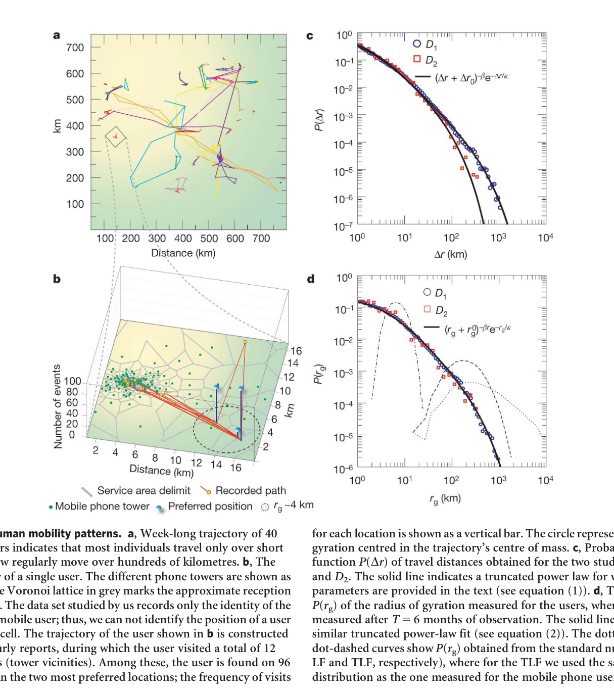
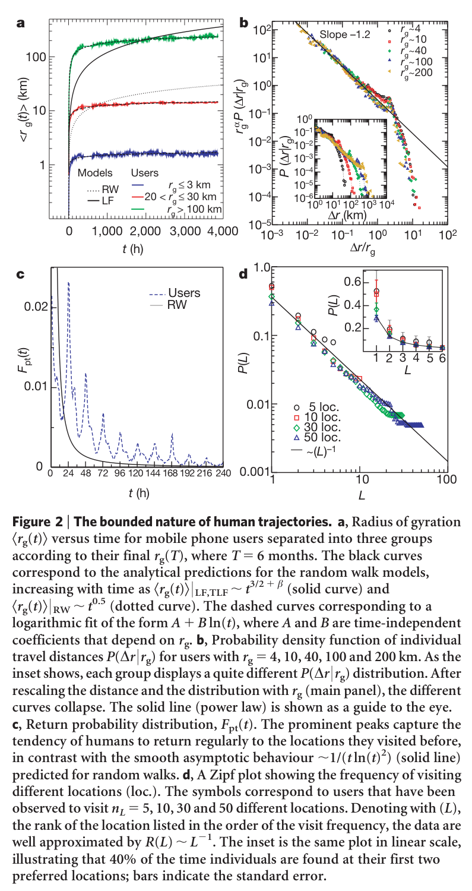
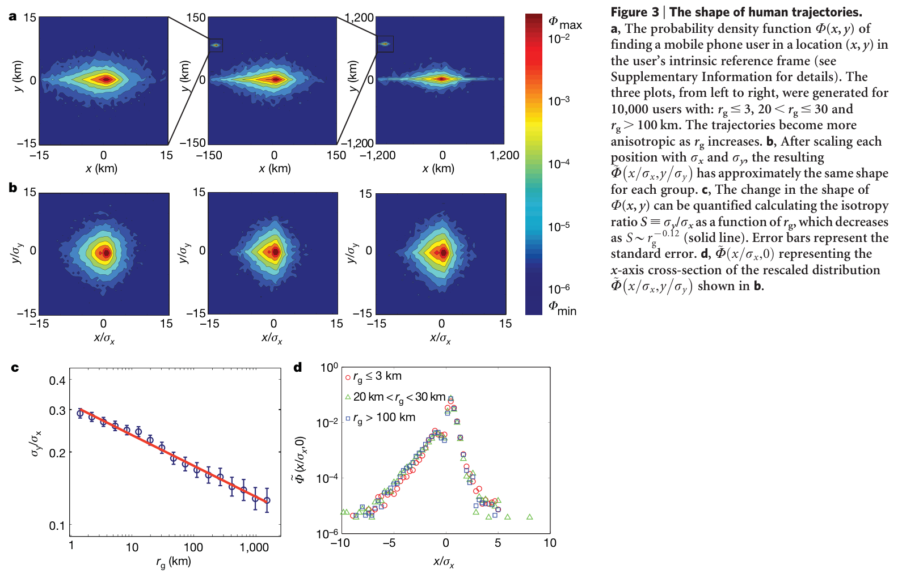

# Understanding individual human mobility patterns

**Authors:** Marta C. González, César A. Hidalgo and Albert-László Barabási

## 摘要（Abstract）

Despite their importance for urban planning1, traffic forecasting2

and the spread of biological3–5 and mobile viruses6, our understanding of the basic laws governing human motion remains limited owing to the lack of tools to monitor the time-resolved location of individuals. Here we study the trajectory of 100,000 anonymized mobile phone users whose position is tracked for a six-month period. We find that, in contrast with the random trajectories predicted by the prevailing Lévy flight and random walk models7, human trajectories show a high degree of temporal and spatial regularity, each individual being characterized by a time-independent characteristic travel distance and a significant probability to return to a few highly frequented locations. After correcting for differences in travel distances and the inherent anisotropy of each trajectory, the individual travel patterns collapse into a single spatial probability distribution, indicating that, despite the diversity of their travel history, humans follow simple reproducible patterns. This inherent similarity in travel patterns could impact all phenomena driven by human mobility, from epidemic prevention to emergency response, urban planning and agent-based modelling.

## 正文：引言、结果与讨论（不含方法）

Given the many unknown factors that influence a population’s mobility patterns, ranging from means of transportation to job- and family-imposed restrictions and priorities,human trajectories are often approximated with various random walk or diffusion models7,8. Indeed, early measurements on albatrosses9, followed by more recent data on monkeys and marine predators10,11, suggested that animal trajectory is approximated by a Lévy flight12,13—a random walk for which step size Dr follows a power-law distribution P(Dr), Dr2(11 b), where the displacement exponent b, 2. Although the Lévy statistics for some animals require further study14, this finding has been generalized to humans7, documenting that the distribution of distances between consecutive sightings of nearly half-a-million bank notes is fat-tailed.Given that money is carried by individuals, bank note dispersal is a proxy for human movement, suggesting that human trajectories are best modelled as a continuous-time random walk with fat-tailed displacements and waiting-time distributions7. A particle following a Lévy flight has a significant probability to travel very long distances in a single step12,13, which seems to be consistent with human travel patterns: most of the time we travel only over short distances, between home and work, whereas occasionally we take longer trips.

Each consecutive sighting of a bank note reflects the composite motion of two or more individuals who owned the bill between two reported sightings. Thus, it is not clear whether the observed distribution reflects the motion of individual users or some previously unknown convolution between population-based heterogeneities and individual human trajectories. Contrary to bank notes, mobile phones are carried by the same individual during his/her daily routine, offering the best proxy to capture individual human trajectories15–19.

We used two data sets to explore the mobility pattern of individuals. The first (D1) consisted of the mobility patterns recorded over

a six-month period for 100,000 individuals selected randomly from a sample of more than 6 million anonymized mobile phone users. Each time a user initiated or received a call or a text message, the location of the tower routeing the communication was recorded, allowing us to reconstruct the user’s time-resolved trajectory (Fig. 1a, b). The time between consecutive calls followed a ‘bursty’ pattern20 (see Supplementary Fig. 1), indicating that although most consecutive calls are placed soon after a previous call, occasionally there are long periods without any call activity. To make sure that the obtained results were not affected by the irregular call pattern, we also studied a data set (D2) that captured the location of 206 mobile phone users, recorded every two hours for an entire week. In both data sets, the spatial resolution was determined by the local density of the more than 104 mobile towers, registering movement only when the user moved between areas serviced by different towers. The average service area of each tower was approximately 3 km2, and over 30% of the towers covered an area of 1 km2 or less.

To explore the statistical properties of the population’s mobility patterns, we measured the distance between user’s positions at consecutive calls, capturing 16,264,308 displacements for the D1 and 10,407 displacements for the D2 data set. We found that the distribution of displacements over all users is well approximated by a truncated power-law:

Equation (1): P(Δr) ∼ (Δr + Δr₀)^(-β) exp(-Δr/κ).

with exponent b 5 1.75 6 0.15 (mean 6 standard deviation), Dr0 5 1.5 km and cutoff values k D1 j ~400 km and k D2 j ~80 km (Fig. 1c, see the Supplementary Information for statistical validation). Note that the observed scaling exponent is not far from b 5 1.59 observed in ref. 7 for bank note dispersal, suggesting that the two distributions may capture the same fundamental mechanism driving human mobility patterns.

Equation (1) suggests that human motion follows a truncated Lévy flight7. However, the observed shape of P(Dr) could be explained by three distinct hypotheses: first, each individual follows a Lévy trajectory with jump size distribution given by equation (1) (hypothesis A); second, the observed distribution captures a population-based heterogeneity, corresponding to the inherent differences between individuals (hypothesis B); and third, a population-based heterogeneity coexists with individual Lévy trajectories (hypothesis C); hence, equation (1) represents a convolution of hypotheses A and B.

To distinguish between hypotheses A, B and C, we calculated the radius of gyration for each user (see Supplementary Information), interpreted as the characteristic distance travelled by user a when observed up to time t (Fig. 1b). Next, we determined the radius of gyration distribution P(rg) by calculating rg for all users in samples D1 and D2, finding that they also can be approximated with a truncated power-law:

Equation (2): P(r_g) ∼ (r_g + r_g⁰)^(-β_r) exp(-r_g/κ).

with r0

g~5:8 km, br 51.6560.15 and k5 350km (Fig. 1d, see Supplementary Information for statistical validation). Lévy flights are characterized by a high degree of intrinsic heterogeneity, raising the possibility that equation (2) could emerge from an ensemble of identical agents, each following a Lévy trajectory. Therefore, we determined P(rg) for an ensemble of agents following a random walk (RW), Lévy flight (LF) or truncated Lévy flight (TLF) (Fig. 1d)8,12,13. We found that an ensemble of Lévy agents display a significant degree of heterogeneity in rg; however, this was not sufficient to explain the truncated power-law distribution P(rg) exhibited by the mobile phone users. Taken together, Fig. 1c and d suggest that the difference in the range of typical mobility patterns of individuals (rg) has a strong impact on the truncated Lévy behaviour seen in equation (1), ruling out hypothesis A.

If individual trajectories are described by an LF or TLF, then the radius of gyration should increase with time as rg(t), t3/(2 1 b)

(ref. 21), whereas, for an RW, rg(t), t1/2; that is, the longer we observe a user, the higher the chance that she/he will travel to areas not visited before. To check the validity of these predictions, we measured the time dependence of the radius of gyration for users whose gyration radius would be considered small (rg(T) # 3 km), medium (20, rg(T) # 30 km) or large (rg(T). 100 km) at the end of our observation period (T 5 6 months). The results indicate that

the time dependence of the average radius of gyration of mobile phone users is better approximated by a logarithmic increase, not only a manifestly slower dependence than the one predicted by a power law but also one that may appear similar to a saturation process (Fig. 2a and Supplementary Fig. 4).

In Fig. 2b, we chose users with similar asymptotic rg(T) after T 5 6 months, and measured the jump size distribution P(Drjrg) for each group. As the inset of Fig. 2b shows, users with small rg travel mostly over small distances, whereas those with large rg tend to display a combination of many small and a few larger jump sizes. Once we rescaled the distributions with rg (Fig. 2b), we found that the data collapsed into a single curve, suggesting that a single jump size distribution characterizes all users, independent of their rg. This indicates that P Dr rg

Scaling form: P(Δr | r_g) ∼ r_g^(-α) F(Δr/r_g), with F(x) ∼ x^(-α) for x < 1 and rapidly decreasing for x > 1.

, where a < 1.2 6 0.1 and F(x) is an rg-independent function with asymptotic behaviour, that is, F(x), x2a for x, 1 and F(x) rapidly decreases for x ? 1. Therefore, the travel patterns of individual users may be approximated by a Lévy flight up to a distance characterized by rg. Most important, however, is the fact that the individual trajectories are bounded beyond rg; thus, large displacements, which are the source of the distinct and anomalous nature of Lévy flights, are statistically absent. To understand the relationship between the different exponents, we note that the measured probability distributions are related

The measured probability distributions are related by P(Δr) = ∫ P(Δr | r_g) P(r_g) dr_g, implying β ≈ β_r + α − 1 to leading order.

drg, which suggests (see Supplementary Information) that up to the leading order we have b 5 br 1 a 2 1, consistent, within error bars, with the measured exponents. This indicates that the observed jump size distribution P(Dr) is in fact the convolution between the statistics of individual trajectories P(Drgjrg) and the population heterogeneity P(rg), consistent with hypothesis C.

To uncover the mechanism stabilizing rg, we measured the return probability for each individual Fpt(t) (first passage time probability)21,22, defined as the probability that a user returns to the position where he/she was first observed after t hours (Fig. 2c). For a two-dimensional random walk, Fpt(t) should follow,1/(t ln2(t)) (ref. 21). In contrast, we found that the return probability is characterized by several peaks at 24 h, 48 h and 72 h, capturing a strong tendency of humans to return to locations they visited before, describing the recurrence and temporal periodicity inherent to human mobility23,24.

To explore if individuals return to the same location over and over, we ranked each location on the basis of the number of times an individual was recorded in its vicinity, such that a location with L 5 3 represents the third-most-visited location for the selected individual. We find that the probability of finding a user at a location with a given rank L is well approximated by P(L), 1/L, independent of the number of locations visited by the user (Fig. 2d). Therefore, people devote most of their time to a few locations, although spending their remaining time in 5 to 50 places, visited with diminished regularity. Therefore, the observed logarithmic saturation of rg(t) is rooted in the high degree of regularity in the daily travel patterns of individuals, captured by the high return probabilities (Fig. 2b) to a few highly frequented locations (Fig. 2d).

An important quantity for modelling human mobility patterns is the probability density function Wa(x, y) to find an individual a in a given position (x, y). As it is evident from Fig. 1b, individuals live and travel in different regions, yet each user can be assigned to a well defined area, defined by home and workplace, where she or he can be found most of the time. We can compare the trajectories of different users by diagonalizing each trajectory’s inertia tensor, providing the probability of finding a user in a given position (see Fig. 3a) in the user’s intrinsic reference frame (see Supplementary Information for the details). A striking feature of W (x, y) is its prominent spatial anisotropy in this intrinsic reference frame (note the different scales in Fig. 3a); we find that the larger an individual’s rg, the more pronounced is this anisotropy. To quantify this effect, we defined the anisotropy ratio S; sy/sx, where sx and sy represent the standard deviation of the trajectory measured in the user’s intrinsic reference frame (see Supplementary Information). We found that S decreases monotonically with rg (Fig. 3c), being well approximated with S*r{g

g for g < 0.12. Given the small value of the scaling exponent, other functional forms may offer an equally good fit; thus, mechanistic models are required to identify if this represents a true scaling law or only a reasonable approximation to the data.

To compare the trajectories of different users, we removed the individual anisotropies, rescaling each user trajectory with its respective sx and sy. The rescaled ~W x=sx,y

distribution (Fig. 3b) is similar for groups of users with considerably different rg, that is, after the anisotropy and the rg dependence are removed all individuals seem to follow the same universal ~W ~x,~y ð Þ probability distribution. This is particularly evident in Fig. 3d, where we show the cross section of ~W x=sx,0 ð Þ for the three groups of users, finding that apart from the noise in the data the curves are indistinguishable.

Taken together, our results suggest that the Lévy statistics observed in bank note measurements capture a convolution of the population heterogeneity shown in equation (2) and the motion of individual users. Individuals display significant regularity, because they return to a few highly frequented locations, such as home or work. This regularity does not apply to the bank notes: a bill always follows the trajectory of its current owner; that is, dollar bills diffuse, but humans do not.

The fact that individual trajectories are characterized by the same rg-independent two-dimensional probability distribution

suggests that key statistical characteristics of individual trajectories are largely indistinguishable after rescaling. Therefore, our results establish the basic ingredients of realistic agent-based models, requiring us to place users in number proportional with the population density of a given region and assign each user an rg taken from the observed P(rg) distribution. Using the predicted anisotropic rescaling, combined with the density function

~W x,y ð Þ, the shape of which is provided as Supplementary Table 1, we can obtain the likelihood of finding a user in any location. Given the known correlations between spatial proximity and social links, our results could help quantify the role of space in network development and evolution25–29 and improve our understanding of diffusion processes8,30.

## Figures / Assets

### Figure 1

**Caption:** Figure 1 | Basic human mobility patterns. a, Week-long trajectory of 40 mobile phone users indicates that most individuals travel only over short distances, but a few regularly move over hundreds of kilometres. b, The detailed trajectory of a single user. The different phone towers are shown as green dots, and the Voronoi lattice in grey marks the approximate reception area of each tower. The data set studied by us records only the identity of the closest tower to a mobile user; thus, we can not identify the position of a user within a Voronoi cell. The trajectory of the user shown in b is constructed from 186 two-hourly reports, during which the user visited a total of 12 different locations (tower vicinities). Among these, the user is found on 96 and 67 occasions in the two most preferred locations; the frequency of visits for each location is shown as a vertical bar. The circle represents the radius of gyration centred in the trajectory’s centre of mass. c, Probability density function P(Dr) of travel distances obtained for the two studied data sets D1 and D2. The solid line indicates a truncated power law for which the parameters are provided in the text (see equation (1)). d, The distribution P(rg) of the radius of gyration measured for the users, where rg(T) was measured after T 5 6 months of observation. The solid line represents a similar truncated power-law fit (see equation (2)). The dotted, dashed and dot-dashed curves show P(rg) obtained from the standard null models (RW, LF and TLF, respectively), where for the TLF we used the same step size distribution as the one measured for the mobile phone users.

### Figure 2

**Caption:** Figure 2 | The bounded nature of human trajectories. a, Radius of gyration Ærg(t)æ versus time for mobile phone users separated into three groups according to their final rg(T), where T 5 6 months. The black curves correspond to the analytical predictions for the random walk models, increasing with time as Ærg(t)æ | LF,TLF, t3/2 1 b (solid curve) and Ærg(t)æ | RW, t0.5 (dotted curve). The dashed curves corresponding to a logarithmic fit of the form A 1 B ln(t), where A and B are time-independent coefficients that depend on rg. b, Probability density function of individual travel distances P(Dr |rg) for users with rg 5 4, 10, 40, 100 and 200 km. As the inset shows, each group displays a quite different P(Dr |rg) distribution. After rescaling the distance and the distribution with rg (main panel), the different curves collapse. The solid line (power law) is shown as a guide to the eye. c, Return probability distribution, Fpt(t). The prominent peaks capture the tendency of humans to return regularly to the locations they visited before, in contrast with the smooth asymptotic behaviour,1/(t ln(t)2) (solid line) predicted for random walks. d, A Zipf plot showing the frequency of visiting different locations (loc.). The symbols correspond to users that have been observed to visit nL 5 5, 10, 30 and 50 different locations. Denoting with (L), the rank of the location listed in the order of the visit frequency, the data are well approximated by R(L), L21. The inset is the same plot in linear scale, illustrating that 40% of the time individuals are found at their first two preferred locations; bars indicate the standard error.

### Figure 3

**Caption:** Figure 3 | The shape of human trajectories. a, The probability density function W(x, y) of finding a mobile phone user in a location (x, y) in the user’s intrinsic reference frame (see Supplementary Information for details). The three plots, from left to right, were generated for 10,000 users with: rg # 3, 20, rg # 30 and rg. 100 km. The trajectories become more anisotropic as rg increases. b, After scaling each position with sx and sy, the resulting has approximately the same shape for each group. c, The change in the shape of W(x, y) can be quantified calculating the isotropy ratio S; sy/sx as a function of rg, which decreases as S*r{0:12 g (solid line). Error bars represent the standard error. d, ~W x=sx,0 ð Þ representing the x-axis cross-section of the rescaled distribution ~W x=sx,y shown in b.
