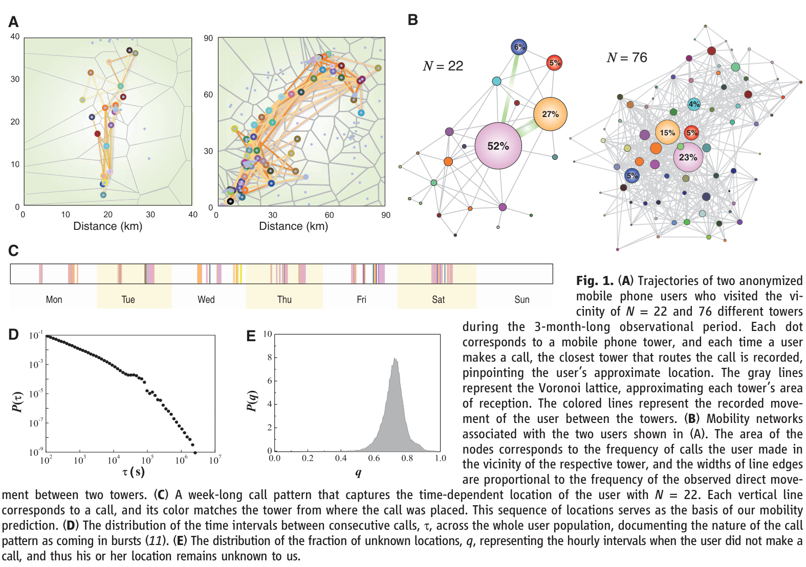
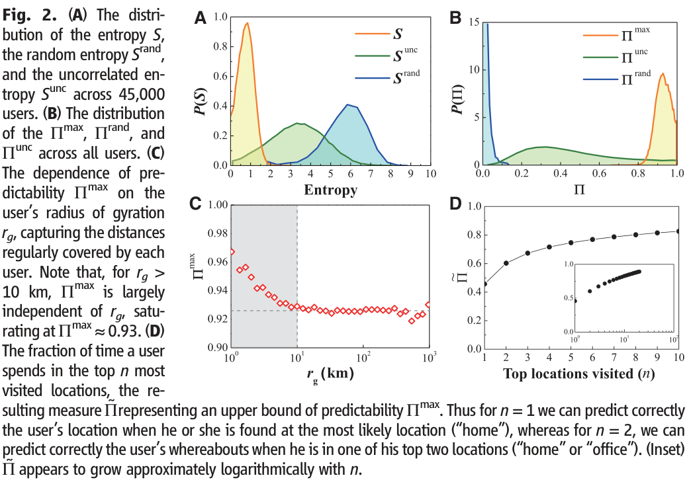
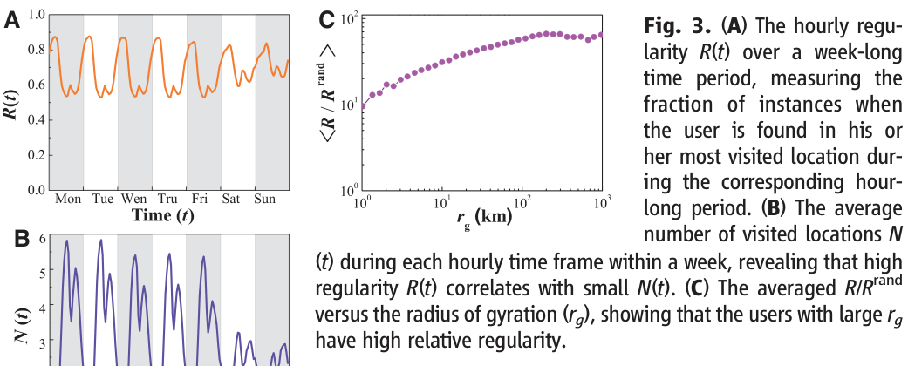

# Limits of Predictability in Human Mobility

**Authors:** Chaoming Song, Zehui Qu, Nicholas Blumm and Albert-László Barabási

## 摘要（Abstract）

A range of applications, from predicting the spread of human and electronic viruses to city planning and resource management in mobile communications, depend on our ability to foresee the whereabouts and mobility of individuals, raising a fundamental question: To what degree is human behavior predictable? Here we explore the limits of predictability in human dynamics by studying the mobility patterns of anonymized mobile phone users. By measuring the entropy of each individual’s trajectory, we find a 93% potential predictability in user mobility across the whole user base. Despite the significant differences in the travel patterns, we find a remarkable lack of variability in predictability, which is largely independent of the distance users cover on a regular basis. W

## 正文：引言、结果与讨论（不含方法）

When it comes to the emerging field of human dynamics, there is a fundamental gap between our intuition and the current modeling paradigms. Indeed, although we rarely perceive any of our actions to be random, from the perspective of an outside observer who is unaware of our motivations and schedule, our activity pattern can easily appear

random and unpredictable. Therefore, current models of human activity are fundamentally stochastic (1) from Erlang’s formula (2) used in telephony to Lévy-walk models describing human mobility (3–7) and their applications in viral dynamics (8–10), queuing models capturing human communication patterns (11–13), and models capturing body balancing (14) or panic (15). Yet the probabilistic nature of the existing modeling framework raises fundamental questions: What is the role of randomness in human behavior and to what degree are individual human actions predictable? Our goal here is to quantify

the interplay between the regular and thus predictable and the random and thus unforeseeable, probing through human mobility the fundamental limits that characterize the predictability of human dynamics. At present, the most detailed information on human mobility across a large segment of the population is collected by mobile phone carriers (4, 16–21). Mobile carriers record the closest mobile tower each time the user uses his or her phone. Here we use a 3-month-long record, collected for billing purposes and anonymized by the data source, capturing the mobility patterns of 50,000 individuals chosen from ~10 million anonymous mobile phone users with the criteria that they visit more than two locations (tower vicinity) during the observational period and that their average call frequency f is ≥0.5 hour−1 [(22) sections S1 and S2]. The trajectories of two users with widely different mobility patterns are shown in Fig. 1A: The first user moves in the vicinity of N = 22 towers in a 30-km region, whereas the second visits as many as N = 76 towers spanning approximately a 90-km neighborhood. To understand the recurrent nature of individual mobility, we assigned to each user a mobility network (23) (Fig. 1B), in which nodes are the locations visited by the user (each location corresponding to a

mobile phone tower, with about a 3-km2 reception area on average, representing the uncertainty in our ability to determine the user’s whereabouts), and links represent the observed movements between these. The uneven node sizes, corresponding to the percentage of time the user spent in the vicinity of the particular tower, indicate that individuals tend to spend most of their time in a few selected locations. Finally, each mobility network has an associated dynamical pattern (Fig. 1C), capturing the temporal sequence of towers visited by the user. Entropy is probably the most fundamental quantity capturing the degree of predictability characterizing a time series (24). We assign three entropy measures to each individual’s mobility pattern: (i) The random entropy Srand i ≡log2Ni, where Ni is the number of distinct locations visited by user i, capturing the degree of predictability of the user’s whereabouts if each location is visited with equal probability; (ii) the temporal-uncorrelated entropy Sunc i ≡ −∑Ni j¼1pið jÞ log2pið jÞ, where pi( j) is the historical probability that location j was visited by the user i, characterizing the heterogeneity of visitation patterns; (iii) the actual entropy, Si, which depends not only on the frequency of visitation, but also the order in which the nodes were visited and the time spent at each

location, thus capturing the full spatiotemporal order present in a person’s mobility pattern. To be specific, if Ti ¼ fX1; X2; ⋯; XLg denotes the sequence of towers at which user i was observed at each consecutive hourly interval, the entropy Si is given by −∑T0 i ⊂TiPðT 0 i Þlog2½PðT 0 i Þ, where P(Ti′) is the probability of finding a particular time-ordered subsequence Ti′ in the trajectory Ti [(22) section S4]. Naturally, for each user, Si ≤Sunc i ≤Srand i. To calculate the real entropy Si, we need a continuous (e.g., hourly) record of a user’s momentary location. Mobile phone records provide location information only when a person uses his or her phone. The users tend to place most of their calls in short bursts (11–13, 25) (Fig. 1D), followed by long periods with no call activity, during which we have no information about the user’s location (Fig. 1C). This incompleteness of the collected data is captured by the parameter q, representing the fraction of hourlong intervals when the user’s location is unknown to us. As Fig. 1E shows, P(q) across our user base peaked around q = 0.7, which indicated that, for a typical user, we have no location update for about 70% of the hourly intervals, which masks the user’s real entropy Si. We therefore studied the dependence of the entropy S(q) on the incompleteness q, which

allowed us to extrapolate the entropy to q = 0. We tested the method’s accuracy on the trajectory of 100 users whose whereabouts were recorded every hour [(22) section S4] and found that it performed well for q < 0.8, which represented 92% of the users in our data set. We therefore removed 5000 users with the highest q from our data set, which ensured that all remaining 45,000 users satisfied q < 0.8. To characterize the inherent predictability across the user population, we determined Si, Si unc, and Si rand for each user i; the obtained P(S), P(Sunc), and P(Srand) distributions are shown in Fig. 2A. The most striking result is the prominent shift of P(S) compared with P(S rand). Indeed, P(Srand) peaks at Srand ≈6, which indicates that, on average, each update of the user’s location represents six bits per hour of new information; that is, a user who chooses randomly his or her next location could be found on average in any of 2Srand ≈64 locations. In contrast, the fact that P(S) peaks at S = 0.8 indicates that the real uncertainty

in a typical user’s whereabouts is not 64 but 20.8 = 1.74, i.e., fewer than two locations. The typical distances covered by individuals during their daily mobility pattern, as captured by each user’s radius of gyration, rg, follows a fattailed distribution (4), which indicates that, although most individuals’ daily activity is confined to a limited neighborhood of 1 to 10 km, a few users regularly cover hundreds of kilometers (fig. S2). These differences suggest that predictability should also follow a fat-tailed distribution. In other words, we expect that individuals who travel less should be easy to predict (small entropy), whereas those with large rg should be much less predictable (high entropy). An important measure of predictability is the probability P that an appropriate predictive algorithm can predict correctly the user’s future whereabouts. This quantity is subject to Fano’s inequality (24, 26). That is, if a user with entropy S moves between N locations, then her or his

predictability P ≤Pmax(S,N), where Pmax is given by S = H(Pmax) + (1 – Pmax) log2(N – 1) with the binary entropy function H(Pmax) = –Pmax log2(Pmax) – (1 – Pmax) log2(1 – Pmax). For a user with Pmax = 0.2, this means that at least 80% of the time the individual chooses his location in a manner that appears to be random, and only in the remaining 20% of the time can we hope to predict his or her whereabouts. In other terms, no matter how good our predictive algorithm, we cannot predict with better than 20% accuracy the future whereabouts of a user with Pmax = 0.2. Therefore, Pmax represents the fundamental limit for each individual’s predictability. We determined Pmax separately for each user in the database. To our surprise, we found that P(Pmax) does not follow the fat-tailed distribution suggested by the travel distances, but it is narrowly peaked near Pmax ≈0.93 (Fig. 2B). This highly bounded distribution indicates that, despite the apparent randomness of the individuals’ trajectories, a historical record of the daily mobility pattern of the users hides an unexpectedly high degree of potential predictability. We have also determined the maximal predictability Punc and the random predictability Prand

extracted from Sunc and Srand. As Fig. 2B shows, the result is strikingly different—P(Punc) is extremely widely distributed and peaked at Punc ~ 0.3, which indicates that, if we rely only on the heterogeneous spatial distribution, the predictability across the whole population is insignificant and varies widely from person to person. Similarly, P(Prand) has a peak at Prand = 0, which suggests not only that Prand and Punc are ineffective as predictive tools, but also that a significant share of predictability is encoded in the temporal order of the visitation pattern. How can we reconcile the wide variability in the observed travel distances, as captured by the fat-tailed P(rg), with the highly bounded predictability observed across the user population? To answer this, we measured the dependency of Pmax on rg, and found that, for rg ≥10 km, predictability becomes largely independent of rg, saturating at Pmax ≈0.93 (Fig. 2C). Therefore, Fig. 2C explains the failure of our earlier hypothesis: Individuals with rg ≥100 km, covering hundreds of kilometers on a regular basis, are just as predictable as those whose life is constrained to a rg ≈10-km neighborhood, a saturation that lies behind the high predictability observed across the whole user base. To determine how much of our predictability is really rooted in the visitation patterns of the top locations, we calculated the probability ˜P that, in a given moment, the user is in one of the top n most visited locations, where n = 2 typically captures home and work. Thus, ˜P represents an upper bound for Pmax, as, even if our predictive algorithm is 100% accurate, it can foresee the future location only when the user is found in one of the top n locations monitored by the algorithm. As Fig. 2D shows, the top two locations (n = 2)

offer only a 60% overall predictability. Gradually adding more locations increases ˜PðnÞ, but we need several dozen distinct locations to converge to ˜P ¼ 1 (Fig. 2D, inset). To understand the origin of the observed high potential predictability, we segmented each week into 24 × 7 = 168 hourly intervals, and within each hour, we identified for each user the most visited location (Fig. 3, A and B). For example, if, between 8 and 9 a.m. on Monday, a user was found 10 times at tower 1, twice at tower 2, and once at tower 3, we assumed that her most likely location during this hour will be tower 1. Next, we measured each user’s regularity, R, defined as the probability of finding the user in his most visited location during that hour. R represents a lower bound for predictability P, as it ignores the temporal correlations in user mobility. We found that across the whole user base, R ≈0.7, which meant that, on average, 70% of the time the most visited location coincides with the user’s actual location. The pattern is time dependent: During the night, when most people tend to be reliably at home, R peaks at ≈0.9, but between noon and 1 p.m. and between 6 and 7 p.m., R has clear minima, corresponding to transition periods (travel to lunch or home). Indeed, if we measure the total number of distinct locations N(t) a user visited each hour (Fig. 3B), we find that moments of low regularity R correspond to significant increase in N(t), a signature of high mobility, and when R peaks there is a drop in N(t). If the users were to move randomly between their N locations, then Rrand = 1/N, which is 1=2Srand≈0:016, an order of magnitude smaller than the observed R ≈0.7. This gap once again indicates that the high regularity characterizing each user’s mobility represents a significant departure from the expectation that they will be random. In Fig. 3C, we plot the relative regularity R/Rrand as a function of rg, observing a clearly increasing tendency. That is, counterintuitively, the relative regularity of users who travel the most (i.e., have high rg) is higher than the relative regularity of the more homebound individuals. To explore whether demographic factors influence the users’ regularity and predictability, we measured R and Pmax for different age and gender groups (fig. S10). It was surprising that we did not observe gender- or age-based differences in Pmax, but only a systematic, but statistically insignificant, gender-based difference emerged in regularity. We also explored the impact of home, language groups, population

density, and rural versus urban environment on predictability and found only insignificant variations (figs. S8, S12, and S13). Finally, we did not find significant changes in user regularity over the weekends compared with their weekday mobility (fig. S8), which suggested that regularity is not imposed by the work schedule, but potentially is intrinsic to human activities. In summary, the combination of the empirically determined user entropy and Fano’s inequality indicates that there is a potential 93% average predictability in user mobility, an exceptionally high value rooted in the inherent regularity of human behavior. Yet it is not the 93% predictability that we find the most surprising. Rather, it is the lack of variability in predictability across the population. Indeed, given the fat-tailed distribution of the distances over which users travel on a regular basis (see fig. S2), most individuals are well localized in a finite neighborhood, but a few travel widely. Furthermore, a number of demographic and external parameters, from age to population density and the number of towers visited, vary widely from user to user. It is not unreasonable to expect, therefore, that predictability should also vary widely: For people who travel little, it should be easier to foresee their location, whereas those who regularly cover hundreds of kilometers should have a low predictability. Despite this inherent population heterogeneity, the maximal predictability varies very little—indeed P(Pmax) is narrowly peaked at 93%, and we see no users whose predictability would be under 80%. Although making explicit predictions on user whereabouts is beyond our goals here, appropriate data-mining algorithms (19, 20, 27) could turn the predictability identified in our study into actual mobility predictions. Most important, our results indicate that when it comes to processes driven by human mobility, from epidemic modeling to urban planning and traffic engineering, the development of accurate predictive models is a scientifically grounded possibility, with potential impact on our well-being and public health. At a more fundamental level, they also indicate that, despite our deep-rooted desire for change and spontaneity, our daily mobility is, in fact, characterized by a deep-rooted regularity.

## Figures / Assets

### Figure 1

**Caption:** Fig. 1. (A) Trajectories of two anonymized mobile phone users who visited the vicinity of N = 22 and 76 different towers during the 3-month-long observational period. Each dot corresponds to a mobile phone tower, and each time a user makes a call, the closest tower that routes the call is recorded, pinpointing the user’s approximate location. The gray lines represent the Voronoi lattice, approximating each tower’s area of reception. The colored lines represent the recorded movement of the user between the towers. (B) Mobility networks associated with the two users shown in (A). The area of the nodes corresponds to the frequency of calls the user made in the vicinity of the respective tower, and the widths of line edges are proportional to the frequency of the observed direct movement between two towers. (C) A week-long call pattern that captures the time-dependent location of the user with N = 22. Each vertical line corresponds to a call, and its color matches the tower from where the call was placed. This sequence of locations serves as the basis of our mobility prediction. (D) The distribution of the time intervals between consecutive calls, t, across the whole user population, documenting the nature of the call pattern as coming in bursts (11). (E) The distribution of the fraction of unknown locations, q, representing the hourly intervals when the user did not make a call, and thus his or her location remains unknown to us.

### Figure 2

**Caption:** Fig. 2. (A) The distribution of the entropy S, the random entropy Srand, and the uncorrelated entropy Sunc across 45,000 users. (B) The distribution of the Pmax, Prand, and Punc across all users. (C) The dependence of predictability Pmax on the user’s radius of gyration rg, capturing the distances regularly covered by each user. Note that, for rg > 10 km, Pmax is largely independent of rg, saturating at Pmax ≈0.93. (D) The fraction of time a user spends in the top n most visited locations, the resulting measureP˜ representing an upper bound of predictability Pmax. Thus for n = 1 we can predict correctly the user’s location when he or she is found at the most likely location (“home”), whereas for n = 2, we can predict correctly the user’s whereabouts when he is in one of his top two locations (“home” or “office”). (Inset) P˜ appears to grow approximately logarithmically with n.

### Figure 3

**Caption:** Fig. 3. (A) The hourly regularity R(t) over a week-long time period, measuring the fraction of instances when the user is found in his or her most visited location during the corresponding hourlong period. (B) The average number of visited locations N (t) during each hourly time frame within a week, revealing that high regularity R(t) correlates with small N(t). (C) The averaged R/Rrand versus the radius of gyration (rg), showing that the users with large rg have high relative regularity.
