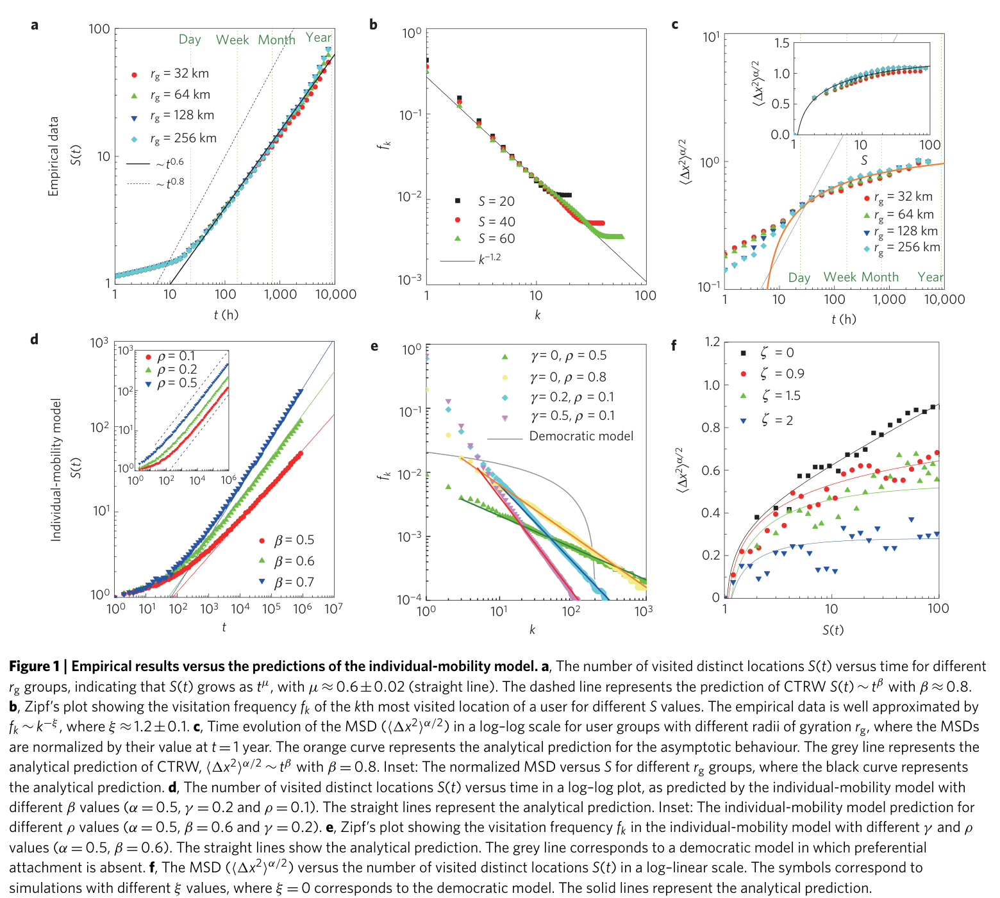
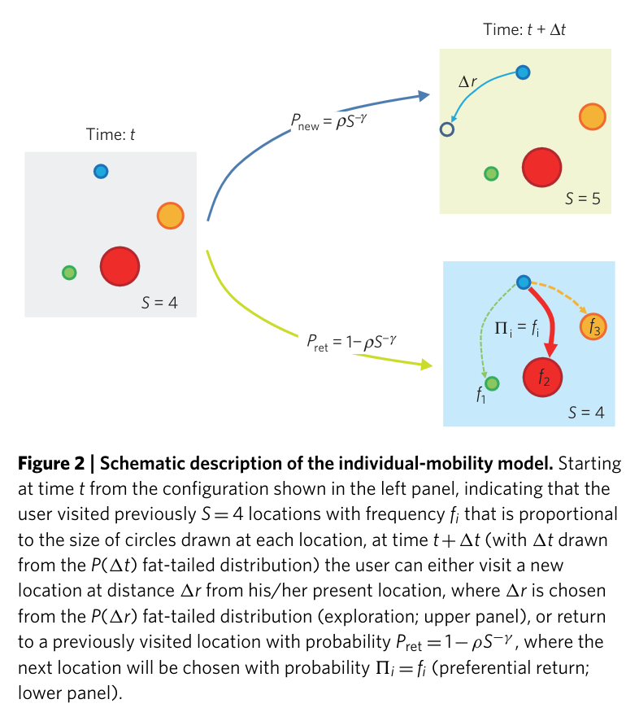
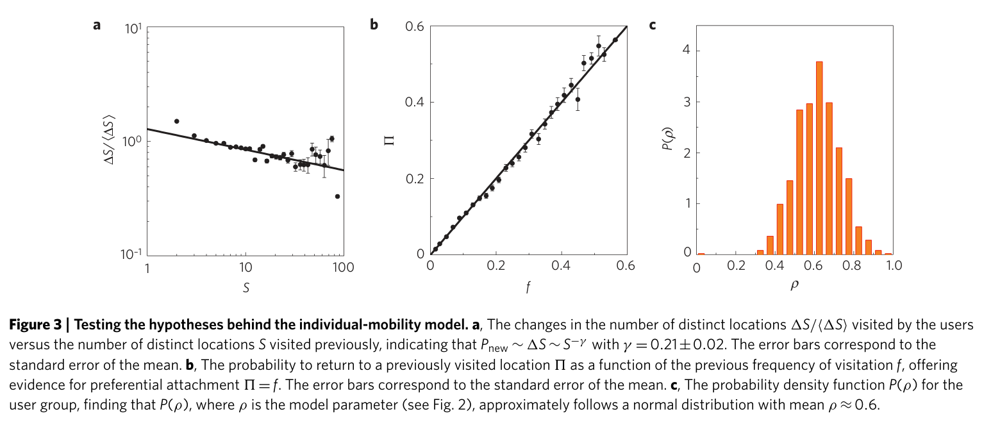
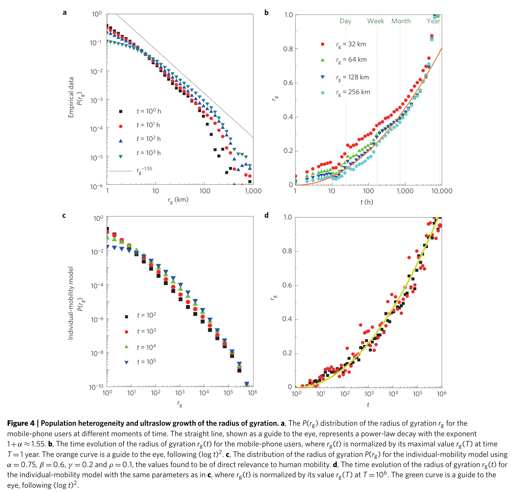

# Modelling the scaling properties of human mobility

**Authors:** Chaoming Song, Tal Koren, Pu Wang and Albert-László Barabási

## 摘要（Abstract）

Individual human trajectories are characterized by fat-tailed distributions of jump sizes and waiting times, suggesting the relevance of continuous-time random-walk (CTRW) models for human mobility. However, human traces are barely random. Given the importance of human mobility, from epidemic modelling to traffic prediction and urban planning, we need quantitative models that can account for the statistical characteristics of individual human trajectories. Here we use empirical data on human mobility, captured by mobile-phone traces, to show that the predictions of the CTRW models are in systematic conflict with the empirical results. We introduce two principles that govern human trajectories, allowing us to build a statistically self-consistent microscopic model for individual human mobility. The model accounts for the empirically observed scaling laws, but also allows us to analytically predict most of the pertinent scaling exponents. U

## 正文：引言、结果与讨论（不含方法）

Uncovering the statistical patterns that characterize the trajectories humans follow during their daily activity is not only a major intellectual challenge, but also of importance for public health1–5, city planning6–8, traffic engineering9,10 and economic forecasting11. For example, quantifiable models of human mobility are indispensable for predicting the spread of biological pathogens1–5 or mobile-phone viruses12. In the past few years the availability of mobile-phone records, global-positioning-system data and other data sets capturing aspects of human mobility have given a new empirically driven momentum to the subject. Although the available data sets significantly differ in their reach and resolution, the results seem to agree on a number of quantitative characteristics of human mobility. For example, both dollar-bill tracking13 and mobile-phone data14 indicate that the aggregated jump-size (1r) and waiting-time (1t) distributions characterizing human trajectories are fat-tailed, that is, P(1r) ∼|1r|−1−α and P(1t) ∼|1t|−1−β with 0 < α ≤2 and 0 < β ≤1, where 1r denotes the distances covered by an individual between consecutive sightings and 1t is the time spent by an individual at the same location. These findings suggest that human trajectories are best described as Lévy flights or CTRWs, a much studied modelling framework in the random-walk community13,15–20. The purpose of the present Article is to show, using a series of direct measurements, that human trajectories do follow several highly reproducible scaling laws. Yet, many of these laws are either not explained by the CTRW model, or they are in direct contradiction with the CTRW predictions, indicating the lack of a modelling framework capable of capturing the basic features of human mobility. To explain the origin of the observed scaling laws, we introduce two principles that govern human mobility, serving as the starting point of a statistically acceptable microscopic model for individual human motion. We show that the model can account for the empirically observed scaling laws and allows us to analytically predict the pertinent scaling exponents.

Scaling anomalies We used two data sets to uncover the patterns characterizing individual mobility. The first data set (D1) captures for a one-year

period the time-resolved trajectories of three million anonymized mobile-phone users. Each time a user initiated or received a phone call the tower that routed the communication was recorded for billing purposes. Thus, the user’s location was recorded with the resolution that is determined by the local tower density. The reception area of a tower varies from as little as a few hundred metres in metropolitan areas to a few kilometres in rural regions, controlling our uncertainty about the user’s precise location. However, as here we focus on the asymptotic scaling properties of human trajectories, these short distance uncertainties are not expected to affect our results (see Supplementary Section S2). The second data set (D2) uses the anonymized location record of 1,000 users who signed up for a location-based service; thus, their location was recorded every hour for a two-week period. As a first step we calculated the displacement at hourly intervals, finding P(1r) ∼|1r|−1−α with α = 0.55 ± 0.05 and an expected cutoff at 1r ∼100 km, corresponding to the distance people could reasonably cover in an hour. We used the D2 data set to measure P(1t), where the waiting time 1t is defined as the time a user spent at one location. We find that P(1t) follows P(1t) ∼|1t|−1−β with β = 0.8 ± 0.1 and a cutoff of 1t = 17 h, probably capturing the typical awake period of an individual. Taken together, the fat-tailed natures of P(1r) and P(1t) suggest that humans follow a CTRW during their daily mobility. Next we discuss three empirical observations that indicate that human trajectories follow reproducible scaling laws, but also illustrate the shortcoming of the CTRW model in capturing the observed scaling properties. (A) The number of distinct locations S(t) visited by a randomly moving object is expected to follow21–23

Equation (1): S(t) ∼ t^μ.

where µ = 1 for Lévy flights24 and µ = β for CTRW. Interestingly, our measurements indicate that for humans µ = 0.6 ± 0.02 (see Fig. 1a), smaller than the CTRW prediction of β = 0.8±0.1. The fact that µ < 1 indicates a slow-down at large timescales, a decreasing tendency of the user to visit previously unvisited locations.

(B) Visitation frequency: the probability f of a user to visit a given location is expected to be asymptotically (t →∞) uniform everywhere (f ∼const.) for both Lévy flights and CTRWs. In contrast, the visitation patterns of humans is rather uneven, so that the frequency f of the kth most visited location follows Zipf’s law14

Equation (2): f_k ∼ k^(-ζ).

where ζ ≈1.2 ± 0.1 (see Fig. 1b). This suggests that the visitation frequency distribution follows P(f )∼f −(1+1/ζ). (C) Ultraslow diffusion: the CTRW model predicts that the mean square displacement (MSD) asymptotically follows ⟨1x2(t)⟩∼t ν with ν = 2β/α ≈3.1. As both P(1r) and P(1t) have cutoffs, asymptotically the MSD should converge to a Brownian behaviour with ν =1. However, this convergence is too slow25 to be relevant in our observational time frame. Either way, CTRW predicts that the longer we follow a human trajectory, the further it will drift from its initial position. Yet, humans have a tendency to return home on a daily basis, suggesting that simple diffusive processes, which are not recurrent in two dimensions, do not offer a suitable description of

human mobility. Indeed, our measurements indicate an ultraslow diffusive process, in which the MSD seems to follow a slower than logarithmic growth (see Fig. 1c and ref. 14). Such ultraslow growth of the MSD is rare in diffusion, having been observed before only in a few disordered systems, from glasses (for example the Sinai model26) to polymers27 and iterated maps28. On one hand, the findings summarized in A–C indicate that individual human mobility does follow reproducible scaling laws, the origins of which remain to be uncovered. Yet, they also document systematic deviations from the predictions of the Lévyflight- or CTRW-based null models. The main purpose of this Article is to offer a model that not only explains the origin of anomalies A–C, but also leads to a self-consistent statistical model of individual human mobility.

Generic mechanisms and individual mobility model As we build our model, we will take for granted the observations that the jump-size P(1r) and the waiting-time P(1t) distributions characterizing individual human trajectories are heavy-tailed, a phenomenon addressed by a series of models29–33. Yet, P(1r) and P(1t) alone are not sufficient to explain scaling laws A–C. We

propose that the main reason for this discrepancy is that two generic mechanisms, exploration and preferential return, both unique to human mobility, are missing from the traditional random-walk (Lévy-flight or CTRW) models. (i) Exploration: random-walk models assume that the next diffusive step is independent of the previously visited locations. In contrast, the scaling law (1) indicates that the tendency to explore additional locations decreases with time. Indeed, the longer we observe a person’s trajectory, the harder it is to find locations in the vicinity of their home/workplace that they have not yet visited. (ii) Preferential return: in contrast with the random-walk-based models for which the visitation probability is random and uniform in space, humans show significant propensity to return to the locations they visited frequently before, such as their home or workplace. In what follows we present an individual-mobility model that incorporates ingredients (1) and (2), showing that they are sufficient to explain anomalies A–C. The model, intended to describe the trajectory of an individual, assumes that at time t = 0 the individual is at some preferred location (see Fig. 2). After a waiting time 1t chosen from the P(1t) distribution, the individual will change his/her location. We assume that the individual has two choices. (i) Exploration: with probability

Equation (3): P_new = ρ S^(-γ).

the individual moves to a new location (different from the S locations he/she visited before). The distance 1r that he/she covers during this exploratory jump is chosen from the P(1r) distribution and his/her direction is selected to be random. As the individual moves to this new position, the number of previously visited locations increases from S to S + 1. (ii) Preferential return: with the complementary probability Pret = 1−ρS−γ the individual returns to one of the S previously visited locations. In this case, the probability 5i to visit location i is chosen to be proportional to the number of visits the user previously had to that location. That is, we assume that

Equation (4): Π_i = f_i.

an assumption known as preferential attachment or cumulative advantage in network and social science34–38.

Model predictions The individual-mobility model has two parameters, 0 < ρ ≤1 and γ ≥0, both of which control the user’s tendency to explore a new location during his/her next move versus returning to a previously visited location. The numerical values of these two parameters will be determined later from the empirical data. To explain the origin of the anomaly A, we note that in the individual-mobility model the probability that an individual moves to a new location is proportional to S−γ, that is, dS/dn ∝S−γ, predicting S ∼n1/(1+γ ), where n is the total number of discrete moves the individual had up to time t. For a fat-tailed waiting-time distribution P(1t)∼|1t|−1−β the time t scales with the number of jumps n as t ∼n1/β (Supplementary Section S4A), showing that S(t) follows (1) with the exponent

Equation (5): μ = β/(1 + γ).

To verify the validity of this prediction for the individual-mobility model, in Fig. 1d we calculated S(t) numerically for different values of β, finding that the asymptotic scaling exponent of S(t) follows equation (5). Therefore, we predict that µ ≤β, in line with the empirical data. To account for anomaly B we notice that mi, the number of visits to location i, increases as dmi/dn = 5i(1 −Pnew), where 5i = fi = mi/6imi(n) is the probability to return to the location i during step n. When γ > 0, in the limit of S(t) →∞the probability to explore a new location is negligible compared with the return visits; thus, asymptotically we have dmi/dn = mi/6imi(n). As 6imi(n) = n, we obtain mi(n) = n/ni, where ni denotes the jump during which location i was first visited, at which moment mi(ni) = 1. Owing to preferential return (4), the earlier a location is visited, the more it is visited later. Thus, the ranking ki for location i coincides with the order in which it was first visited, that is, ki = S(ni) ∼n1/(1+γ ) i. As the visitation frequency fi is proportional to mi(n) = n/ni, we have fk ∼k−ζ with the exponent ζ = 1+γ. In general, we find (Supplementary Section S4C)

Equation (6): ζ = 1 + γ for γ > 0; ζ = 1 − ρ for γ = 0.

Note that for γ = 0 and ρ = 1 equation (6) predicts ζ = 0, indicating, as expected, that the visitation becomes homogeneous in the CTRW limit. To test the validity of prediction (6), in Fig. 1e we measured fk for different values of γ and ρ in the individual-mobility model, finding that the numerically observed scaling behaviour is in agreement with equation (6). The model also suggests that the observed Zipf’s law is rooted mainly in the preferential return (4). Indeed, if we calculate fk for a ‘democratic’ model in which 5i is independent of fi (that is, the individual visits the previously visited locations with the same likelihood), Zipf’s law vanishes (see Fig. 1e). To understand the origin of anomaly C, we note that the number of jumps to new locations l relates to the displacement 1r as 1r ∼l1/α (Supplementary Section S4A), suggesting that ⟨1r2⟩∼⟨l2/α⟩= Pn l=1 l2/αP(l|S), where P(l|S) is the probability that the Sth location is l steps away from the starting point of the individual. Note that l is different from n, as l counts only moves that result in a jump to some new location, so l ≤n. P(l|S) follows the recurrent equation P(l|S) = PS i=1P(l −1|k)f S k, where each term within the sum represents a jump from the kth location to the Sth location. Here f s i is the probability of visitation of the kth location given that the total number of locations visited previously is S −1, and is well approximated by Zipf’s law (2)

f s k ≈(ζ −1)/(1 −S1−ζ)k−ζ. By applying this approximation (see Supplementary Section S4D), we find 1x2 α/2 ∼log 1−S1−ζ

Equation (7): ⟨Δx²⟩^(α/2) grows logarithmically with the number of visited distinct locations S, according to the approximation derived in the paper.

which relates the MSD to the number of distinct locations S visited by the user. In Fig. 1c,f, we plot the MSD versus S for different values of ζ, finding that equation (7) agrees well with the numerical results. Furthermore, in the inset of Fig. 1c we plot the prediction (7) against the empirical data, again with excellent agreement. To determine the explicit time dependence of MSD, we use Equations (1) and (5) to predict three possible scaling regimes for large t (or S). (a) For ζ <1 (γ =0 and ρ <1), S1−ζ diverges and thus the MSD grows with time as (log t)2/α. In this regime the visitation frequency P(f ) ∼f −(1+1/ζ) has an exponent greater than two and thus the diffusion is dominated by the infrequently visited locations. (b) For ζ =1, we have (ζ −1)/(1−S1−ζ)=log(S), and thus the MSD ∼log(log(t))2/α. (c) For ζ > 1, S1−ζ approaches zero for large S and thus the MSD is expected to saturate. This is because P(f ) decays with an exponent that has a value of less than two and thus the individual’s motion is dominated by his/her most visited location. To compare further the individual-mobility model with the empirical data, we first need to test the validity of hypotheses (i) and (ii) as formulated by equations (3) and (4). To do this, we used the D2 data set and measured the rate at which the users visit new locations (Fig. 3a). We find that Pnew ∝S−γ with γ = 0.21±0.02, a result that not only confirms the validity of hypothesis (i), but also provides the numerical value of the exponent γ. To test the validity of hypothesis (ii), in Fig. 3b we plot the probability 5 that a user returns to a previous location as a function of the previous visitation frequency f of this location. The plot indicates that 5=f, confirming the validity of preferential return (4). Furthermore, the ratio between Pnew and S−γ measures the parameter ρ for each user, allowing us to plot P(ρ) for our user group, finding that P(ρ) approximately follows a normal distribution with the mean at ⟨ρ⟩≈0.6. Note that the scaling properties of the individual-mobility model do not depend on ρ for γ > 0; thus, although the precise value of ρ is important to parameterize the model, it does not affect the scaling laws discussed in A–C. Finally, to match our model-based prediction with the empirical data, it is necessary to inspect the relationship between the exponents characterizing the model and those observed for real human mobility. In this respect our starting point is the set of three independently determined exponents α =0.55±0.05, β =0.8±0.1 and γ = 0.21 ± 0.02. Equation (5) predicts µ = 0.67 ± 0.07, in

agreement within the error bar with the empirical value µ = 0.6± 0.02 (Fig. 1a). Furthermore, equation (6) predicts ζ = 1.21±0.02, again in excellent agreement with the empirical value ζ = 1.2±0.1. Moreover, equations (5) and (6) predict the existence of the scaling relationship β = µζ between three empirical exponents (valid for ζ > 1), which is again consistent with the empirical data (Fig. 1b). Finally, for anomaly C the analytical predictions offer three different scaling regimes, determined by the value of ζ. The empirical data indicate the Zipf exponent ζ = 1.2 ± 0.1, for which we predict a saturation in the MSD. To understand how the system reaches saturation, we expand ζ around ζ = 1, finding that in the transient regime the MSD scales as (loglog(t))2/α. This prediction is valid only if S(t)<exp(1/(ζ −1))≈148, which is true for 89% of the users that have S<148 over the one-year period. This prediction is consistent with the empirical data shown in Fig. 1c, documenting a slower than logarithmic growth of the MSD. Note that in the empirical data we do not observe the predicted saturation of the MSD, potentially owing to the finite time frame (1 year) used in the study. To estimate the saturation time, we extrapolated equation (1) up to S(ts) = 148 for the empirical data, predicting that the saturation can be reached only after ts =5 years, beyond our data horizon. Note that the MSD saturation could also be rooted in the finite size of the country (that is, the finite number of towers a user can visit). Yet, scaling arguments (see Supplementary S6) indicate that the saturation time for S because of the finite size effects is approximately 10,000 years. Therefore, the saturation of MSD is rooted in the need to return to the most visited locations, forcing the new locations explored by a user to be close to the user’s most visited location. Another key empirical observation is population heterogeneity: the radius of gyration rg of the trajectory of different individuals is found to follow a fat-tailed distribution14 (see Fig. 4a). As we show in Fig. 4c, our model can reproduce this feature as well, indicating that the fat-tailed P(rg) is a consequence of the inherent fluctuations present within the model and it is rooted in the P(1r) distribution. Indeed, in Supplementary Section S5 we show that the tails of P(rg) and P(1r) are expected to share the same exponent 1 + α. Furthermore, we find that the model reproduces not only the P(rg) distribution, but the ultraslow growth of rg as well (Fig. 4d), in agreement with the empirical data (Fig. 4b). It is important to note that in contrast with the traditional random-walk, Lévy-flight or CTRW models, our model is dynamically quenched. That is, after an individual explores a new location, he/she will have an increasing tendency to return to it in the future, generating a recurrent and relatively stable mobility pattern for each individual. In principle one could also consider a

model that assigns a quenched visitation variable to each site. Our approach not only avoids the need to parameterize such a model, but also achieves the trajectory selection dynamically, through its self-quenching character. We also note that the model is designed to capture the long-term spatial and temporal scaling patterns; thus, in its present from it does not reproduce the short-term temporal order and correlations potentially present in individual mobility. Our choice to focus the asymptotic properties is driven not only by theoretical arguments (we aim to reproduce the universal and not the transient patterns), but also by practical considerations: many human-mobility-driven processes, from epidemic spreading to city planning, are driven by the asymptotic characteristics of human mobility. To achieve a better short-range temporal fidelity, we need to incorporate the periodic modulations that are known to characterize human mobility (there is a 24 hour and 7 day periodicity in human mobility; individuals are less likely to change locations during the night and are quite mobile in the morning and late afternoon, see Supplementary S7)

as well potential correlations in spatial mobility (that is, if location B is between locations A and C in space, the likely order of visitation will be A →B →C or C →B →A). These correlations further constrain the human trajectories, being partly responsible for the high degree of predictability characterizing individual mobility patterns39. Finally, we note that the dynamical quenching and the recurrent behaviour are unique to human trajectories, and do not restrict banknote diffusion or foraging behaviour13,33,40. As such, our model represents an improvement over the CTRW/Lévy-flight models, as it is adapted to capture the specifics of human mobility. By reproducing the basic scaling laws characterizing human trajectories, the present model offers a conceptual framework that has the flexibility to absorb future extensions, potentially improving the temporal fidelity of its short-term dynamics as well.

## Figures / Assets

### Figure 1

**Caption:** Figure 1 | Empirical results versus the predictions of the individual-mobility model. a, The number of visited distinct locations S(t) versus time for different rg groups, indicating that S(t) grows as tµ, with µ ≈0.6±0.02 (straight line). The dashed line represents the prediction of CTRW S(t) ∼tβ with β ≈0.8. b, Zipf’s plot showing the visitation frequency fk of the kth most visited location of a user for different S values. The empirical data is well approximated by fk ∼k−ξ, where ξ ≈1.2±0.1. c, Time evolution of the MSD (⟨1x2⟩α/2) in a log–log scale for user groups with different radii of gyration rg, where the MSDs are normalized by their value at t = 1 year. The orange curve represents the analytical prediction for the asymptotic behaviour. The grey line represents the analytical prediction of CTRW, ⟨1x2⟩α/2 ∼tβ with β = 0.8. Inset: The normalized MSD versus S for different rg groups, where the black curve represents the analytical prediction. d, The number of visited distinct locations S(t) versus time in a log–log plot, as predicted by the individual-mobility model with different β values (α = 0.5, γ = 0.2 and ρ = 0.1). The straight lines represent the analytical prediction. Inset: The individual-mobility model prediction for different ρ values (α = 0.5, β = 0.6 and γ = 0.2). e, Zipf’s plot showing the visitation frequency fk in the individual-mobility model with different γ and ρ values (α = 0.5, β = 0.6). The straight lines show the analytical prediction. The grey line corresponds to a democratic model in which preferential attachment is absent. f, The MSD (⟨1x2⟩α/2) versus the number of visited distinct locations S(t) in a log–linear scale. The symbols correspond to simulations with different ξ values, where ξ = 0 corresponds to the democratic model. The solid lines represent the analytical prediction.

### Figure 2

**Caption:** Figure 2 | Schematic description of the individual-mobility model. Starting at time t from the configuration shown in the left panel, indicating that the user visited previously S = 4 locations with frequency fi that is proportional to the size of circles drawn at each location, at time t+1t (with 1t drawn from the P(1t) fat-tailed distribution) the user can either visit a new location at distance 1r from his/her present location, where 1r is chosen from the P(1r) fat-tailed distribution (exploration; upper panel), or return to a previously visited location with probability Pret = 1−ρS−γ, where the next location will be chosen with probability 5i = fi (preferential return; lower panel).

### Figure 3

**Caption:** Figure 3 | Testing the hypotheses behind the individual-mobility model. a, The changes in the number of distinct locations 1S/⟨1S⟩visited by the users versus the number of distinct locations S visited previously, indicating that Pnew ∼1S ∼S−γ with γ = 0.21±0.02. The error bars correspond to the standard error of the mean. b, The probability to return to a previously visited location 5 as a function of the previous frequency of visitation f, offering evidence for preferential attachment 5 = f. The error bars correspond to the standard error of the mean. c, The probability density function P(ρ) for the user group, finding that P(ρ), where ρ is the model parameter (see Fig. 2), approximately follows a normal distribution with mean ρ ≈0.6.

### Figure 4

**Caption:** Figure 4 | Population heterogeneity and ultraslow growth of the radius of gyration. a, The P(rg) distribution of the radius of gyration rg for the mobile-phone users at different moments of time. The straight line, shown as a guide to the eye, represents a power-law decay with the exponent 1+α ≈1.55. b, The time evolution of the radius of gyration rg(t) for the mobile-phone users, where rg(t) is normalized by its maximal value rg(T) at time T = 1 year. The orange curve is a guide to the eye, following (log t)2. c, The distribution of the radius of gyration P(rg) for the individual-mobility model using α = 0.75, β = 0.6, γ = 0.2 and ρ = 0.1, the values found to be of direct relevance to human mobility. d, The time evolution of the radius of gyration rg(t) for the individual-mobility model with the same parameters as in c, where rg(t) is normalized by its value rg(T) at T = 106. The green curve is a guide to the eye, following (log t)2.
