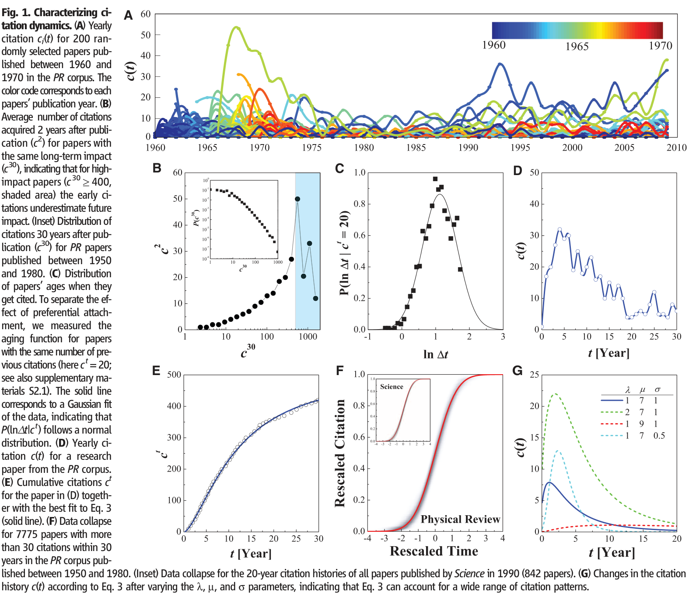
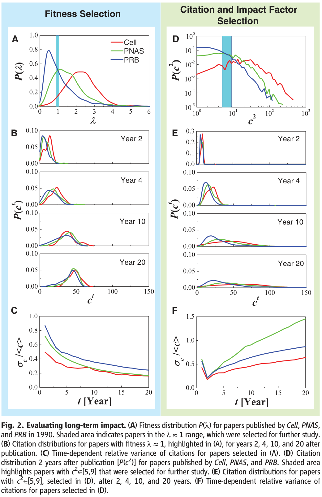
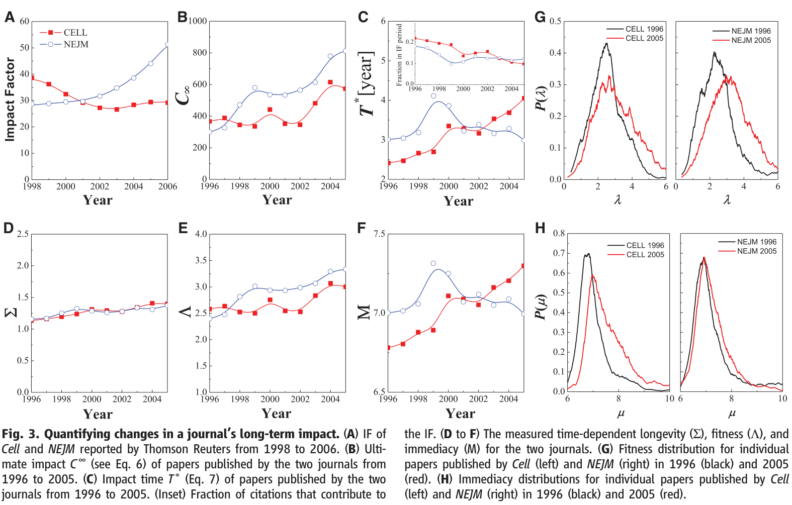
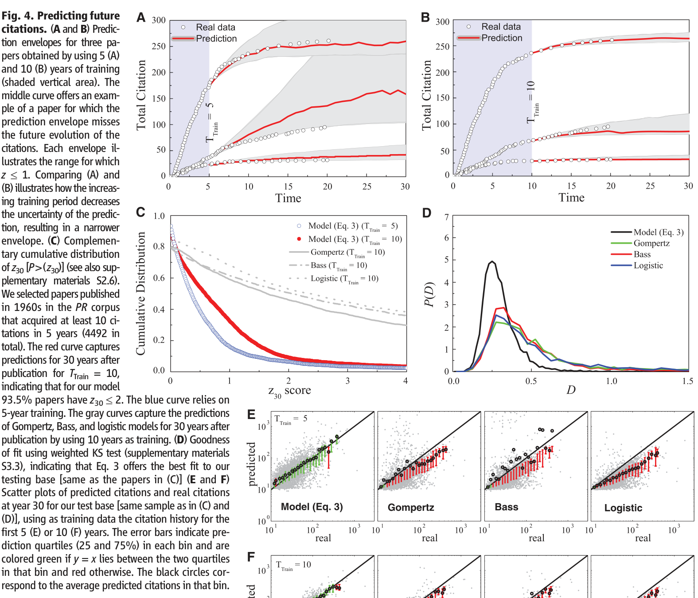

# Quantifying Long-Term Scientific Impact

**Authors:** Dashun Wang, Chaoming Song and Albert-László Barabási

## 摘要（Abstract）

The lack of predictability of citation-based measures frequently used to gauge impact, from impact factors to short-term citations, raises a fundamental question: Is there long-term predictability in citation patterns? Here, we derive a mechanistic model for the citation dynamics of individual papers, allowing us to collapse the citation histories of papers from different journals and disciplines into a single curve, indicating that all papers tend to follow the same universal temporal pattern. The observed patterns not only help us uncover basic mechanisms that govern scientific impact but also offer reliable measures of influence that may have potential policy implications. O

## 正文：引言、结果与讨论（不含方法）

Of the many tangible measures of scientific impact, one stands out in its frequency of use: citations (1–10). The reliance on citation-based measures, from the Hirsch index (4) to the g-index (11), from impact factors (1) to eigenfactors (12), and on diverse ranking-based

metrics (13) lies in the (often debated) perception that citations offer a quantitative proxy of a discovery’s importance or a scientist’s standing in the research community. Often lost in this debate is the fact that our ability to foresee lasting impact on the basis of citation patterns has well-known limitations. 1) The impact factor (IF) (1), conferring a journal’s historical impact to a paper, is a poor predictor of a particular paper’s future citations (14, 15): Papers published in the same journal a decade later acquire widely different number of citations, from one to thousands (fig. S2A). 2) The number of citations (2) collected by a paper strongly depends on the paper’s age; hence, citation-based comparisons favor older papers and established investigators. It also lacks predictive

power: A group of papers that within a 5-year span collect the same number of citations are found to have widely different long-term impacts (fig. S2B). 3) Paradigm-changing discoveries have notoriously limited early impact (3), precisely because the more a discovery deviates from the current paradigm, the longer it takes to be appreciated by the community (16). Indeed, although for most papers their early- and long-term citations correlate, this correlation breaks down for discoveries with the most long-term citations (Fig. 1B). Hence, publications with exceptional long-term impact appear to be the hardest to recognize on the basis of their early citation patterns. 4)Comparison of different papers is confounded by incompatible publication, citation, and/or acknowledgment traditions of different disciplines and journals. Long-term cumulative measures like the Hirsch index have predictable components that can be extracted via data mining (4, 17). Yet, given the myriad of factors involved in the recognition of a new discovery, from the work’s intrinsic value to timing, chance, and the publishing venue, finding regularities in the citation history of individual papers, the minimal carriers of a scientific discovery, remains an elusive task. In the past, much attention has focused on citation distributions, with debates on whether they follow a power law (2, 18, 19) or a log-normal form (3, 7, 15). Also, universality across disciplines allowed the rescaling of the distributions

by discipline-dependent variables (7, 15). Together, these results offer convincing evidence that the aggregated citation patterns are characterized by generic scaling laws. Yet little is known about the mechanisms governing the temporal evolution of individual papers. The inherent difficulty in addressing this problem is well illustrated by the citation history of papers extracted from the Physical Review (PR) corpus (Fig. 1A), consisting of 463,348 papers published between 1893 and 2010 and spanning all areas of physics (3). The fat-tailed nature of the citation distribution 30 years after publication indicates that, although most papers are hardly cited, a few do have exceptional impact (Fig. 1B, inset) (2, 3, 7, 19, 20). This impact heterogeneity, coupled with widely different citation histories (Fig. 1A), suggests a lack of order and hence lack of predictability in citation patterns. As we show next, this lack of order in citation histories is only apparent, because

citations follow widely reproducible dynamical patterns that span research fields. We start by identifying three fundamental mechanisms that drive the citation history of individual papers: Preferential attachment captures the well-documented fact that highly cited papers are more visible and are more likely to be cited again than less-cited contributions (20, 21). Accordingly a paper i’s probability to be cited again is proportional to the total number of citations ci the paper received previously (fig. S3). Aging captures the fact that new ideas are integrated in subsequent work; hence, each paper’s novelty fades eventually(22,23). The resulting long-term decay is best described by a log-normal survival probability (Fig. 1C and supplementary materials S2.1), where t is time; m indicates immediacy, governing the time for a paper to reach its citation peak; and s is longevity, capturing the decay rate.

Equation (1): P_i(t) = [1/(√(2π) σ_i t)] exp{−(ln t − μ_i)²/(2σ_i²)}.

Fitness, hi, captures the inherent differences between papers, accounting for the perceived novelty and importance of a discovery (24, 25). Novelty and importance depend on so many intangible and subjective dimensions that it is impossible to objectively quantify them all. Here, we bypass the need to evaluate a paper’s intrinsic value and view fitness hi as a collective measure capturing the community’s response to a work. Combining these three factors, we can write the probability that paper i is cited at time t after publication as

Equation (2): P_i(t) ∝ η_i c_i^t P_i(t), combining fitness, preferential attachment and aging.

Solving the associated master equation, Eq. 2 allows us to predict the cumulative number of

citations acquired by paper i at time t after publication (supplementary materials S2.2)

Equation (3): c_i^t = m [exp(λ_i F((ln t − μ_i)/σ_i)) − 1].

where

is the cumulative normal distribution, m measures the average number of references each new paper

contains, b captures the growth rate of the total number of publications (supplementary materials S1.3), and A is a normalization constant (supplementary materials S2.2). Hence m, b, and A are global parameters, having the same value for all publications. We have chosen m = 30 throughout the paper, because our results do not depend on this choice (supplementary materials S2.3). Equation 3 represents a minimal citation model that captures all known quantifiable mechanisms that affect citation histories. It predicts that the citation history of paper i is characterized by three fundamental parameters: the relative fitness, li ≡ hib=A, capturing a paper’s importance relativeto other papers; mi; and si. By using the rescaled variables ˜t ≡ðln t −miÞ=si and ˜c ≡ lnð1þ ct i=mÞ= li, we obtain our main result

Equation (5): ĉ = F(t̃), after rescaling each paper’s citation history by its paper-specific λ, μ and σ parameters.

predicting that each paper’s citation history should follow the same universal curve Fð˜tÞ if rescaled with the paper-specific (li, mi, and si) parameters. Therefore, given a paper’s citation history, that is, t and ct i, we can obtain the best-fitted three parameters for paper i by using Eq. 3. To illustrate the process, we selected a paper from our corpus, whose citation history is shown in Fig. 1, D and E. We fitted to Eq. 3 the paper’s cumulative citations (Fig. 1E) by using the least square fit method, obtaining l = 2.87, m = 7.38, and s = 1.2. To illustrate the validity of the fit, we show (Fig. 1E) the prediction of Eq. 3 using the uncovered fit parameters. To test the model’s validity, we rescaled all papers published between 1950 and 1980 in the PR corpus, finding that they all collapse into Eq. 5 (Fig. 1F, see also supplementary materials S2.4.1 for the statistical test of the data collapse). The reason is explained in Fig. 1G: By varying l, m, and s, Eq. 3 can account for a wide range of empirically observed citation histories, from jump-decay patterns to delayed impact. We also tested our model on all papers published in 1990 by 12 prominent journals (table S4), finding an exceptional collapse for all (see Fig. 1G, inset, for Science and supplementary materials S2.4.2 and fig. S8 for the other journals). The model Eqs. 3 to 5 also predicts several fundamental measures of impact: Ultimate impact (c∞) represents the total number of citations a paper acquires during its lifetime. By taking the t →∞limit in Eq. 3, we obtain

Equation (6): c_i^∞ = m(e^{λ_i} − 1).

a simple formula that predicts that the total number of citations acquired by a paper during its lifetime is independent of immediacy (m) or the rate of decay (s) and depends only on a single parameter, the paper’s relative fitness, l. Impact time (T* i ) represents the characteristic time it takes for a paper to collect the bulk of its citations. A natural measure is the time necessary for a paper to reach the geometric mean of its final citations, obtaining (supplementary materials S2.2) T i ≈expðmiÞ ð7Þ

Hence, impact time is mainly determined by the immediacy parameter mi and is independent of fitness li or decay si. The proposed model offers a journal-free methodology to evaluate long term impact. To illustrate this, we selected three journals with widely different IFs: Physical Review B (PRB) (IF = 3.26 in 1992), Proceedings of the National Academy of Sciences USA (PNAS) (10.48), and Cell (33.62).

We measured for each paper published by them the fitness l, obtaining their distinct journal-specific P(l) fitness distribution (Fig. 2A). We then selected all papers with comparable fitness l ≈1 and followed their citation histories. As expected, they follow different paths: Cell papers ran slightly ahead and PRB papers stay behind, resulting in distinct P(cT) distributions for years T = 2 ÷ 4. Yet, by year 20 the cumulative number of citations acquired by these papers shows a notable convergence to each other (Fig. 2B), supporting our prediction that given their similar fitness l, eventually they will have the same ultimate impact: c∞= 51.5. To quantify the magnitude of the observed convergence, we measured the coefficient of variation sc/ c for P(cT), finding that this ratio decreases with time (Fig. 2C). This helps us move beyond visual inspection, offering quantitative evidence that in the long run the differences in citation counts between these papers vanishes with time, as predicted by our model. In contrast, if we choose all papers with the same number of citations at year two (i.e., the same c2, Fig. 2D), the citations acquired by them diverge with time, and sc/ c increases (Fig. 2, E and F), supporting our conclusion that these quantities lack predictability. Therefore, l and c∞offer a journal independent measure of a publication’s long-term impact. The model (Eqs. 3 to 5) also helps connect the IF, the traditional measure of impact of a scientific journal, to the journal’s L, M, and S parameters

(the analogs of l, m, and s; supplementary materials S4)

Equation (8): an approximation linking the journal-level impact factor to journal-level fitness, immediacy and longevity.

Knowing L, in analog with Eq. 6 we can calculate a journal’s ultimate impact asC∞¼ mðeL−1Þ, representing the total number of citations a paper in the journal will receive during its lifetime. As we show in the supplementary materials S4, Eq. 8 predicts a journal’s IF in good agreement with the values reported by ISI (Institute for Scientific Information). Equally important, it helps us understand the mechanisms that influence the evolution of the IF, as illustrated by the changes in the impact factor of Cell and New England Journal of Medicine (NEJM). In 1998, the IFs of Cell and NEJM were 38.7 and 28.7, respectively (Fig. 3A). Over the next decade, there was a remarkable reversal: NEJM became the first journal to reach IF = 50, whereas Cell’s IF decreased to around 30. This raises a puzzling question: Has the impact of papers published by the two journals changed so dramatically? To answer this, we determined L, M, and S for both journals from 1996 to 2006 (Fig. 3, D to F). Although S were indistinguishable (Fig. 3D), we find that the fitness of NEJM increased from L = 2.4 (1996) to L = 3.33 (2005), increasing the journal’s ultimate impact from C∞= 300 (1996) to 812 (2005) (Fig.

3B). But Cell’s L also increased in this period (Fig. 3E), moving its ultimate impact from C∞= 366 (1996) to 573 (2005). If both journals attracted papers with increasing long-term impact, why did Cell’s IF drop and NEJM’s grow? The answer lies in changes in the impact time T∗= exp(M): Whereas NEJM’s impact time remained unchanged at T∗≈3 years, Cell’s T∗increased from T∗= 2.4 years to T∗= 4 years (Fig. 3C). Therefore, Cell papers have gravitated from short- to long-term impact: A typical Cell paper gets 50% more citations than a decade ago, but fewer of the citations come within the first 2 years (Fig. 3C, inset). In contrast, with a largely unchanged T∗, NEJM’s increase in L translated into a higher IF. These conclusions are fully supported by the P(l) and P(m) distributions for individual papers published by Cell and NEJM in 1996 and 2005: Both journals show a shift to higher-fitness papers (Fig. 3G), but whereas P(m) is largely unchanged for NEJM, there is a shift to higher-m papers in Cell (Fig. 3H). Can we use the developed framework to predict the future citations of a publication? For this, we adopted a framework borrowed from weather predictions and data mining: We used paper i’s citation history up to year TTrain after publication (training period) to estimate li, mi, and si and then used the model Eq. 3 to predict its future citations ct i and Eq. 6 to determine its ultimate impact c∞ i. The uncertainties in estimating li, mi, and si from the inherently noisy citation histories affect our

predictive accuracy (supplementary materials S2.6). Hence, instead of simply interpolating Eq. 3 into the future, we assigned a citation envelope to each paper, explicitly quantifying the uncertainty of our predictions (supplementary materials S2.6). We show (Fig. 4A) the predicted most likely citation path (red line) with the uncertainty envelope (gray area) for three papers, based on a 5-year training period. Two of the three papers fall within the envelope; for the third, however, the model overestimated the future citations. Increasing the training period enhanced the predictive accuracy (Fig. 4B). To quantify the model’s overall predictive accuracy, we measured the fraction of papers that

fall within the envelope for all PR papers published in 1960s. That is, we measured the z30 score for each paper, capturing the number of standard deviations (z30) the real citations c30

deviate from the most likely citation 30 years after publication. The obtained P(z30) distribution across all papers decayed fast with z30 (Fig. 4C), indicating that large z values are extremely rare. With TTrain = 5, only 6.5% of the papers left the prediction envelope 30 years later; hence, the model correctly approximated the citation range for 93.5% of papers 25 years into the future. The observed accuracy prompts us to ask whether the proposed model is unique in its ability to capture future citation histories. We therefore identified several models that either have been used in the past to fit citation histories or have the potential to do so: the logistic (26), Bass (27), and Gompertz (26, 28) models (for formulae, see supplementary materials and table S2). We fit the predictions of these models to PR papers and used the weighted Kolmogorov-Smirnov (KS) test to evaluate their goodness of fit (see eq. S43 for definition), capturing the maximum deviation between the fitted and the empirical data. The lowest KS distribution across most papers was observed with Eq. 3, indicative of the best fit (Fig. 4D). The reason is illustrated in fig. S18:

The symmetric c(t) predicted by the logistic model cannot capture the asymmetric citation curves. Although the Gompertz and the Bass models predict asymmetric citation patterns, they also predict an exponential (Bass) or double-exponential (Gompertz) decay of citations (table S2) that is much faster than observed in real data. To quantify how these deviations affect the predictive power of each of these models, we used a 5- and a 10-year training period to fit the parameters of each model and computed the predicted most likely citations at year 30 (Fig. 4, E and F). Independent of the training period, the predictions of the logistic, Bass, and Gompertz models always lay outside the 25 to 75% prediction quartiles (red bars), systematically underestimating future citations. In contrast, the prediction of Eq. 3 for both training periods was within the 25 to 75% quantiles, its accuracy visibly improving for the 10-year training period (Fig. 4F). In supplementary materials S3.3, we offer additional quantitative assessment of these predictions (fig. S19), demonstrating our model’s predictive power pertaining to both the fraction of papers whose citations it correctly predicts and the magnitude of deviations between predicted and the real citations. The predictive limitations of the current models were also captured by their P(z30) distribution, indicating that for the logistic, Bass, and Gompertz models more than half of the papers underestimate with more than two standard deviations the true citations (z > 2) at year 30 (Fig. 4C), in contrast with 6.5% for the proposed model (Eq. 3). Ignoring preferential attachment in Eq. 2 leads to the lognormal model, containing a lognormal temporal decay modulated by a single fitness parameter. As we analytically show in supplementary materials S3.4, for small fitness Eq. 3 converged to the lognormal model, which correctly captured the citation history of small impact papers. The lognormal model failed, however, to predict the citation patterns of medium- to high-impact papers (fig. S20). The proposed model therefore allows us to analytically predict the citation threshold when preferential attachment becomes relevant. The calculations indicate that the lognormal model is indistinguishable from the predictions of Eq. 3 for papers that satisfy the equation

Equation (9): ∑_{n=2}^{∞} (1/n!) F^n λ^n < 1.

Solving this equation predicts l < 0.25, equivalent with the citation threshold c∞< 8.5, representing

the theoretical bound for preferential attachment to turn on. This analytical prediction is in close agreement with the empirical finding that preferential attachment is masked by initial attractiveness for papers with fewer than seven citations (29). Note that the lognormal function has been proposed before to capture the citation distribution of a body of papers (15). However, the lognormals appearing in (15) and in the lognormal model discussed above have different origins and implications (supplementary materials S2.5.2). The proposed model has obvious limitations: It cannot account for exogenous “second acts,” like the citation bump observed for superconductivity papers after the discovery of high-temperature superconductivity in the 1980s, or delayed impact, like the explosion of citations to Erdős and Rényi’s work 4 decades after their publication, following the emergence of network science (3, 20, 21, 23). Our findings have policy implications, because current measures of citation-based impact, from IF to Hirsch index (4, 17), are frequently integrated in reward procedures, the assignment of research grants, awards, and even salaries and bonuses (30), despite their well-known lack of predictive power. In contrast with the IF and short-term citations that lack predictive power, we find that c∞

offers a journal-independent assessment of a paper’s long term impact, with a meaningful interpretation: It captures the total number of citations a paper will ever acquire or the discovery’s ultimate impact. Although additional variables combined with data mining could further enhance the demonstrated predictive power, an ultimate understanding of long-term impact will benefit from a mechanistic understanding of the factors that govern the research community’s response to a discovery.

## Figures / Assets

### Figure 1

**Caption:** Fig. 1. Characterizing citationdynamics.(A) Yearly citation ci(t) for 200 randomly selected papers published between 1960 and 1970 in the PR corpus. The color code corresponds to each papers’ publication year. (B) Average number of citations acquired 2 years after publication (c2) for papers with the same long-term impact (c30),indicating that for high-impact papers (c30 ≥400, shaded area) the early citations underestimate future impact.(Inset)Distributionof citations30yearsafterpublication (c30) for PR papers published between 1950 and 1980. (C) Distribution of papers’ ages when they get cited. To separate the effect of preferential attachment, we measured the aging function for papers with the same number of previous citations(herect=20; see also supplementary materials S2.1). The solid line corresponds to a Gaussian fit of the data, indicating that P(ln∆t|ct) follows a normal distribution. (D) Yearly citation c(t) for a research paper from the PR corpus. (E) Cumulative citations ct for the paper in (D) together with the best fit to Eq. 3 (solidline).(F)Datacollapse for 7775 papers with more than 30 citations within 30 years in the PR corpus published between 1950 and 1980. (Inset) Data collapse for the 20-year citation histories of all papers published by Science in 1990 (842 papers). (G) Changes in the citation history c(t) according to Eq. 3 after varying the l, m, and s parameters, indicating that Eq. 3 can account for a wide range of citation patterns.

### Figure 2

**Caption:** Fig. 2. Evaluating long-term impact. (A) Fitness distribution P(l) for papers published by Cell, PNAS, and PRB in 1990. Shaded area indicates papers in the l ≈1 range, which were selected for further study. (B) Citation distributions for papers with fitness l ≈1, highlighted in (A), for years 2, 4, 10, and 20 after publication. (C) Time-dependent relative variance of citations for papers selected in (A). (D) Citation distribution 2 years after publication [P(c2)] for papers published by Cell, PNAS, and PRB. Shaded area highlights papers with c2∈[5,9] that were selected for further study. (E) Citation distributions for papers with c2∈[5,9], selected in (D), after 2, 4, 10, and 20 years. (F) Time-dependent relative variance of citations for papers selected in (D).

### Figure 3

**Caption:** Fig. 3. Quantifying changes in a journal’s long-term impact. (A) IF of Cell and NEJM reported by Thomson Reuters from 1998 to 2006. (B) Ultimate impact C∞(see Eq. 6) of papers published by the two journals from 1996 to 2005. (C) Impact time T∗(Eq. 7) of papers published by the two journals from 1996 to 2005. (Inset) Fraction of citations that contribute to the IF. (D to F) The measured time-dependent longevity (S), fitness (L), and immediacy (M) for the two journals. (G) Fitness distribution for individual papers published by Cell (left) and NEJM (right) in 1996 (black) and 2005 (red). (H) Immediacy distributions for individual papers published by Cell (left) and NEJM (right) in 1996 (black) and 2005 (red).

### Figure 4

**Caption:** Fig. 4. Predicting future citations. (A and B) Prediction envelopes for three papers obtained by using 5 (A) and 10 (B) years of training (shaded vertical area). The middle curve offers an example of a paper for which the prediction envelope misses the future evolution of the citations. Each envelope illustrates the range for which z ≤1. Comparing (A) and (B)illustrates how the increasing training period decreases the uncertainty of the prediction, resulting in a narrower envelope. (C) Complementary cumulative distribution of z30 [P>(z30)] (see also supplementary materials S2.6). We selected papers published in 1960s in the PR corpus that acquired at least 10 citations in 5 years (4492 in total). The red curve captures predictions for 30 years after publication for TTrain = 10, indicating that for our model 93.5% papers have z30 ≤2. The blue curve relies on 5-year training. The gray curves capture the predictions of Gompertz,Bass,andlogisticmodelsfor30yearsafter publication by using 10 years as training. (D) Goodness of fit using weighted KS test (supplementary materials S3.3), indicating that Eq. 3 offers the best fit to our testing base [same as the papers in (C)] (E and F) Scatter plots of predicted citations and real citations at year 30 for our test base [same sample as in (C) and (D)], using as training data the citation history for the first 5 (E) or 10 (F) years. The error bars indicate prediction quartiles (25 and 75%) in each bin and are colored green if y = x lies between the two quartiles in that bin and red otherwise. The black circles correspond to the average predicted citations in that bin.
