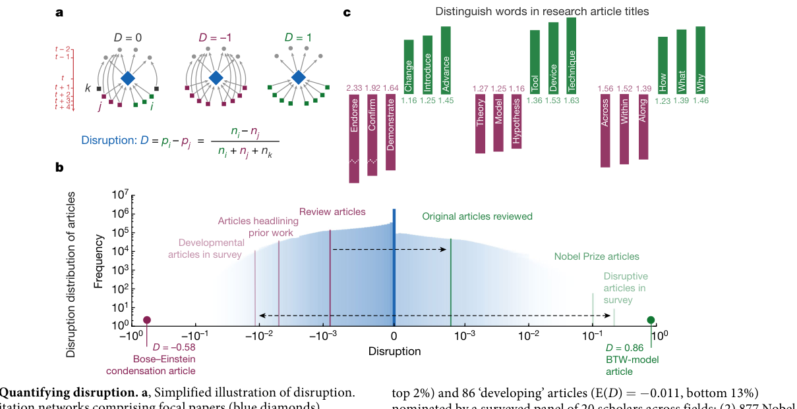
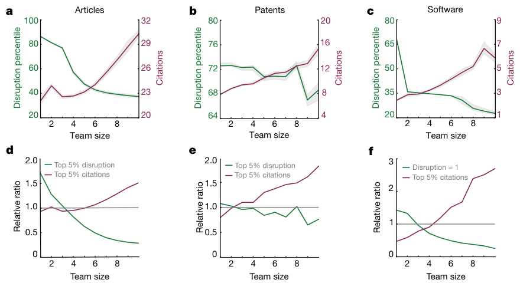
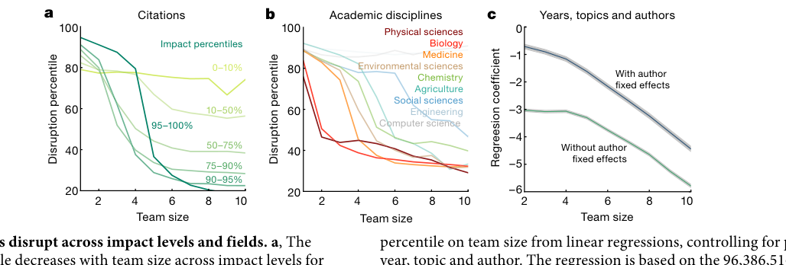
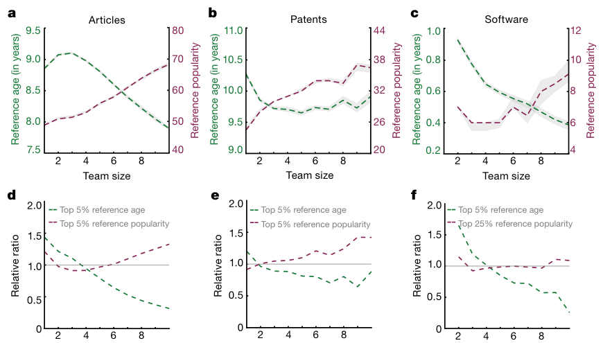

# Large teams develop and small teams disrupt science and technology

**Source PDF:** `JE_1.pdf`  
**Authors:** Lingfei Wu, Dashun Wang & James A. Evans  
**Processing note:** Nature Letter; main text retained through the end of discussion before Online content; Methods, references and Extended Data omitted.

> Included: abstract, introduction/background/framework, results/analysis and discussion/implications. Excluded: Methods/materials, references, acknowledgements, reporting summaries, extended data/supplementary sections and appendices unless a main-text figure explicitly appears there.

## Abstract

One of the most universal trends in science and technology today is the growth of large teams in all areas, as solitary researchers and small teams diminish in prevalence1–3. Increases in team size have been attributed to the specialization of scientific activities3, improvements in communication technology4,5, or the complexity of modern problems that require interdisciplinary solutions6–8. This shift in team size raises the question of whether and how the character of the science and technology produced by large teams differs from that of small teams. Here we analyse more than 65 million papers, patents and software products that span the period 1954–2014, and demonstrate that across this period smaller teams have tended to disrupt science and technology with new ideas and opportunities, whereas larger teams have tended to develop existing ones. Work from larger teams builds on morerecent and popular developments, and attention to their work comes immediately. By contrast, contributions by smaller teams search more deeply into the past, are viewed as disruptive to science and technology and succeed further into the future—if at all. Observed differences between small and large teams are magnified for higherimpact work, with small teams known for disruptive work and large teams for developing work. Differences in topic and research design account for a small part of the relationship between team size and disruption; most of the effect occurs at the level of the individual, as people move between smaller and larger teams. These results demonstrate that both small and large teams are essential to a flourishing ecology of science and technology, and suggest that, to achieve this, science policies should aim to support a diversity of team sizes.

## Introduction / Background

Advocates of team science have claimed that a shift to larger teams in science and technology fulfils the essential function of solving problems in modern society that are complex and which require interdisciplinary solutions6–8. Although much has been demonstrated about the professional and career benefits of team size for team members9, there is little evidence that supports the notion that larger teams are optimized for knowledge discovery and technological invention9. Experimental and observational research on groups reveals that individuals in large groups think and act differently—they generate fewer ideas10,11, recall less learned information12, reject external perspectives more often13 and tend to neutralize each other’s viewpoints14. Small and large teams may also differ in their response to the risks associated with innovation. Large teams, such as large business organizations, may focus on sure bets with large potential markets, whereas small teams that have more to gain and less to lose may undertake new, untested opportunities with the potential for high growth and failure15, leading to markedly different outcomes. These possibilities led us to explore the consequences of smaller and larger teams for scientific and technological advance, and how such teams search and assemble knowledge differently. Previous research demonstrates that large article and patent teams receive slightly more citations2,16. However, citation counts alone cannot capture distinct types of contribution. This can be seen in the difference between two well-known articles: one about self-organized criticality17 (the BTW model, after the authors’ initials) and another about Bose–Einstein condensation18 (for which Wolfgang Ketterle was awarded the 2001 Nobel Prize in Physics) (Fig. 1, Extended Data Fig. 1b). The two articles have received a similar number of citations, but most research subsequent to the BTW-model article has cited only the model itself without mentioning references from the article. By contrast, the Bose–Einstein condensation article is almost always co-cited with Bose19, Einstein20 and other antecedents. The difference between the two papers is reflected not in citation counts but in whether they suggested or solved scientific problems—whether they disrupted or developed existing scientific ideas, respectively21. The BTW model launched new streams of research, whereas the experimental realization of Bose–Einstein condensation elaborated upon possibilities that had previously been posed. To systematically evaluate the role that small and large teams have in unfolding scientific and technological advances, we collected largescale datasets from three related but distinct domains (see Methods): (1) the Web of Science (WOS) database that contains more than 42 million articles published between 1954 and 2014, and 611 million citations among them; (2) 5 million patents granted by the US Patent and Trademark Office from 1976 to 2014, and 65 million citations added by patent applicants; (3) 16 million software projects and 9 million forks to them on GitHub (2011–2014), a popular web platform that allows users to collaborate on the same code repository and ‘cite’ other repositories by copying and building on their code.

## Results / Analysis

For each dataset, we assess the degree to which each work disrupts the field of science or technology to which it belongs by introducing something new that eclipses attention to previous work upon which it has built. We use a measure that was previously designed22 to identify destabilization and consolidation in patented inventions; this measure varies between −1 and 1, which corresponds to science and technology that develops or disrupts, respectively (Fig. 1a). We validate the disruption measure in several ways. First, we investigate the distribution of disruption across scientific papers (Fig. 1b); the disruptive BTWmodel article is located in the top 1%, whereas the developmental Bose–Einstein condensation paper is in the bottom 3% of the disruption distribution. We also find that, on average, Nobel-prize-winning papers register among the 2% most disruptive articles. Review articles are developmental with a negative mean of disruption (bottom 46%), whereas the original research works that they review have a positive mean (top 23%). Articles that headline prominent prior work—such as the Bose–Einstein condensation article—lie in the bottom 25% (Supplementary Table 1). We further confirmed these results with a survey in which we asked scholars from diverse fields to propose disruptive and developmental articles; this symmetrically confirmed the disruption measure (Supplementary Table 2). Finally, we find that in the titles of articles different words associate with disruptive (‘introduce’, ‘measure’, ‘change’ and ‘advance’) versus developing (‘endorse’, ‘confirm’, ‘demonstrate’, ‘theory’ and ‘model’) papers (Fig. 1c, Supplementary Table 3). USA. 4Northwestern Institute on Complex Systems, Northwestern University, Evanston, IL, USA. 5McCormick School of Engineering, Northwestern University, Evanston, IL, USA. 6Santa Fe Institute, 3 7 8 | N A T U R E | V O L 5 6 6 | 2 1 F E B R U A R Y 2 0 1 9

We predict that work by small teams will be substantially more disruptive than work by large teams. Our databases of papers, patents and software strongly confirm this prediction. Our sources differ in scope and domain, but we consistently observe that over the past 60 years, larger teams produce articles, patents and software with a disruption score that markedly and monotonically declines with each additional team member (Fig. 2a–c, Extended Data Fig. 3). Specifically, as teams grow from 1 to 50 team members, their papers, patents and products drop in percentiles of measured disruption by 70, 30 and 50, respectively (Extended Data Fig. 3a). In every case, this highlights a transition from disruption to development. These results support the hypothesis that large teams may be better designed or incentivized to develop current science and technology, and that small teams disrupt science and technology with new problems and opportunities. This phenomenon is amplified when we focus on the most disruptive and impactful work (Fig. 2d–f). We measure the impact of each article, patent and software using the number of citations each work received. As shown in Fig. 2d, solo authors are just as likely to produce high-impact papers (in the top 5% of citations) as teams with five members, but solo-authored papers are 72% more likely to be highly disruptive (in the top 5% of disruptive papers). By contrast, ten-person teams are 50% more likely to score a high-impact paper, yet these contributions are much more likely to develop existing ideas already prominent in the system, which is reflected in the very low likelihood they are among the most disruptive. By repeating the same analyses for patents (Fig. 2e) and software development (Fig. 2f), we find that disruption and impact consistently diverge as teams grow in size. Differences in disruption between works produced by small and large teams are magnified as the impact of the work increases (Fig. 3a); high-impact papers produced by small teams are the most disruptive, and high-impact papers produced by large teams are the most developmental. As article impact increases, the negative slope of disruption as a function of team size steepens sharply. Even within the pool of high-impact articles and patents (Fig. 3a, top 5% of citations), which are statistically more likely produced by large teams (Fig. 2d), small teams have disrupted the current system with substantially more new ideas. We further split papers by time period (Extended Data Fig. 3c) and scientific field (Fig. 3b, Extended Data Fig. 4), and found that these patterns linking disruption and team size are stable for all eras and for 90% of disciplines. The only consistent exceptions were observed for engineering and computer science, in which conference proceedings rather than journal articles are the publishing norm (the WOS database indexes only journal articles). We considered whether observed differences between the work of small and large teams could simply be attributed to differences in disruptive potential for the different types of articles that they produce; for example, small teams may generate more theoretical innovations and large teams more empirical analyses. Drawing on a previous approach23, we matched papers from www.arXiv. org with the WOS database and repeated our analyses controlling for the number of figures in each article (Extended Data Fig. 5a), as empirical papers tend to have more figures than theoretical ones. Our results suggest that most of the difference in disruption between work from smaller and larger teams is not driven by differences in whether they contributed theoretical versus empirical papers (that is, had more or less figures). The association remains the same when we consider other distinctions, including review versus original research articles. Review articles with fewer authors are more disruptive than those with more, just as with original research articles (Extended Data Fig. 5b).

Another possible explanation for our results is that the team effect that we observe occurs because the scientists, inventors and software designers involved in larger teams are qualitatively different from those comprising smaller teams. But when we predict disruptiveness as a function of team size, controlling for publication year, topic and author (Fig. 3c, Extended Data Fig. 3b, Supplementary Table 4), we find that the decrease of disruption with the growth of team size continues to hold, and controlling for authors greatly improves the percentage of variance explained (Supplementary Table 4). We further test the robustness of our results against several different definitions of the disruption measure, including the removal of self-citation links, exclusion of all but high-impact references and other variations (Extended Data Fig. 5g–i). Across all variations, our conclusions remain the same. The considerable difference in disruption between large and small teams raises questions regarding how these teams differ in searching the past to formulate their next paper, patent or product. When we dissect search behaviour, we find that large and small teams engage in notably different practices that may be related to divergent contributions in disruption and impact. Specifically, we measure search depth as average relative age of references cited and search popularity as median citations to the references of a focal work. We examine these search strategies

across fields, time periods and impact levels in science, technology and software. We also relate these search strategies to temporal delay in the impact these works receive using the ‘Sleeping Beauty index’24, which captures a delayed burst of attention traced by convexity in the citation attention that a work receives over time. We find that solo authors and small teams much more often build on older, less popular ideas (Fig. 4, Extended Data Fig. 6). Larger teams more often target recent, high-impact work as their primary source of inspiration, and this tendency increases monotonically with team size. It follows that large teams receive more of their citations rapidly, as their work is immediately relevant to more contemporaries whose ideas they develop and audiences primed to appreciate them. Conversely, smaller teams experience a much longer citation delay; the average Sleeping Beauty index percentile for solo and two-person research teams is twice that of ten-person teams (Extended Data Fig. 7). As a result, even though small teams receive less recognition overall owing to the rapid decay of collective attention25–27 (as shown in Fig. 2a), their successful research produces a ripple effect, which becomes an influential source of later large-team success (Extended Data Fig. 8). We also consider the relationship between these distinctive search mechanisms and recent findings28 that suggest multi- and interdisciplinary teams more often link work from divergent fields. We examined the novelty of journal combinations within article reference lists and also keyword combinations within articles in relation to team size. These show consistent diminishing marginal increases to novelty with team size, such that with each new team member, their contribution to novel combinations decreases (Extended Data Fig. 9). Moreover, using a previous measure of atypical combinations28, we find that atypical combinations increase slowly up to teams of approximately ten and then decrease sharply below the value associated with a solo investigator. Whereas larger teams facilitate broader search, small teams search deeper.

## Discussion / Implications

In summary, we report a universal and previously undocumented pattern that systematically differentiates the contributions of small and large teams in the creation of scientific papers, technology patents and software products. Small teams disrupt science and technology by exploring and amplifying promising ideas from older and less-popular work. Large teams develop recent successes, by solving acknowledged problems and refining common designs. Some of this difference results from the substance of science and technology that small versus large teams tackle, but the larger part appears to emerge as a consequence of team size itself. Certain types of research require the resources of large teams, but large teams demand an ongoing stream of funding and success to ‘pay the bills’29, which makes them more sensitive to the loss of reputation and support that comes from failure30. Our findings are consistent with field research on teams in other domains, which demonstrate that small groups with more to gain and less to lose are more likely to undertake new and untested opportunities that have the potential for high growth and failure15. Our findings are also in accordance with experimental and observational research on groups that demonstrates how individuals in large groups think and act differently from those in small groups10–14. Both small and large teams are essential to a flourishing ecology of science and technology. Taken together, the increasing dominance of large teams, a flurry of scholarship on their perceived benefits2,6–9,28,31 and our findings call for new investigations into the vital role that individuals and small groups have in advancing science and technology. Direct sponsorship of small-group research may not be enough to preserve its benefits. We analysed articles published from 2004 to 2014 that acknowledged financial support from several top government agencies around the world, and found that small teams with this funding are indistinguishable from large teams in their tendency to develop rather than disrupt their fields (Extended Data Fig. 10). In contrast to Nobel Prize papers, which have an average disruption among the top 2% of all contemporary papers, funded papers rank near the bottom 31%. This

could result from a conservative review process, proposals designed to anticipate such a process or a planning effect whereby small teams lock themselves into large-team inertia by remaining accountable to a funded proposal. When we compare two major policy incentives for science (funding versus awards), we find that Nobel-prize-winning articles significantly oversample small disruptive teams, whereas those that acknowledge US National Science Foundation funding oversample large developmental teams. Regardless of the dominant driver, these results paint a unified portrait of underfunded solo investigators and small teams who disrupt science and technology by generating new directions on the basis of deeper and wider information search. These results suggest the need for government, industry and non-profit funders of science and technology to investigate the critical role that small teams appear to have in expanding the frontiers of knowledge, even as large teams rapidly develop them.

## Figures

### Figure 1 (source page 2)

Fig. 1 | Quantifying disruption. a, Simplified illustration of disruption. Three citation networks comprising focal papers (blue diamonds), references (grey circles) and subsequent work (rectangles). Subsequent work may cite the focal work (i, green), both the focal work and its references (j, red) or just its references (k, black). Disruption, D, of the focal paper is defined by the difference between the proportion of type i and j papers pi − pj, which equals the difference between the observed number of these papers ni − nj divided by the number of all subsequent works ni + nj + nk. A paper may be disrupting (D = 1), neutral (D = 0) or developing (D = −1). b, The distribution of disruption across 25,988,101 WOS journal articles published between 1900 and 2014. On this distribution, we mark the BTW-model (D = 0.86, top 1%) and Bose–Einstein condensation articles (D = −0.58, bottom 3%) along with several samples used to validate D (Methods, Supplementary Tables 1–3). This includes (1) 104 ‘disruptive’ articles (disruption mean E(D) = 0.215, top 2%) and 86 ‘developing’ articles (E(D) = −0.011, bottom 13%) nominated by a surveyed panel of 20 scholars across fields; (2) 877 Nobelprize-winning papers published between 1902 and 2009 (E(D) = 0.10, top 2%); (3) 22,672 review articles (E(D) = −0.0009, bottom 46%) and 1,338,808 original research articles that they review (E(D) = 0.0008, top 23%); and (4) 148,303 articles that headline prominent prior work by mentioning one or more cited authors in the title (E(D) = −0.0049, bottom 24%). c, We select titles from 24,174,022 articles published between 1954 and 2014 and assign them to one of two groups, disrupting (D > 0) or developing (D < 0) articles. For the 1,033,879 words observed in both groups, we calculate the ratio of frequency in disrupting versus developing articles, r. We visualize differences in the content and writing style between these two groups in terms of verbs, nouns, and adverbs and prepositions (from left to right). To facilitate comparison, we visualize r in green if r > 1, and 1/r in red otherwise. 2 1 F E B R U A R Y 2 0 1 9 | V O L 5 6 6 | N A T U R E | 3 7 9

### Figure 2 (source page 3)

Fig. 2 | Small teams disrupt whereas large teams develop. a–c, For research articles (24,174,022 WOS articles published between 1954 and 2014), patents (2,548,038 US patents assigned between 2002 and 2014) and software (26,900 GitHub repositories uploaded between 2011 and 2014), median citations (red curves, indexed by right y axis) increase with team size whereas the average disruption percentile (green curves, indexed by left y axis) decreases with team size. For all datasets, we present work with one or more citations. Teams of between 1 and 10 authors account for 98% of articles, 99% of patents and 99% of code repositories. Bootstrapped 95% confidence intervals are shown as grey zones. Extended Data Figure 3a shows that observed relationships hold for two orders of magnitude of team size. d–f, As in a–c but for extreme cases rather than for average behaviour. Relative ratios compare the observed proportion of teamwork being extremely (top 5%) disruptive or impactful (measured with citations) against a constant baseline (grey line y = 1), which indicates a situation in which the most disruptive and impactful work is distributed equally across team sizes. We find that the probability of observing papers, patents and products of highest impact increases with team size (Kolmogorov–Smirnov statistics and probabilities for all team sizes plotted in Extended Data Fig. 2f), whereas the probability of observing the most disruptive work decreases with team size (t-statistics and probabilities for all team sizes plotted in Extended Data Fig. 2c). For example, d shows that the percentage of top 5% disruptive papers depends on team size, with 8.6% contributed by single authors and only 1.4% contributed by teams of ten authors. This posts relative ratios of 8.6/5 = 1.72 and 1.4/5 = 0.28, respectively. For software, 69% of the codebases have disruption values that equal 1; we therefore use this maximum value instead of the top 5%. Citations Academic disciplines a b Team size Disruption percentile Team size Disruption percentile Physical sciences Biology Medicine Environmental sciences Chemistry Agriculture Social sciences ci Engineering Computer science 0–10% 10–50% 50–75% 75–90% 90–95% 95–100% Regreesion coefficient –3 –4 –2 –1 Team size c Years, topics and authors With author fixed effects –5 –6 Without author fixed effects Impact percentiles Fig. 3 | Small teams disrupt across impact levels and fields. a, The disruption percentile decreases with team size across impact levels for research articles (24,174,022 WOS articles published between 1954 and 2014). Curves are coloured by impact percentile (in number of citations). The disruption percentile decreases faster for higher-impact articles (darker green curves). The transition from disruption to development (D = 0) occurs when the disruption percentile equals 70. b, Disruption decreases with team size across nine fields for research articles. These fields were manually coded, on the basis of 258 sub-field labels attached to journals in WOS data. c, Plot of the regression coefficients of disruption percentile on team size from linear regressions, controlling for publication year, topic and author. The regression is based on the 96,386,516 WOS research articles (articles are counted repeatedly if they appear across the publication records of different scholars), contributed by 38,000,470 name-disambiguated scholars. To control for topics, we use the field codes inherited from b. Estimated parameters from the regression models are presented in Supplementary Table 4. The same regressions using raw values of disruption rather than disruption percentile are shown in Extended Data Fig. 3b. 3 8 0 | N A T U R E | V O L 5 6 6 | 2 1 F E B R U A R Y 2 0 1 9

### Figure 3 (source page 3)

Fig. 3 | Small teams disrupt across impact levels and fields. a, The disruption percentile decreases with team size across impact levels for research articles (24,174,022 WOS articles published between 1954 and 2014). Curves are coloured by impact percentile (in number of citations). The disruption percentile decreases faster for higher-impact articles (darker green curves). The transition from disruption to development (D = 0) occurs when the disruption percentile equals 70. b, Disruption decreases with team size across nine fields for research articles. These fields were manually coded, on the basis of 258 sub-field labels attached to journals in WOS data. c, Plot of the regression coefficients of disruption percentile on team size from linear regressions, controlling for publication year, topic and author. The regression is based on the 96,386,516 WOS research articles (articles are counted repeatedly if they appear across the publication records of different scholars), contributed by 38,000,470 name-disambiguated scholars. To control for topics, we use the field codes inherited from b. Estimated parameters from the regression models are presented in Supplementary Table 4. The same regressions using raw values of disruption rather than disruption percentile are shown in Extended Data Fig. 3b. 3 8 0 | N A T U R E | V O L 5 6 6 | 2 1 F E B R U A R Y 2 0 1 9

### Figure 4 (source page 4)

Fig. 4 | Small and large teams behave differently in their search through past work. a–c, For research articles (24,174,022 WOS articles published between 1954 and 2014), patents (2,548,038 US patents granted between 2002 and 2014) and software (26,900 GitHub repositories uploaded between 2011 and 2014), the median popularity of references (in number of citations, shown as red curves and indexed by the right y axis) increases with team size, whereas the average age of references (green curves, indexed by the left y axis) decreases with team size. For all datasets, we present work with one or more citations. Bootstrapped 95% confidence intervals are shown as grey zones. Teams of between 1 and 10 authors account for 98% of articles, 99% of patents and 99% of code repositories. Extended Data Figure 3a shows that the observed relationships hold for two orders of magnitude of team size. d–f, As in a–c, but for extreme cases rather than for average behaviour. Relative ratios compare empirically observed proportions of teamwork that searches for extremely early or unpopular previous ideas against theoretical baselines of what would have been expected at random. The grey line (y = 1) indicates a scenario in which work building upon the earliest and the most unpopular ideas is distributed equally across team sizes. We find that the probability of observing papers, patents and products built upon the most influential previous work increases with team size, whereas the probability of citing older work decreases with team size. For example, d shows that the percentage of the 5% of articles that cite the oldest ideas is unequally distributed, with 7.2% contributed by single authors and only 1.6% contributed by ten author teams. This provides relative ratios 7.2/5 = 1.44 and 1.6/5 = 0.32, respectively. Software has very few high-citation codebases; we therefore use the top 25% rather than top 5% reference popularity for our calculations. 2 1 F E B R U A R Y 2 0 1 9 | V O L 5 6 6 | N A T U R E | 3 8 1
