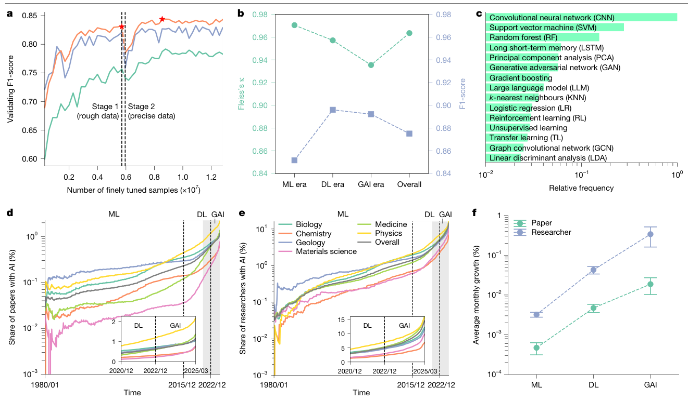
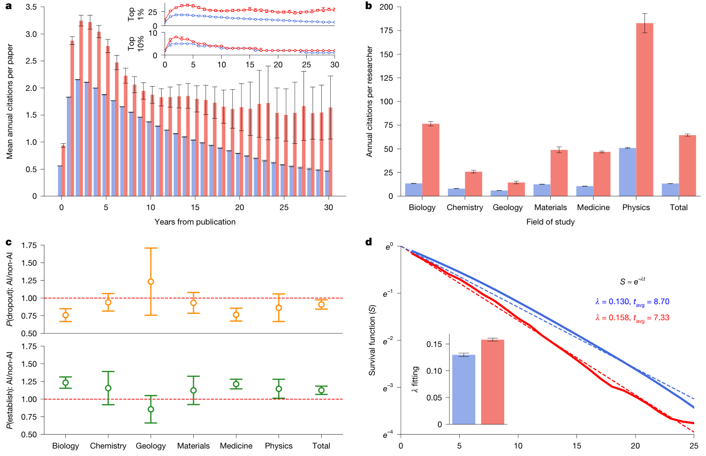
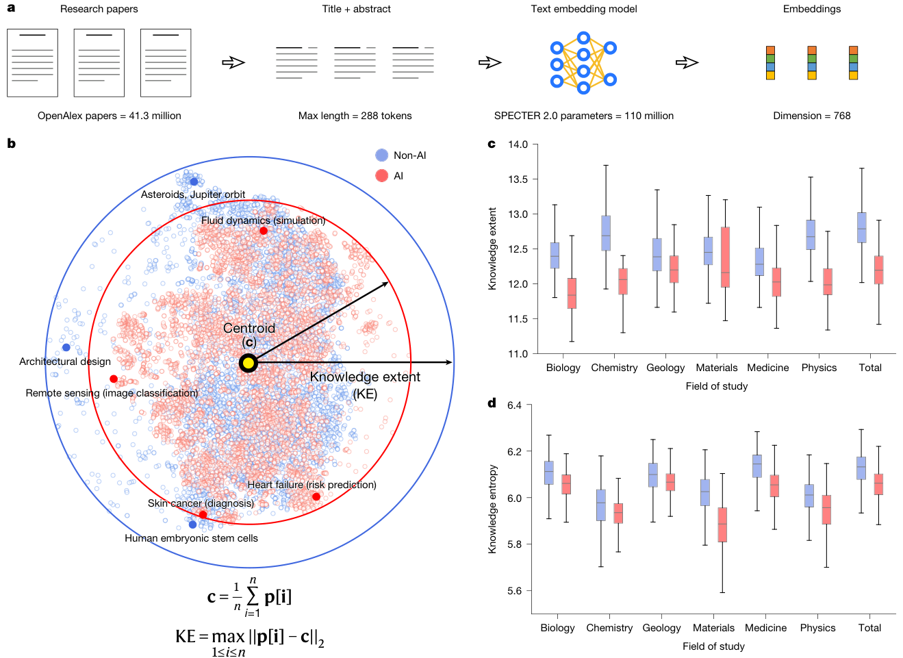
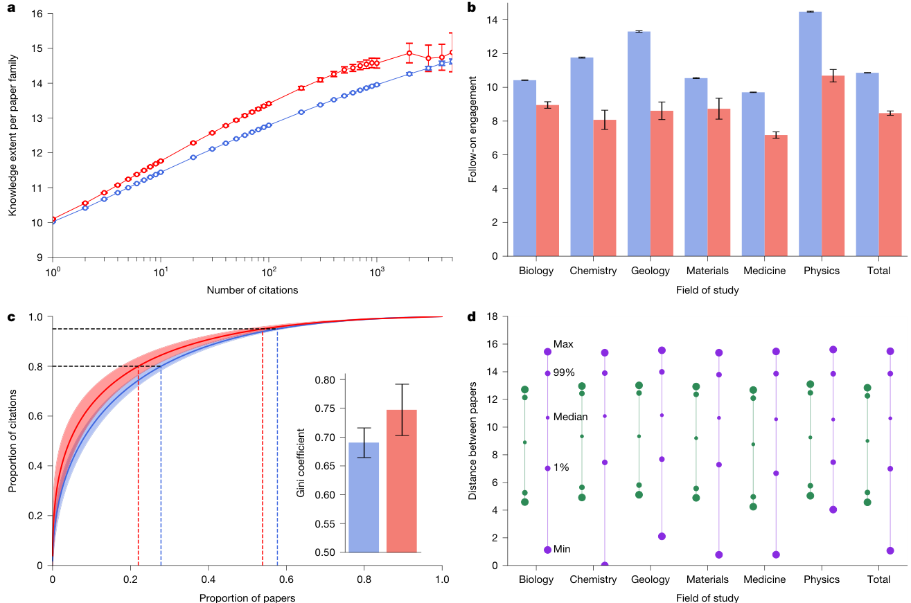

# Artificial intelligence tools expand scientists’ impact but contract science’s focus

**Source PDF:** `JE_2.pdf`  
**Authors:** Qianyue Hao, Fengli Xu, Yong Li & James Evans  
**Processing note:** Nature Article; main text retained through Discussion; Methods, references and Extended Data omitted.

> Included: abstract, introduction/background/framework, results/analysis and discussion/implications. Excluded: Methods/materials, references, acknowledgements, reporting summaries, extended data/supplementary sections and appendices unless a main-text figure explicitly appears there.

## Abstract

Developments in artificial intelligence (AI) have accelerated scientific discovery1. Alongside recent AI-oriented Nobel prizes2–9, these trends establish the role of AI tools in science10. This advancement raises questions about the influence of AI tools on scientists and science as a whole, and highlights a potential conflict between individual and collective benefits11. To evaluate these questions, we used a pretrained language model to identify AI-augmented research, with an F1-score of 0.875 in validation against expertlabelled data. Using a dataset of 41.3 million research papers across the natural sciences and covering distinct eras of AI, here we show an accelerated adoption of AI tools among scientists and consistent professional advantages associated with AI usage, but a collective narrowing of scientific focus. Scientists who engage in AI-augmented research publish 3.02 times more papers, receive 4.84 times more citations and become research project leaders 1.37 years earlier than those who do not. By contrast, AI adoption shrinks the collective volume of scientific topics studied by 4.63% and decreases scientists’ engagement with one another by 22%. By consequence, adoption of AI in science presents what seems to be a paradox: an expansion of individual scientists’ impact but a contraction in collective science’s reach, as AI-augmented work moves collectively towards areas richest in data. With reduced follow-on engagement, AI tools seem to automate established fields rather than explore new ones, highlighting a tension between personal advancement and collective scientific progress.

## Introduction / Background

Artificial intelligence (AI) has made considerable strides in recent decades, promising to affect myriad aspects of society, including education12,13, healthcare14,15 and industry16. Major investments in predictive and generative AI have catalysed society-level debates over the future of AI at home and in the workplace. Perhaps more than any other domain, AI tools have become deeply entwined with the process of knowledge production, yielding findings that attract disproportionate attention in various scientific fields1. For example, AlphaFold, which recently earned the 2024 Nobel Prize, learns known protein structures to accurately predict unexplored ones, circumventing the human and experimental cost of conventional structural inference9,17. Models improved via deep reinforcement learning have sustained complex plasma configurations in fusion reactors18 and discovered new, hardware-optimized forms of matrix multiplication that recursively accelerate deep learning itself19. Autonomous laboratory systems driven by ChatGPT have helped some chemists and materials scientists upscale the number of adaptive high-throughput experiments20–22. Recent developments in large language models have also become increasingly used to assist scientific writing23–26 and facilitate the distillation of scientific findings, but they raise concerns about weakened confidence in AI-generated content21,22,27. Artificial intelligence’s increasing capabilities to influence scientific research suggest that it manifests the potential to both increase the productivity of individual scientists and raise the visibility of the science it supports. Despite the increasing adoption of AI in science, large-scale empirical measurements of AI’s scientific impact are limited, and a detailed, dynamic understanding of AI’s influence on the entire character of science remains largely unknown. Recent work suggests that AI has brought widespread benefits to individual scientists but may lead to demographic disparity resulting from gaps in AI education10. Researchers have also identified evolving citation patterns that signal a changing scientific landscape in AI research28. Here we explore the impact of AI in scientific research at different scales, and how the adoption of AI influences both individual scientists’ careers and the collective exploration of science as a whole. We conduct a large-scale quantitative analysis of the impact of AI on scientists and science, covering 41,298,433 research papers spanning from 1980 to 2025 in the OpenAlex dataset29, with patterns corroborated using the Web of Science30,31. Notably, we do not focus on computer science or mathematics—fields which develop AI methodologies directly—but rather on papers that augment research in natural science fields by adopting AI, primarily covering decades that involve the development and deployment of conventional machine learning algorithms, and also extend to a necessarily more preliminary analysis of the latest generative AI techniques. Specifically, we select six representative disciplines that cover the vast majority of natural science contributions: biology, medicine, chemistry, physics, materials science and geology. We then leverage a fine-tuned BERT language model32,33 tsinghua.edu.cn; jevans@uchicago.edu

to accurately identify such AI-augmented research papers on the basis of their titles and abstracts. We separate the periods in which AI was predominantly conventional machine learning, deep learning and, most recently, generative designs such as large language models. With abundant data-based evidence across decades of conventional machine learning and deep learning, we validate these AI-based measurements and use them to reveal that the adoption of AI leads to an amplifying effect on the career of individual scientists, accelerating the production and visibility of science produced by those scientists who incorporate AI. Nevertheless, this effect corresponds with a contracted focus within collective science. Measured with ‘knowledge extent’, the ‘diameter’ covered by a sampled batch of papers in vector space, AI-driven science spans less topical ground and is associated with a decrease in follow-on scientific engagement, suggesting that AI is currently more likely to focus on existing popular research problems rather than explore new ones. Analyses using currently available data within the latest era of generative AI including large language models reveal consistency with past periods, providing a starting point for further study as generative AI-enhanced science develops over a longer period.

## Results

### Increasing prevalence of AI in science

Here we focus on research papers using AI methods in various fields of natural science, where we conduct our analysis on the basis of 41,298,433 papers from the OpenAlex dataset29, covering six representative disciplines: biology, chemistry, geology, materials science, medicine, and physics (Methods). According to the invention of milestone technologies in the trend of AI development, we divide the past decades into three eras, namely, machine learning, deep learning and generative AI (Methods). To identify AI papers in various fields across eras, we fine-tune BERT32,33, an established language model34–36, on articles published in explicitly AI-oriented scientific journals and conferences to automatically extract and interpret information from context. Specifically, we use a two-stage fine-tuning process to adapt the pre-trained BERT model to the task of AI paper identification. We first independently train two models based on titles and abstracts of papers, respectively, then ensemble the optimized individual models to identify all selected papers (Fig. 1a, Methods and Extended Data Fig. 1). This approach eliminates the need for manual selection of AI-related trigger words, as demonstrated in previous research28. To evaluate the accuracy of our identification, we recruited a team of human experts to validate these results (Methods and Extended Data Fig. 2). The experts formed a strong consensus across their independent annotation of papers sampled at random from the six disciplines mentioned above, achieving an average Fleiss’ κ of 0.964 (refs. 37,38). The BERT model attains an average F1-score of 0.875 in an evaluation that uses the expert labels as ground truth. The strong consensus among experts and high quality for identification is consistent across samples from different eras of AI, confirming the reliability of our identification

accuracy and laying a robust foundation for subsequent analysis (Fig. 1b and Supplementary Tables 1–4). To provide a rationale and explainability for our identification results, we visualize attention strengths in the BERT model with examples, where the model allocates substantial attention to terms such as neural network and large language model, illustrating how the model correctly interprets and accurately identifies AI-related contents from papers published in different eras of AI development (Supplementary Figs. 2 and 3). In total we identify 310,957 AI-augmented papers, comprising 0.75% of all selected papers. Semantically, the identified AI-related papers tend to combine artificial intelligence and conventional research topics across disciplines (Supplementary Fig. 4). Counting all eras and disciplines collectively, the most commonly adopted AI methods in natural science research include support vector machines and principal component analysis from the machine learning era, and convolutional neural networks and generative adversarial networks from the deep learning era. Large language models, which have emerged in recent years, also rank among the most frequently used methods (Fig. 1c and Supplementary Tables 5–11). Statistically, despite the overall rise in the number of papers published annually across all disciplines39, the share of AI-augmented papers surged by 10.70 (geology, Z = 348.60, P < 0.001 and degrees of freedom (df) = 1 in a Cochran–Armitage test) to 51.89 (biology, Z = 1,388.70, P < 0.001 and df = 1 in a Cochran– Armitage test) times from 1980 to 2025 (Fig. 1d). Similarly, the proportion of researchers adopting AI has grown even more rapidly: from 135.46 times in geology (Z = 546.81, P < 0.001 and df = 1 in a Cochran– Armitage test) to 362.16 in physics (Z = 2,237.51, P < 0.001 and df = 1 in a Cochran–Armitage test) (Fig. 1e). Meanwhile, growth rates for AI-augmented papers and researchers have accelerated across the three eras (Fig. 1f and Supplementary Figs. 5 and 6). These findings underscore the increasing prevalence and rapid development of AI in science across all disciplines and the importance of understanding AI’s impact on scientific research and progress.

### AI enhances individual scientists

From statistics across 27,405,011 papers with intact reference records in the OpenAlex dataset, we note that, from the publication date of each paper across subsequent decades, annual citations to AI papers are 98.70% higher than those to non-AI papers on average (Fig. 2a, t ≥ 8.33, P < 0.001 and df > 103 in t-test on any year). In addition to higher annual average citations, the greater scientific impact of AI-augmented papers is also reflected by multiple alternative statistical indicators, including measures of both the highest and lowest annual citation

count (Supplementary Fig. 8). Furthermore, AI papers consistently receive more citations, regardless of the era in which they are published (Extended Data Fig. 3, t ≥ 4.06, P < 0.001 and df > 103 in a t-test on any era). We also examine the distribution of AI-augmented papers across journals of varying Journal Citation Report quantiles40 (Supplementary Fig. 14). We find that the proportion of AI papers in Q1 journals is 18.60% higher than that of non-AI papers in all journals; in Q2 journals, the AI proportion is 1.59% higher; whereas Q3 and Q4 journals hold a relatively lower proportion of papers with AI (χ2 = 3629.11, P < 0.001 and df = 3 in a χ2-test). These results indicate a heterogeneous distribution of AI-augmented papers across journals, with a higher prevalence in high-impact journals. Paralleled by the attention paid to AI papers, the impact of AI researchers also substantially increases. On average, researchers adopting AI annually publish 3.02 times more papers (t ≥ 47.18, P < 0.001 and df > 103 in t-test on any discipline) and garner 4.84 times more citations (t ≥ 30.32, P < 0.001 and df > 103 in t-test on any discipline) than those not adopting AI, with consistency across disciplines and robustness for core researchers with multi-year continuous publication records41 (Fig. 2b, Extended Data Fig. 4 and Supplementary Fig. 17). Furthermore, when controlling for and comparing scientists with similar early career positions, the enhanced productivity and impact still hold (Supplementary Fig. 16). This suggests that, after accounting for potential selection-biases among researchers with different original achievements that may influence their choice of AI adoption, AI itself contributes to the observed advantages. To identify the implications of AI adoption on a scientist’s career development, we classify the scientists into ‘junior’ and ‘established’; junior scientists are defined as newcomers who have not yet led a research project, whereas established scientists are defined as those who have led one or more research projects (Methods and Extended Data Fig. 5). We extract the career trajectories of 2,282,029 scientists from the dataset, each initially identified as a junior scientist (Methods). The results reveal that AI-augmented research is associated with reduced research team sizes, averaging 1.33 (19.29%) fewer scientists (t = 20.47, P < 0.001 and df > 103 in a t-test; Extended Data Fig. 6). Specifically, the average number of junior scientists decreased from 2.89 in non-AI teams to 1.99 (31.14%) in AI teams (t = 19.02, P < 0.001 and df > 103 in t-test), whereas the number of established scientists decreased from 4.01 in non-AI teams to 3.58 (10.77%) in AI teams (t = 20.82, P < 0.001 and df > 103 in t-test). This indicates that AI adoption primarily contributes to a reduction in the number of junior scientists in teams, whereas the decrease in the number of established scientists is relatively moderate. Given the decline in the number of junior scientists, we further calculate the probability of junior scientists becoming established scientists or leaving academia (Fig. 2c). Across all studied disciplines, the probability that AI-adopting junior scientists become established scientists is 45%, which is 13.64% higher than for their counterparts who do not adopt AI (t ≥ 1.40, P < 0.2 and df = 90 in a t-test on four out of six disciplines). This indicates that AI-adopting scientists are associated with increased opportunities to lead research projects and reduced risks of dropping out of academia, thereby experiencing accelerated career transitions from junior to established scientists. To further quantify this effect, we measure the accelerated career development of junior scientists by using a birth–death model42 and fitting the model parameter λ with scientists’ career trajectories (Fig. 2d and Methods). We find that the anticipated transition time to becoming established is 1.37 years shorter for AI-adopting junior scientists than for their counterparts who do not adopt AI. The expected transition time is 7.33 years for junior scientists who adopt AI (R2 = 0.995) and 8.70 years for those who do not (R2 = 0.987). This demonstrates how AI adoption affords junior scientists with opportunities to lead research projects and become established earlier. Further analysis reveals that this reduction in the transition time for AI-adopting junior scientists to become established is universal across examined disciplines (Extended Data Fig. 7). Moreover, established scientists involved in AI papers are, on average, 10.77% younger than those involved in non-AI papers (Extended Data Fig. 6; t ≥ 2.12, P < 0.05 and df > 103 in a t-test on most year). Collectively, these findings suggest that AI research receives more attention from academia, and AI-adopting scientists are associated with higher scholarly productivity and impact. In this way, they have a higher probability of becoming established scientists, and at earlier ages, therefore experiencing accelerated career development.

### AI contracts science’s focus

The accelerating use of AI in science and its impact on individual scientists raises questions about its influence across the entire field of science. To evaluate how AI collectively impacts the frontiers of scientific exploration, we design a measurement to characterize the breadth of scholarly attention represented by a collection of research papers. We use SPECTER 2.0—a specialized text embedding model pre-trained on a large scientific literature corpus and fine-tuned with citation information36—to project research articles onto its 768-dimensional embedding space of science (Fig. 3a). Within this high-dimensional embedding space, we measure knowledge extent as the ‘diameter’ of vector space covered by a sampled batch of papers, which allows us to compare the coverage of topical ground between AI and non-AI papers in each given domain43,44 (Fig. 3b and Methods). Compared with conventional research, AI research is associated with a 4.63% contracted median collective knowledge extent across science, which is consistent across all six disciplines (Fig. 3c and Extended Data Fig. 8; χ2 ≥ 84.05, P < 0.001 and df = 1 in a median test on any discipline). Moreover, when dividing these disciplines into more than two hundred sub-fields, the contraction of knowledge extent can be observed in more than 70% of them (Extended Data Fig. 9). When we compare the median entropy of knowledge distribution between AI and non-AI research in each domain (Fig. 3d), results demonstrate that the knowledge distribution of AI research has a lower entropy (χ2 ≥ 79.20, P < 0.001 and df = 1 in a median test on any discipline), indicating an increasingly disproportionate focus on specific core problems within established fields. These results generally highlight an emerging conflict between individual and collective incentives to adopt AI in science, where scientists receive expanded personal reach and impact, but the knowledge extent of entire scientific fields tends to shrink and focus attention on a subset of topical areas. According to analyses on possible factors that may influence the selectivity of AI adoption across different topics, we find that factors such as inherent topicality, original impact and funding priority remain almost unrelated to the disproportionate AI adoption (Supplementary Figs. 22–24). By contrast, data availability seems to be a major impacting factor, where areas with an abundance of data are increasingly and disproportionately amenable to AI research, contributing to the observed concentration within knowledge space (Supplementary Fig. 25).

### AI reduces scientific engagement

To analyse mechanisms underlying the conflict between the growing influence of individual papers and researchers and the narrowing of domain knowledge within AI research, we examine the relationship between articles that cite AI and non-AI work. We first examine the knowledge extent of ‘paper families’, that is, a focal paper and its follow-on citations, which measures the size of the space covered by research derived from each original paper (Fig. 4a and Methods). Results show that the knowledge extent of AI papers’ citation families is on average 3.46% more expanded than that of non-AI papers (t ≥ 1.91, P ≤ 0.1 and df > 103 in t-test on 30 out of 32 pairs of data). The contraction of knowledge space in AI research is therefore not attributable to the narrowing of knowledge space that can be derived from each original research work.

To further investigate engagement, we examine relationships between papers by measuring the degree of follow-on paper engagement, namely, how frequently citations of the same original paper cite each other (Fig. 4b and Methods). Results demonstrate AI research spawns 22% less follow-on engagement (t ≥ 8.10, P < 0.001 and df > 103 in t-test on any discipline), suggesting that AI papers tend to only concentrate on the original paper, rather than forming dense interactions among each other, which is the characteristic of emerging fields45. This results in a star-like structure around specific popular research topics, rather than a network of emergent and interconnected research works. Further evidence of this concentration is found in the Matthew effect46 among AI paper citations across different fields (Fig. 4c and Extended Data Fig. 10). In AI research, a small number of superstar papers dominate the field, with 22.20% of top papers receiving 80% of the citations and the top 54.14% receiving 95% of citations. This unequal distribution leads to a Gini coefficient of 0.754 in citation patterns surrounding AI research, higher than 0.690 for non-AI papers (t = 27.86, P < 0.001 and df = 198 in t-test), signalling a disparity in recognition. To further analyse the impact of reduced follow-on engagement, we sample 590,325,130 pairs of papers, where each pair cites the same original work. Among these, 51,723,984 pairs not only cite the same original work but also cite each other (engaged), whereas the remaining pairs do not cite each other (disengaged). We examine distances between these pairs of papers within our 768-dimensional vector space (Fig. 4d) and find that median distance between paper pairs that are disengaged from one another tends to be 18.11% larger than between paper pairs that are engaged with each other. By contrast, the closest disengaged paper pairs are 76.51% closer to one another than the closest engaged paper pairs. Taken together, a pair of disengaged papers commonly focus on less related topics and lie farther apart in the embedding space. Occasionally, however, owing to the lack of reciprocal engagement, it is possible that mutually unaware papers lie very close to each other, which indicates more overlapping research. These findings suggest that AI in science has become more concentrated around popular research topics that become ‘lonely crowds’ with reduced interaction among papers, linking to more

overlapping research and a contraction in knowledge extent and diversity across science.

## Discussion

### Discussion

Here we perform a large-scale empirical measurement of the effect of adopting AI in science on both individual scientists and scientific communities. We identify three waves of AI adoption in science, which correspond to the dominance of machine learning, deep learning and generative AI, respectively. Each wave is marked with an accelerated AI adoption rate in research papers and authors. In all natural science research fields we studied, we find that individual scientists are increasingly rewarded with expanded academic impact and accelerated career development for incorporating AI assistance in research across each of these waves. On average, AI adoption helps individual scientists publish 3.02 times more papers, receive 4.84 times more citations and become team leaders 1.37 years sooner. This probably results from improved modelling and prediction of field-specific data, resulting in higher performance on recognized benchmarks. The substantial academic benefits of AI use may be a driving force behind its accelerated rate of adoption; however, we also find unintended consequences from the increased prevalence of AI-augmented research. In all fields, AI-augmented research focuses on a narrower scope of scientific topics and reduces the scientific engagement of follow-on research, leading to more overlapping research work that slows the expansion of knowledge. Further, with a greater concentration of collective attention to the same AI papers, the adoption of AI seems to induce authors to converge on the same solutions to known problems rather than create new ones. These findings raise critical questions for science policy. What are the topics that are most likely to be left behind from AI-augmented research across fields? Those with less available data include critical scientific questions regarding the origins of natural phenomena, where data are necessarily reduced. Accelerating scientific activity under the light cast by highly visible, data-rich phenomena moves science away from many foundational questions and towards operational ones. By driving attention towards the most popular new developments, AI seems to drive problem solution over generation. These issues become particularly concerning in the face of calls to further increase support for AI-augmented science47,48, coupled with the personal scientific incentives we observe. This could shift collective attention away from new and original questions that lack the data required for AI to demonstrate benefit. It is true that more overlapping attention and a contracted focus may benefit scientific replication and extension, accelerating the emergence of solid and practical solutions to core

questions. Insofar as scientific discovery represents a vast and complex landscape, however, concentrating attention on the same developments may increase the likelihood that science becomes fixed on local maxima of scientific explanation and prediction rather than searching in a more broad, decoupled and diverse way. Although our analysis provides new insight into AI’s impact on science, clear limitations remain. Our identification approach—although validated by experts—misses subtle and unmentioned forms of AI use, and our focus on natural sciences excludes important domains in which AI adoption patterns may differ. Moreover, despite consistently suggestive evidence, we cannot fully identify the causal linkage between AI adoption and scientific impact. Nevertheless, our findings demonstrate that currently attributed uses of AI in science primarily augment cognitive tasks through data processing and pattern recognition. Looking forward, these findings illuminate a critical and expansive pathway for AI development in science. To preserve collective exploration in an era of AI use, we will need to reimagine AI systems that expand not only cognitive capacity but also sensory and experimental capacity49,50, enabling and incentivizing scientists to search, select and gather new types of data from previously inaccessible domains rather than merely optimizing analysis of standing data. The history of major discoveries has been most consistently linked with new views on nature51. Expanding the scope of AI’s deployment in science will be required for sustained scientific research and to stimulate new fields rather than merely automate existing ones.

## Figures

### Figure 1 (source page 2)

Fig. 1 | Increasing prevalence of AI adoption in science. a, Increasing performance of AI paper identification during the two-stage fine-tuning of BERT pre-trained models, where we use rough training data in stage 1 to evolve precise assessments in stage 2. We independently train two models on titles (green) and abstracts (purple), and then integrate them into an ensemble (orange) that selects the optimal models during both stages (red stars) to identify all relevant papers. b, Accuracy evaluation of our identification results by human experts. For samples spanning three eras of AI, experts reached consensus, with κ ≥ 0.93. Our model identification results have strong accuracy in validation against expert-labelled data, with an F1-score ≥0.85. c, Relative adoption frequency of the top 15 AI methods across all disciplines for all selected AI development eras. d,e, The growth of AI-augmented papers (d, n = 41,298,433) and AI-adopting researchers (e, n = 5,377,346) across machine learning (ML), deep learning (DL) and generative AI (GAI) eras between 1980 and 2025 in selected scientific disciplines. The y axes are set to a logarithmic scale. f, The average monthly growth rates for AI papers and researchers across the eras of ML, DL and GAI across all selected disciplines (n = 543 month observations), where 99% confidence intervals (CIs) are shown as error bars centred at the mean.

### Figure 2 (source page 3)

Fig. 2 | AI enlarges paper impact and enhances researcher careers. a, Average (insets: top 1% and 10%) annual citations after publication of AI (red) and non-AI (blue) papers (n = 27,405,011), where AI papers attract more citations. b, Average annual citations for researchers who use AI and their counterparts who do not (P < 0.001, n = 5,377,346), where researchers who adopt AI receive 4.84 times more citations. c, The probability of two role transitions between junior scientists who adopt AI and their counterparts who do not (n = 46 year observations for each field). Junior scientists who adopt AI have a higher probability of becoming established researchers and a lower probability of exiting academia compared with their counterparts who do not adopt AI. d, Survival functions for the transition from a junior to an established researcher (P < 0.001, n = 2,282,029). The survival functions can be well-fit with exponential distributions, where junior scientists who adopt AI become established earlier. For all panels, 99% CIs are shown as error bars, with the insets of a centred at the 1% and 10% percentiles and other panels centred at the mean. All statistical tests use a two-sided t-test.

### Figure 3 (source page 5)

Fig. 3 | AI adoption is associated with a contraction in knowledge extent within and across scientific fields. a, We embed research papers into a 768-dimensional vector space with a pre-trained text embedding model; we then measure the knowledge extent of papers within that space. b, For visualization, we use the t-distributed stochastic neighbour embedding (t-SNE) algorithm to flatten the high-dimensional embeddings of a random batch of 10,000 papers (half of which are AI papers) into a two-dimensional plot. As shown by the solid arrows and circular boundaries, the knowledge extent of AI papers (calculated in the unflattened space) is smaller across the entirety of the natural sciences. Furthermore, AI papers are more clustered in knowledge space, indicating a higher concentration on specific problems. c, Knowledge extent of AI and non-AI papers in each field (P < 0.001, n = 1,000 samples in each field), where AI research focuses on a more contracted knowledge space. d, Knowledge entropy of AI and non-AI papers in each field (P < 0.001, n = 1,000 samples in each field), where AI research has a lower entropy. For panels c and d, boxplots are centred at the median and bounded at the first and third quartiles (Q1 and Q3), with 1.5 times the interquartile range shown as whiskers from the box. All statistical tests use a median-test.

### Figure 4 (source page 6)

Fig. 4 | Reduced follow-on engagement and more
