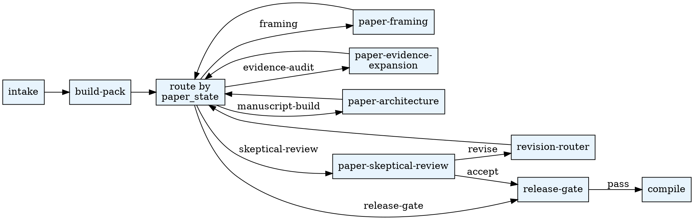

# Paper Orchestrator

Drive the paper-development state machine. The kernel under
`<workspace>/paper/state/paper_state.yaml` records the current phase; you
read it, pick the next action, dispatch a fresh Task subagent against
the appropriate sub-skill, persist what comes back via the python CLI,
then loop until release-gate is met.

This skill **never** writes manuscript prose itself. Producer prose
comes from `agentsociety-paper-framing` / `-evidence-expansion` /
`-architecture` subagents; reviewer verdicts come from
`agentsociety-paper-skeptical-review`. The orchestrator only
coordinates and persists.

## When to Use

- User asks for a paper draft, revision pass, or compiled PDF
- A research workspace already has at least one hypothesis with
  analysis output (`presentation/hypothesis_*/report*.md`)
- A previous paper run is in progress and the user wants to continue it

**Do NOT use when:**

- The workspace has no analysis output yet (run `analysis` first)
- The user only wants a non-academic summary (no Nature template needed)

## Quick Reference

Use the workspace's interpreter from `.env`. See `CLAUDE.md` for setup.

| Action | Command |
|--------|---------|
| Initialize identity | `$PYTHON_PATH .agentsociety/bin/ags.py paper-orchestrator init-meta --workspace . --payload '{...}'` |
| Initialize state | `$PYTHON_PATH .agentsociety/bin/ags.py paper-orchestrator intake --workspace .` |
| Build research pack | `$PYTHON_PATH .agentsociety/bin/ags.py paper-orchestrator build-pack --workspace .` |
| Persist storyline | `$PYTHON_PATH .agentsociety/bin/ags.py paper-orchestrator framing --workspace . --payload <json>` |
| Persist evidence | `$PYTHON_PATH .agentsociety/bin/ags.py paper-orchestrator evidence --workspace . --payload <json>` |
| Persist claim ledger | `$PYTHON_PATH .agentsociety/bin/ags.py paper-orchestrator architecture --workspace . --artifact claim_ledger --payload <json>` |
| Persist figure map | `$PYTHON_PATH .agentsociety/bin/ags.py paper-orchestrator architecture --workspace . --artifact figure_argument_map --payload <json>` |
| Append review | `$PYTHON_PATH .agentsociety/bin/ags.py paper-orchestrator review --workspace . --payload <json> --round N` |
| Compile PDF | `$PYTHON_PATH .agentsociety/bin/ags.py paper-orchestrator compile --workspace .` |
| One-shot smoke | `$PYTHON_PATH .agentsociety/bin/ags.py paper-orchestrator run-loop --workspace . --max-rounds 0` |
| Read state | `$PYTHON_PATH .agentsociety/bin/ags.py paper-orchestrator status --workspace .` |

Aliases: `paper`, `generate-paper`, `generate_paper`, `paper_orchestrator` all route here.

## Workflow

State machine reference: `references/phase_diagram.md`.
Persistence layout reference: `references/state_schema.md`.
Envelope contract reference: `references/envelope_schema.md`.

## Subagent Delegation

The orchestrator dispatches **fresh** Task subagents for every artifact;
each subagent reads its skill's prompt files to stay tightly scoped.

| Phase | Sub-skill | Subagents |
|-------|-----------|-----------|
| framing | `agentsociety-paper-framing` | producer / angle-critic / contribution-auditor |
| evidence-audit + expansion-plan | `agentsociety-paper-evidence-expansion` | producer / evidence-skeptic / alternative-explanation-reviewer |
| manuscript-build | `agentsociety-paper-architecture` | producer / figure-logic-reviewer |
| skeptical-review | `agentsociety-paper-skeptical-review` | significance-calibrator / precision-editor / evidence-skeptic |
| revision-router | this skill | `subagent-prompts/revision-router.md` |
| release-gate | this skill | `subagent-prompts/release-gate-judge.md` |

Orchestrator-internal subagents (revision-router, release-gate-judge) get
read-only access to `paper_state.yaml`, current artifacts, and the
latest review round. They return a routing decision or release verdict
in the standard envelope shape.

## Cap Enforcement (Phase 4)

`paper_state.yaml#counters` tracks `figure_regenerations` and
`citation_augmentations` per round. The orchestrator may dispatch back
into:

- `agentsociety-analysis` to regenerate figures (cap: 2 / round)
- `agentsociety-literature-search` to augment refs (cap: 2 / round)

When these dispatches are planned, the paper loop pauses in
`expansion-plan` or reroutes through `evidence-audit` /
`manuscript-build` after review. External results must be folded back
into `research_pack.json` via `build-pack` before the next paper stage
continues.

When the same `target_artifact + issue_type` recurs across rounds, open
a human gate via `human_gates.yaml` instead of dispatching again.

## Pipeline Position

**Predecessors:** `agentsociety-analysis` (must produce
`presentation/hypothesis_*/report*.md` + `analysis_summary.json`)
**Successors:** none in the research-pipeline tree; produces the final
`<workspace>/paper/runs/<TS>/compose/out/paper.pdf`
**Required Sub-Skills:** `agentsociety-paper-adapter`,
`agentsociety-paper-framing`, `agentsociety-paper-evidence-expansion`,
`agentsociety-paper-architecture`, `agentsociety-paper-skeptical-review`

## Common Mistakes

| Mistake | Fix |
|---------|-----|
| Writing manuscript prose directly inside this skill | Delegate to `agentsociety-paper-architecture` producer subagent; the orchestrator only persists what the subagent returns |
| Emitting `\cite{key}` in producer markdown | Use `[CITE:key]` always; `md_to_tex` rewrites to `\supercite{key}` (cite vs biblatex conflict in `wlscirep.cls`) |
| Skipping the research pack | `build-pack` must run before any framing/architecture work; producer prompts read it for grounding |
| Forcing forward phase advances out of order | The CLI's `advance_phase` rejects backward jumps; reset only via explicit `reset_phase` (not exposed in CLI) - if you need a backward jump, escalate to a human gate |
| Treating `run-loop --max-rounds 0` as production | That's the smoke / draft-only path; real release-gating needs the Phase 4 review loop |
