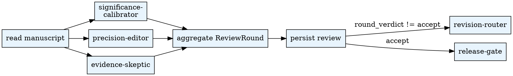

# Paper Skeptical Review

Run a rigorous, multi-perspective review round on the drafted manuscript.
Each review round dispatches three specialist reviewers who challenge the
manuscript from different angles: significance calibration, language
precision, and evidence discipline.

## When to Use

- `paper_state.current_phase = skeptical-review`
- Manuscript markdown exists under `<ws>/paper/artifacts/manuscript/`
- At least `abstract.md`, `main.md`, and one results section exist

**Do NOT use when:**

- No manuscript blocks have been drafted (run architecture/draft_section first)
- The phase is `revision-router` (review is complete; routing is next)

## Quick Reference

| Action | CLI |
|--------|-----|
| Persist review round | `$PYTHON_PATH .agentsociety/bin/ags.py paper-orchestrator review --workspace <ws> --payload '<ReviewRound JSON>' --round <N>` |

Aliases: `paper-skeptical-review`, `paper_skeptical_review`.

## Workflow



## Subagent Delegation

| Role | Prompt file | Writes? |
|------|-------------|---------|
| significance-calibrator | `subagent-prompts/significance-calibrator.md` | No — read-only reviewer |
| precision-editor | `subagent-prompts/precision-editor.md` | No — read-only reviewer |
| evidence-skeptic | `subagent-prompts/evidence-skeptic.md` | No — read-only reviewer |

## Pipeline Position

- **Predecessors:** `agentsociety-paper-architecture` (manuscript blocks drafted)
- **Successors:** `revision-router` (orchestrator-internal) or `release-gate`

## Review Round Structure

Each review round produces a `ReviewRound` with:

```yaml
round_num: 1
started_at: "2026-05-07T10:00:00Z"
completed_at: "2026-05-07T10:30:00Z"
reviews:
  - reviewer_profile: significance-calibrator
    verdict: accept
    issues: []
  - reviewer_profile: precision-editor
    verdict: revise_local
    issues: [...]
  - reviewer_profile: evidence-skeptic
    verdict: accept
    issues: []
unresolved_fatal: []
unresolved_major: [...]
round_verdict: revise
```

## Common Mistakes

1. **Running review on incomplete manuscript** — all planned blocks must
   exist before starting a round.
2. **Aggregating before all reviewers complete** — dispatch all three
   before aggregating.
3. **Treating minor issues as blocking** — minor issues are logged but
   do not block the round.
4. **Skipping the release_blockers checklist** — after the round
   accepts, check `checklists/release_blockers.md` before advancing to
   release-gate.
5. **More than 3 rounds without human gate** — if 3 consecutive rounds
   produce non-accept verdicts, open a human_gate.
