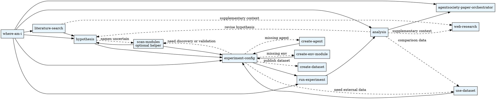

# Research Pipeline

Orchestrates the AgentSociety research workflow. Determines which skill to invoke based on the current workspace state and user intent.

## Overview

The research pipeline is a directed workflow: **literature search → hypothesis → experiment config → run → analysis → paper**. Supporting skills (scan-modules, create-agent, create-env-module, web-research, datasets) branch off the main trunk at specific points.

## Scale Planning Gate

Before entering `experiment-config`, `create-agent`, or `create-env-module`, confirm the simulation scale budget:

- target agent count or range
- expected step budget
- acceptable runtime or compute budget
- preferred complexity tier, such as lean, balanced, or rich

If any of these are missing, ask one round of clarifying questions first. Present 2-3 approaches with trade-offs and a recommendation, then route into the appropriate skill once the budget is fixed.

## Dataset Gate

If the task may depend on external data, treat dataset access as a first-class branch rather than an afterthought.

- Use `agentsociety-use-dataset` to search, inspect, and download datasets from the platform.
- If no suitable dataset exists locally or remotely, surface that gap before continuing with experiment design.
- Use `agentsociety-create-dataset` when the work needs packaging, validation, upload, or publishing of a dataset.
- If local files should be shared or reused, guide the user through dataset upload rather than folding the files into experiment config by hand.

## Quick Reference

At the beginning of a new session or resumption, run:

```bash
$PYTHON_PATH .agentsociety/bin/ags.py research-pipeline where-am-i --json
```

This reads `.agentsociety/progress.json` to determine the current stage. If the file does not exist, fall back to file-existence detection and then bootstrap tracking with `init`.

## Git Checkpoint Discipline

Every pipeline transition must be persisted with an explicit git commit. Hook-based auto-commit approaches are unreliable — always commit manually.

### Workspace Initialization

When bootstrapping a new workspace with `research-pipeline init`:

```bash
# 1. Init the workspace directory if not already a git repo
git init
# 2. Create progress tracking
$PYTHON_PATH .agentsociety/bin/ags.py research-pipeline init --topic "TOPIC"
# 3. Initial commit
git add -A && git commit -m "init: bootstrap research pipeline"
```

### Stage Transitions

After **every** call to `research-pipeline update-stage`, commit the current iteration's changes:

```bash
$PYTHON_PATH .agentsociety/bin/ags.py research-pipeline update-stage STAGE STATUS
git add -A && git commit -m "pipeline: STAGE → STATUS"
```

For example:

```bash
$PYTHON_PATH .agentsociety/bin/ags.py research-pipeline update-stage literature_search completed
git add -A && git commit -m "pipeline: literature_search → completed"
```

### Rules

- If `git` is not initialized in the workspace, run `git init` first.
- Commit messages follow the pattern: `pipeline: STAGE → STATUS`.
- Use `git add -A` to capture all changes produced by the current stage.
- Do **not** rely on git hooks (pre-commit, post-commit, etc.) for this — they are unreliable in this context. Commit explicitly.

## Entry Conditions

Use `where-am-i --json` whenever the current stage is unclear.

- If `.agentsociety/progress.json` exists, trust `current_stage` as the primary routing signal.
- If the file is missing, infer the stage from workspace artifacts, then initialize progress tracking.
- If the current stage already has a failed status, route to the owning skill for repair rather than restarting the pipeline.
- If the work depends on simulation size or runtime budget and those values are missing, resolve the scale planning gate before routing onward.

| `current_stage` | Route to Skill |
|-----------------|----------------|
| `literature_search` | literature-search |
| `hypothesis` | hypothesis |
| `experiment_config` | experiment-config |
| `run_experiment` | run-experiment |
| `analysis` | analysis |
| `generate_paper` | agentsociety-paper-orchestrator |

### Progress File Quick Reference

| Command | Purpose |
|---------|---------|
| `$PYTHON_PATH .agentsociety/bin/ags.py research-pipeline init --topic "TEXT"` | Bootstrap `progress.json` (also `git init` + initial commit if needed) |
| `$PYTHON_PATH .agentsociety/bin/ags.py research-pipeline status` | Show progress summary |
| `$PYTHON_PATH .agentsociety/bin/ags.py research-pipeline where-am-i --json` | Get current stage as JSON |
| `$PYTHON_PATH .agentsociety/bin/ags.py research-pipeline update-stage STAGE STATUS` | Update stage status (then `git add -A && git commit`) |
| `$PYTHON_PATH .agentsociety/bin/ags.py research-pipeline set-verification STAGE STATUS` | Update stage verification status |
| `$PYTHON_PATH .agentsociety/bin/ags.py research-pipeline next-action --json` | Get the recommended next action |

## Workflow



## Pipeline Map

| # | Skill | Produces | Consumes |
|---|-------|----------|----------|
| 1 | **literature-search** | `papers/`, `papers/literature_index.json` | `TOPIC.md` |
| 2 | **hypothesis** | `hypothesis_{id}/HYPOTHESIS.md`, `SIM_SETTINGS.json` | literature index |
| 3 | **experiment-config** | `init_config.json`, `steps.yaml`, `config_params.py` | `SIM_SETTINGS.json` |
| 4 | **run-experiment** | `run/replay/_schema.json`, sharded replay JSONL, `run/output.log`, `run/artifacts/` | `init_config.json` + `steps.yaml` |
| 5 | **analysis** | `presentation/hypothesis_{id}/report.md`, charts, data | `run/replay/` |
| 6 | **agentsociety-paper-orchestrator** | `<ws>/paper/runs/<TS>/compose/out/paper.pdf` | analysis report + literature index |

### Branch Skills (called from trunk)

| Branch Skill | Called By | When |
|-------------|-----------|------|
| **scan-modules** | hypothesis, experiment-config | When module names are unknown or need validation |
| **create-agent** | experiment-config | When needed agent class doesn't exist |
| **create-env-module** | experiment-config | When needed env module doesn't exist |
| **web-research** | literature-search, hypothesis, analysis | When supplementary non-academic context needed |
| **create-dataset** | experiment-config | When packaging data for upload or publishing |
| **use-dataset** | literature-search, hypothesis, experiment-config, analysis | When searching, downloading, or inspecting datasets |

## Skill Index

| Skill | Trigger Keywords |
|-------|-----------------|
| literature-search | "literature", "papers", "related work", "background research" |
| hypothesis | "hypothesis", "research question", "control", "treatment", "experiment groups" |
| experiment-config | "configure experiment", "init_config", "steps.yaml", "set up experiment" |
| run-experiment | "run experiment", "start simulation", "check status", "stop experiment" |
| analysis | "analyze", "results", "visualization", "chart", "report" |
| agentsociety-paper-orchestrator | "write paper", "academic paper", "generate paper", "Nature paper" |
| scan-modules | "available modules", "list agents", "find environment" |
| create-agent | "create agent", "custom agent", "new agent type" |
| create-env-module | "create environment", "custom module", "env module" |
| web-research | "web search", "current events", "recent developments" |
| create-dataset | "create dataset", "upload dataset", "publish data" |
| use-dataset | "download dataset", "find data", "browse datasets", "search datasets", "dataset search" |

## Iterative Cycles

- **Analysis → Hypothesis**: results may refine or revise the hypothesis
- **Experiment-config → Create-agent/Create-env-module**: missing modules trigger creation
- **Experiment-config → Scan-modules**: names can be confirmed when discovery is needed
- **Run → Config**: failed validation or execution loops back to config fixes

## Persistence Files

| File | Git | Purpose |
|------|-----|---------|
| `.agentsociety/progress.json` | Committable | Stage tracker with status, timestamps, attempt counts |

## Hard Constraints

- Never run analysis before `run-experiment` produces `run/replay/_schema.json`
- Always run `experiment-config check` before `run-experiment`
- `agentsociety-paper-orchestrator` requires analysis reports to exist
- Always call `research-pipeline update-stage` after completing a pipeline stage
- Always git commit after `research-pipeline update-stage` — see **Git Checkpoint Discipline**
- On workspace init, run `git init` (if needed) followed by an initial commit
- Do not rely on git hooks for auto-commit; commit explicitly after every stage transition
