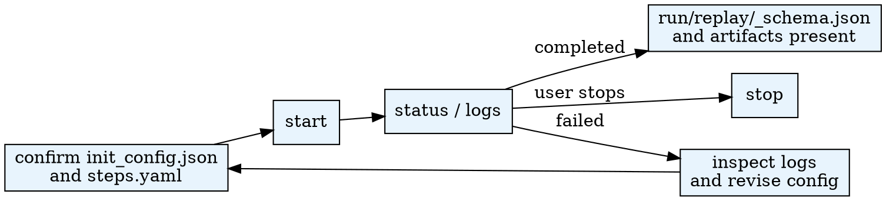

# Run Experiment

Manage experiment execution using the AgentSociety2 CLI: start, monitor, and stop simulation runs.

## When to Use

- `init_config.json` and `steps.yaml` exist and the user wants to start a simulation
- User wants to check experiment status or view logs
- User wants to stop a running experiment

**Do NOT use when:**
- Configuration files do not exist yet (use **experiment-config** skill)
- User wants to analyze results (use **analysis** skill)

## Quick Reference

Run commands from the workspace root through `.agentsociety/bin/ags.py`.

| Action | Command |
|--------|---------|
| Start | `$PYTHON_PATH .agentsociety/bin/ags.py run-experiment start --hypothesis-id ID --experiment-id ID` |
| Status | `$PYTHON_PATH .agentsociety/bin/ags.py run-experiment status --hypothesis-id ID --experiment-id ID` |
| Stop | `$PYTHON_PATH .agentsociety/bin/ags.py run-experiment stop --hypothesis-id ID --experiment-id ID` |
| List | `$PYTHON_PATH .agentsociety/bin/ags.py run-experiment list` |

Use the Python interpreter from `.env`. See `CLAUDE.md` for setup.

## Workflow



## CLI Arguments (`.agentsociety/bin/ags.py run-experiment ...`)

| Argument | Required | Default | Description |
|----------|----------|---------|-------------|
| `action` | Yes | - | `start`, `stop`, `status`, `list` |
| `--hypothesis-id` | Yes (except list) | - | Hypothesis ID |
| `--experiment-id` | Yes (except list) | - | Experiment ID |
| `--workspace` | No | `.` | Workspace root path |
| `--foreground` | No | `false` | Block the current terminal instead of the default background execution |
| `--init-config` | No | `init/init_config.json` | Override config path |
| `--steps` | No | `init/steps.yaml` | Override steps path |
| `--run-id` | No | `run` | Run directory name |
| `--json` | No | `false` | JSON output (status, list) |

## Start Experiment

```bash
$PYTHON_PATH .agentsociety/bin/ags.py run-experiment start --hypothesis-id 1 --experiment-id 1
```

The script auto-resolves paths from `hypothesis_{id}/experiment_{id}/` structure.
By default, `start` launches the experiment in the background, writes logs to `run/stdout.log` and `run/stderr.log`, and keeps `run/pid.json` after completion so the extension can show final status.

### Foreground Mode

Use `--foreground` only when you explicitly want to block the current terminal session:

```bash
$PYTHON_PATH .agentsociety/bin/ags.py run-experiment start --hypothesis-id 1 --experiment-id 1 --foreground
```

### Advanced: Direct CLI

For cases requiring full control (custom log file, manual background execution):

```bash
$PYTHON_PATH -m agentsociety2.society.cli \
    --config hypothesis_1/experiment_1/init/init_config.json \
    --steps hypothesis_1/experiment_1/init/steps.yaml \
    --run-dir hypothesis_1/experiment_1/run \
    --experiment-id "1_1" \
    --log-file hypothesis_1/experiment_1/run/stdout.log &
```

## Common Mistakes

| Mistake | Fix |
|---------|-----|
| Running direct CLI in background without `--log-file` | Always add `--log-file PATH` when using `&` |
| Wrong Python interpreter | Use `PYTHON_PATH` from `.env` |
| Missing `AGENTSOCIETY_LLM_API_KEY` | Set required env vars in `.env` (see CLAUDE.md) |
| Editing config after `run` started | Stop experiment first, edit, then restart |
| Killing with `kill -9` | Use `kill -TERM` for graceful shutdown |

## Pipeline Position

**Predecessors:** experiment-config (completed `check` action)
**Successors:** analysis
**Required Sub-Skills:** None

## Output Files

| File | Description |
|------|-------------|
| `run/replay/` | Replay dataset directory (`_schema.json` + sharded JSONL files) |
| `run/stdout.log` | Standard output |
| `run/stderr.log` | Standard error |
| `run/pid.json` | Process ID and final status (auto-created, retained after completion) |
| `run/artifacts/` | Step execution artifacts |

## Monitoring

```bash
# Check status (recommended)
$PYTHON .agentsociety/bin/ags.py run-experiment status --hypothesis-id 1 --experiment-id 1

# Follow logs in real time
tail -f hypothesis_1/experiment_1/run/stdout.log

# Stop a running experiment (recommended)
$PYTHON .agentsociety/bin/ags.py run-experiment stop --hypothesis-id 1 --experiment-id 1
```

## Troubleshooting

### Environment Validation

The CLI validates required environment variables before execution. Missing variables cause early exit with clear error messages.

### Connection Errors

`litellm.InternalServerError: Connection error` -- verify API endpoint is reachable, API key is valid, and model name is correct.

## Hard Constraints

- **Default `start` mode is background execution with persisted logs and `pid.json`.**
- **When using the direct CLI in background, `--log-file` is NOT optional.** Without it, verbose logs are lost and there is no way to diagnose failures.
- Environment variables (`AGENTSOCIETY_LLM_API_KEY`, `AGENTSOCIETY_LLM_API_BASE`, `AGENTSOCIETY_LLM_MODEL`) must be set. See `CLAUDE.md` for full configuration reference.

## Programmatic API

See [`references/programmatic-api.md`](references/programmatic-api.md) for the async Python API for starting, stopping, and querying experiments programmatically.

## Progress Tracking

After starting an experiment:
```bash
$PYTHON .agentsociety/bin/ags.py research-pipeline update-stage run_experiment in_progress
```

After experiment completes (`run/replay/_schema.json` exists):
```bash
$PYTHON .agentsociety/bin/ags.py research-pipeline update-stage run_experiment completed
```

If the experiment fails:
```bash
$PYTHON .agentsociety/bin/ags.py research-pipeline update-stage run_experiment failed --error "error message"
```
