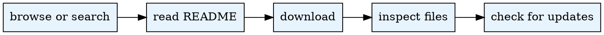

# Use Dataset

## Overview
Search, download, and inspect datasets from the AgentSociety platform. All operations use the public API -- no authentication required. **Always read the README before operating on dataset contents** to avoid misinterpretation of column types, units, and semantics.

Use the Python interpreter from `.env`. See `CLAUDE.md` for setup.

## When to Use
- User needs external datasets for experiments or analysis
- Searching for survey data, agent profiles, or simulation results
- User says "download dataset", "find data", "browse datasets", or "search datasets"

**Do NOT use when:**
- User wants to *create* or *upload* a dataset (use `agentsociety-create-dataset`)
- User needs to design experiments from scratch (use `experiment-config`)

## Quick Reference

| Command | Auth | Description |
|---------|:----:|-------------|
| `list` | No | List datasets (local default, `--all` merged, `--remote` remote only) |
| `list-installed` | No | Alias for `list` (backward compat) |
| `search` | No | Search with `--category`, `--tags`, `--limit`, `--skip` filters |
| `info <id>` | No | Show metadata (local + remote merged, warns if outdated) |
| `readme <id>` | No | Display dataset README |
| `files <id>` | No | List dataset file tree |
| `download <id>` | No | Download and extract to `datasets/<id>/` |
| `cat <id> <path>` | No | Read file content from local dataset |

Run commands from the workspace root through `.agentsociety/bin/ags.py`.

## Workflow

For listing examples and status value details, see `references/listing-guide.md`.
For the downloaded metadata.json schema, see `references/metadata-format.md`.

## Common Mistakes

| Mistake | Fix |
|---------|-----|
| Skipping README before using dataset contents | Always run `readme <id>` first to understand format, columns, units |
| Not checking for updates (using outdated version) | Run `list --all` or `info <id>` to compare local vs remote versions |
| Downloading without reading README first | README describes semantics; downloading without context wastes time |
| Confusing local-only and remote datasets | Use `list --all` for merged view; status column shows source |

## Pipeline Position
**Predecessors:** `create-dataset` (for locally created datasets), otherwise none (standalone)
**Successors:** `experiment-config` (for experiment setup), `analysis` (for data analysis)
