AI Social Scientist 使用指南
================================

**AI Social Scientist** 是 AgentSociety 2 的交互式研究助手，以 VSCode 扩展的形式提供可视化配置、后端管理和研究编排能力。它支持两种使用方式：

- **在线工作空间**：通过网页平台直接使用，无需本地安装，适合快速上手。
- **本地开发**：在本地安装扩展和依赖，适合需要自定义环境的高级用户。

.. _online-workspace:

在线工作空间
------------

我们推荐使用在线平台进行实验，平台已预装 agentsociety2 库、AI Social Scientist 插件和 Claude Code CLI。

平台地址：https://agentsociety2.fiblab.net/

注册与登录
~~~~~~~~~~

1. 打开平台主页，点击"登录"。

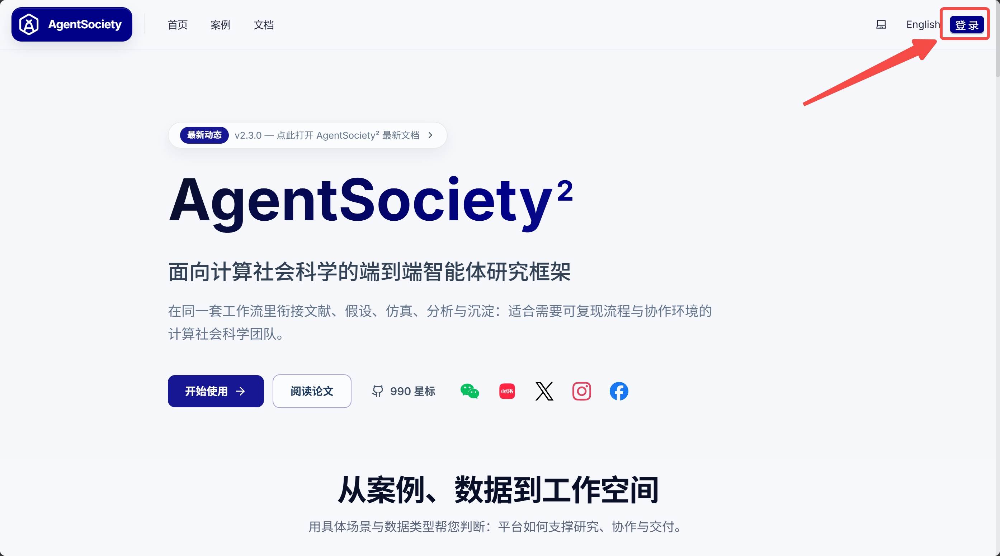

2. 如果没有账号，点击"注册"完成注册流程。已有 FIBLAB 账号的用户可直接登录。

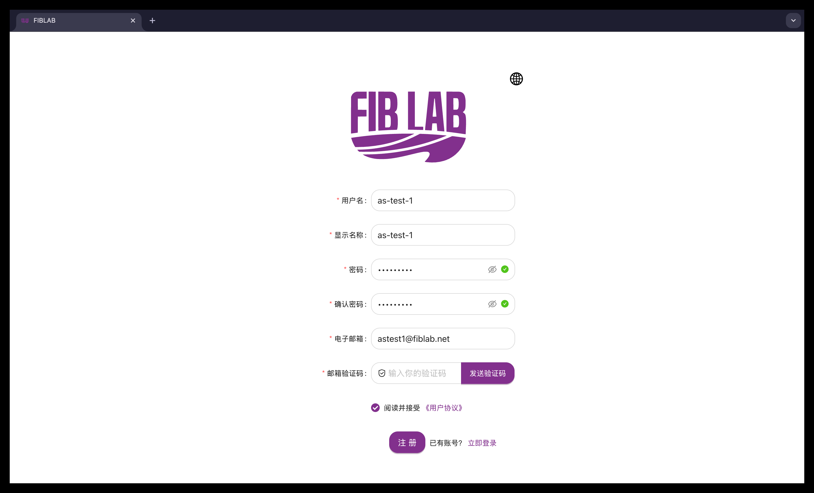

.. note::

   登录成功后，您可能需要联系平台管理员审批账号权限，审批通过后刷新页面即可。

创建工作空间
~~~~~~~~~~~~

1. 进入工作区管理页面，点击"创建工作空间"，输入名称后确认。

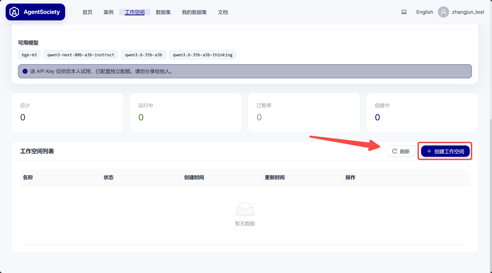

2. 等待工作空间状态从"创建中"变为"运行中"。

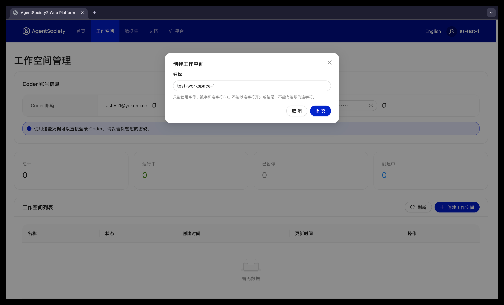

3. 点击工作空间可查看 **Coder 账号密码**、 **免费 LLM API 端点**和 **API Key** 等信息，请妥善保存。

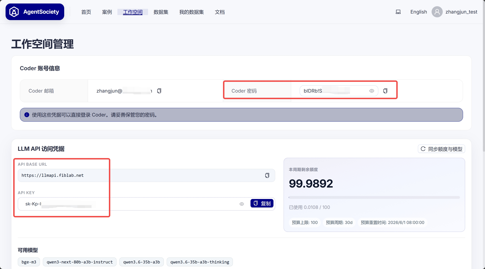

4. 复制页面上方的 Coder 账号信息，点击"打开"进入开发环境。

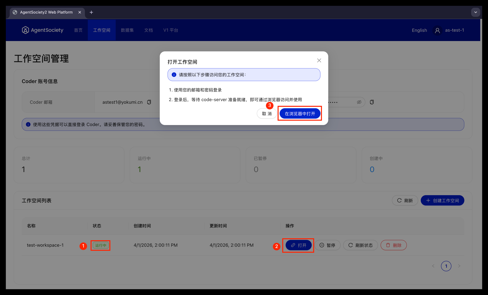

5. 在 Coder 页面中选择 **code-server** （推荐）或 **VS Code Desktop** 打开开发环境。

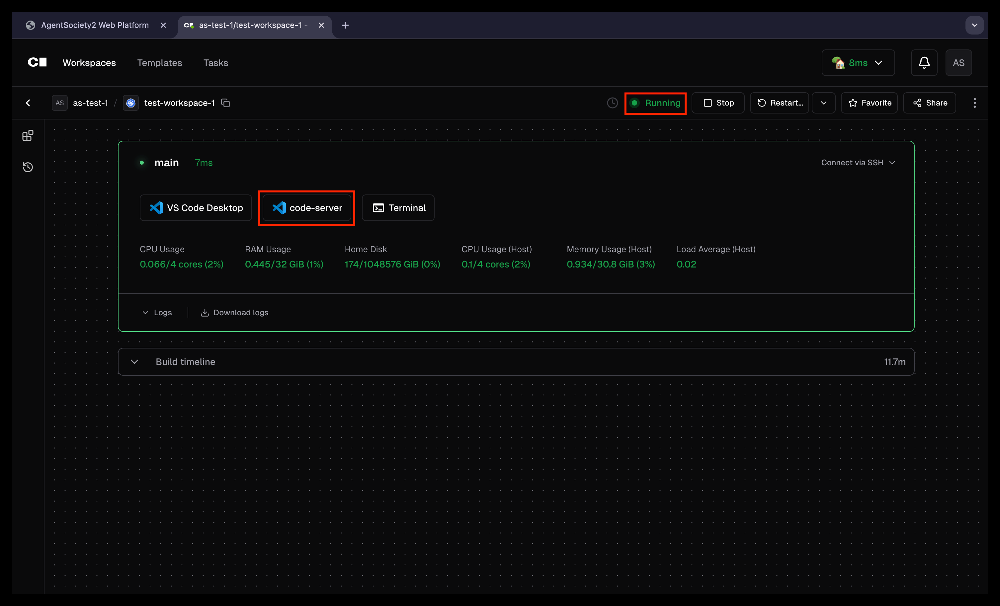

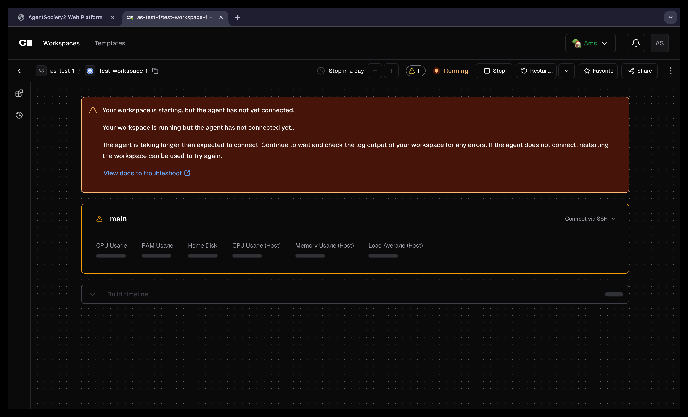

.. _local-setup:

本地环境安装
------------

前置条件
~~~~~~~~

- **操作系统**：macOS 或 Linux（Windows 用户建议使用 WSL）
- **Python**：3.11 或更高版本，推荐使用 `uv <https://docs.astral.sh/uv/>`_ 管理

.. code-block:: bash

   # 安装 uv（macOS/Linux）
   curl -LsSf https://astral.sh/uv/install.sh | sh

安装 agentsociety2
~~~~~~~~~~~~~~~~~~

.. code-block:: bash

   # 使用 uv
   uv venv && source .venv/bin/activate
   uv pip install agentsociety2

   # 或使用 pip
   pip install agentsociety2

.. important::

   请确保安装的是最新版本。查看当前最新版本：https://pypi.org/project/agentsociety2/

安装 AI Social Scientist 插件
~~~~~~~~~~~~~~~~~~~~~~~~~~~~~~~~

1. 从 `Release <https://github.com/tsinghua-fib-lab/AgentSociety/releases>`_ 下载最新版本的 VSIX 文件。
2. 在 VSCode 中按 ``Cmd/Ctrl + Shift + P``，输入 ``Extensions: Install from VSIX...``。
3. 选择下载的 VSIX 文件完成安装。

配置 Coding Agent
~~~~~~~~~~~~~~~~~

插件初始化工作区时会自动同步 AI Social Scientist 的技能到 ``.claude/skills/`` 目录下。您也可以点击侧边栏的"同步 AI 助手资源"手动同步。

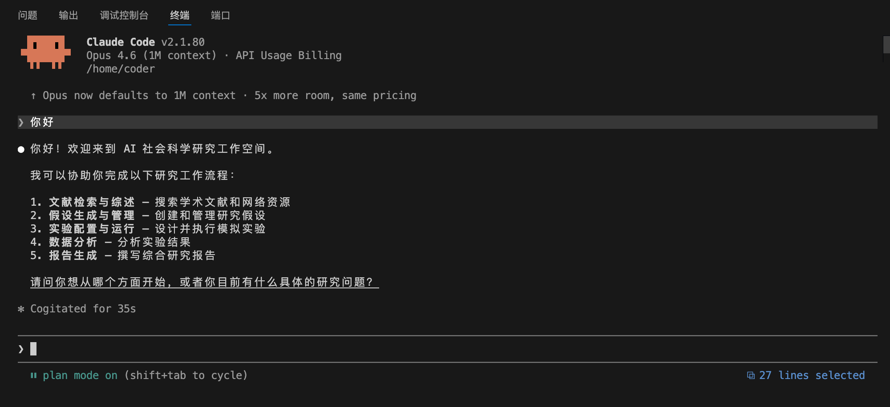

Claude Code（推荐）：

.. code-block:: bash

   npm install -g @anthropic-ai/claude-code

配置第三方中转服务时，创建 ``~/.claude/settings.json``：

.. code-block:: json

   {
     "env": {
       "ANTHROPIC_AUTH_TOKEN": "YOUR_API_KEY",
       "ANTHROPIC_BASE_URL": "YOUR_BASE_URL",
       "ANTHROPIC_MODEL": "claude-sonnet-4-6"
     }
   }

也可以安装 Claude Code 的 VSCode 插件，点击扩展侧边栏的"AI 对话"后会直接弹出 Claude Code 对话页面：

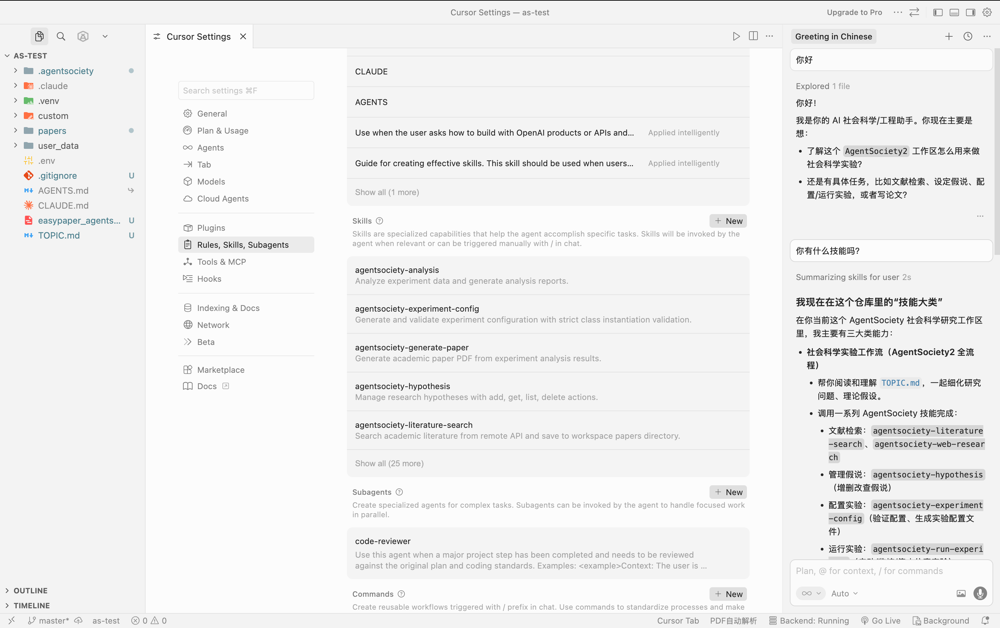

.. note::

   同步到 ``.claude/skills/`` 的技能可被 Claude Code 和 Cursor 自动识别。插件也会自动为 CodeX 创建符号链接（``.codex``），无需手动操作。

.. _env-config:

环境配置
--------

新建工作区
~~~~~~~~~~

在线工作空间中，在左侧文件树新建一个文件夹作为工作区（如 ``demo``），然后通过 ``File → Open Folder`` 打开。

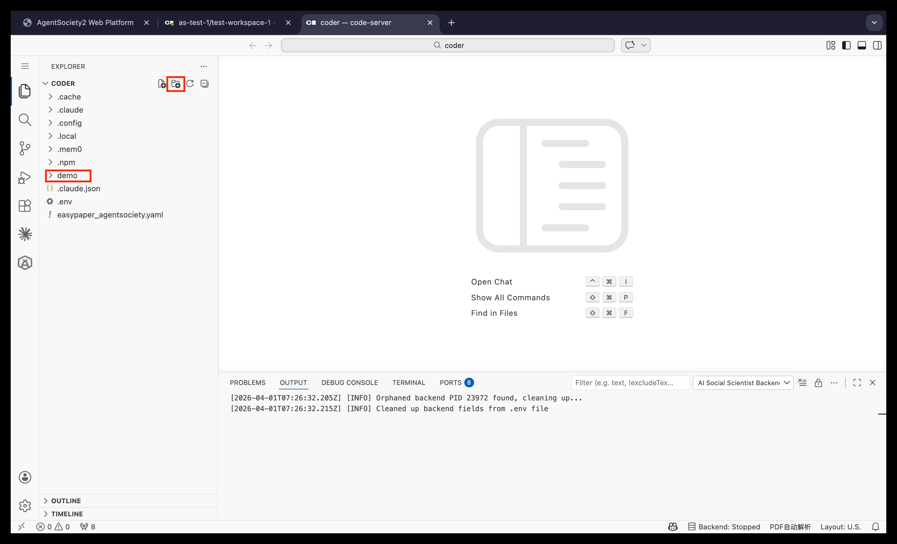

配置向导
~~~~~~~~

初次进入工作区时会弹出配置向导，包含以下步骤：

**步骤 1：LLM 配置** — 填写大模型 API 信息：

.. list-table::
   :widths: 25 50 25
   :header-rows: 1

   * - 参数
     - 说明
     - 是否必填
   * - LLM API 密钥
     - 大模型服务的 API Key，用于默认对话、分析等核心功能
     - 是
   * - LLM API 基础 URL
     - API 的 base URL，如 ``https://api.openai.com/v1``
     - 是
   * - LLM 模型名称
     - 使用的模型名称，默认 ``gpt-5.5``
     - 是

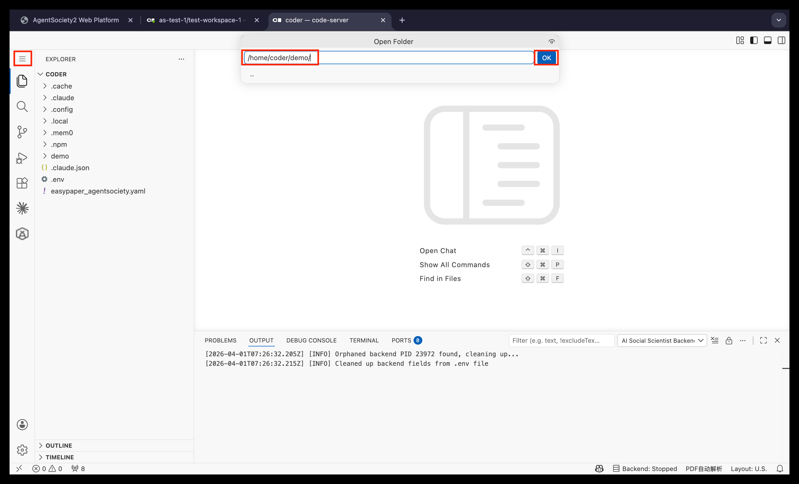

AgentSociety 支持任何 OpenAI 接口兼容的大模型 API。环境变量的详细配置说明见 :doc:`installation`。

**步骤 2：后端服务** — 配置后端服务地址和 Python 环境：

.. list-table::
   :widths: 25 50 25
   :header-rows: 1

   * - 参数
     - 说明
     - 推荐值
   * - Python 路径
     - Python 运行环境路径，留空则自动检测
     - ``which python3`` 查看

**步骤 3：代码生成 LLM（可选）** — 代码生成专用模型，可留空沿用默认 LLM 配置。

**步骤 4：高级功能（可选）** — 为不同功能指定专用模型：

.. list-table::
   :widths: 25 50 25
   :header-rows: 1

   * - 参数
     - 说明
     - 推荐值
   * - 数据分析 LLM
     - 数据分析、洞察生成和报告撰写使用的模型
     - 编程能力较强的模型
   * - 高频操作 LLM
     - 高频快速操作的轻量级模型
     - 响应速度快的模型
   * - Embedding 模型
     - 文本嵌入模型
     - ``text-embedding-3-large``（维度 ``1024``）
   * - 文献检索服务
     - 文献检索 API URL
     - ``http://localhost:8008/api/search``

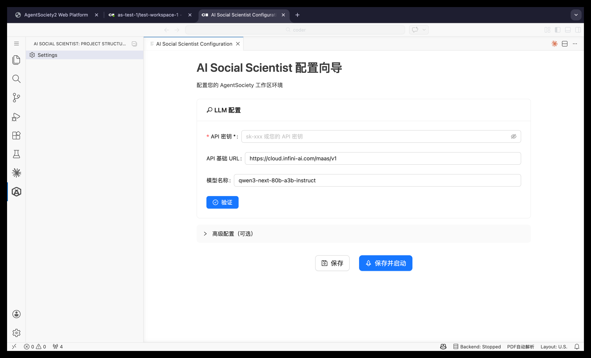

**步骤 5：完成** — 配置保存到工作区的 ``.env`` 文件中。

启动后端
~~~~~~~~

配置完成后点击"保存并启动后端"，系统会自动保存配置并启动后端服务。右下角状态栏显示后端运行状态（含端口号）表示启动成功。

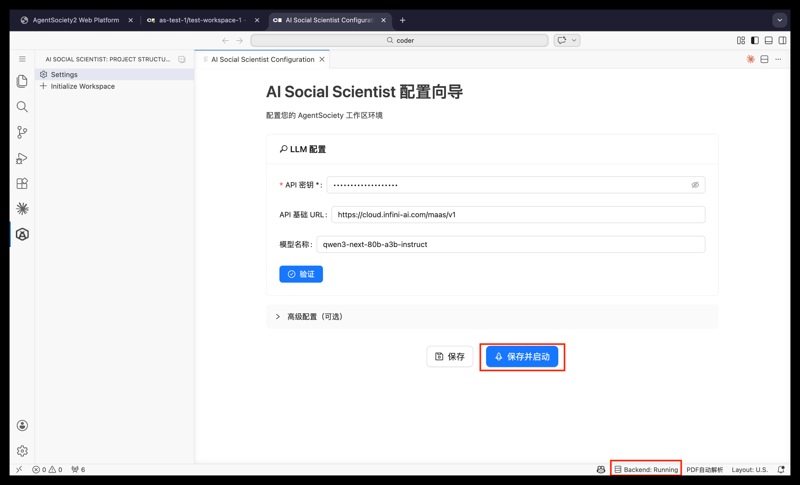

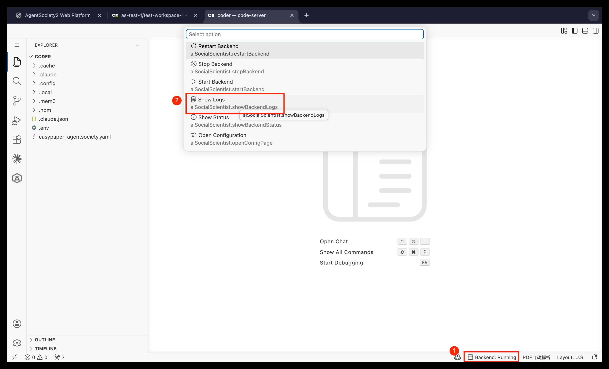

.. _start-research:

开始研究
--------

初始化工作区
~~~~~~~~~~~~~~

后端启动成功后，在插件页面点击"初始化工作区"，输入研究话题（如 "polarization"）并回车。系统会自动创建 ``TOPIC.md`` 和相关目录结构。

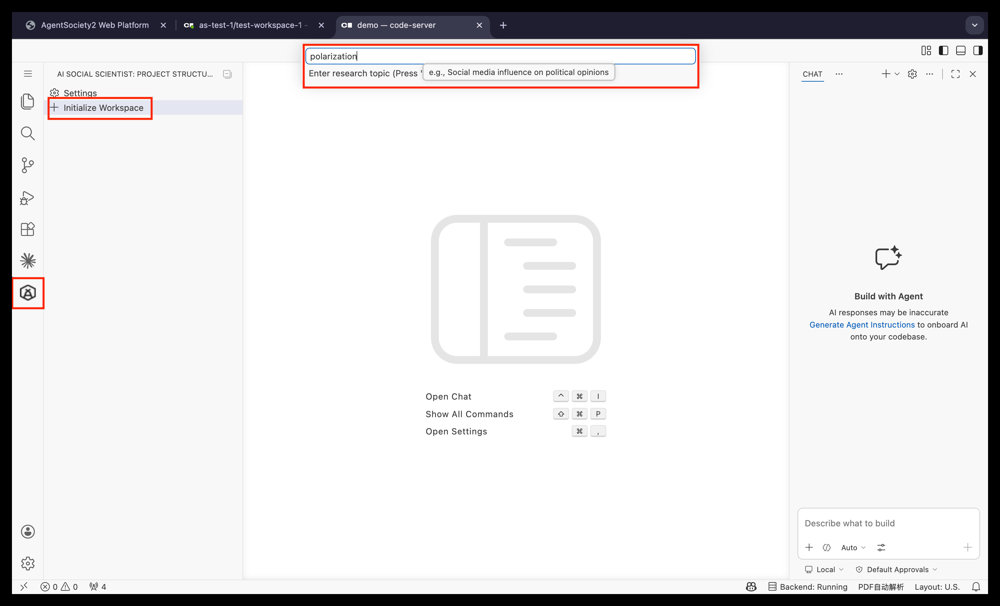

``TOPIC.md`` 是贯穿整个研究流程的核心文档，您可以随时手动编辑来补充研究描述、背景信息和研究方向。

与 Claude Code 协作
~~~~~~~~~~~~~~~~~~~~

点击插件侧边栏的"AI 对话"按钮进入 Claude Code：

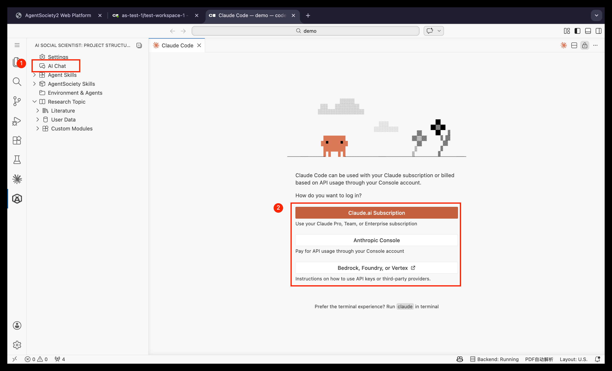

进入对话界面后，用自然语言描述研究需求即可。平台会将研究流程中的关键操作封装为技能（Skill），Claude Code 会自动识别并调用。

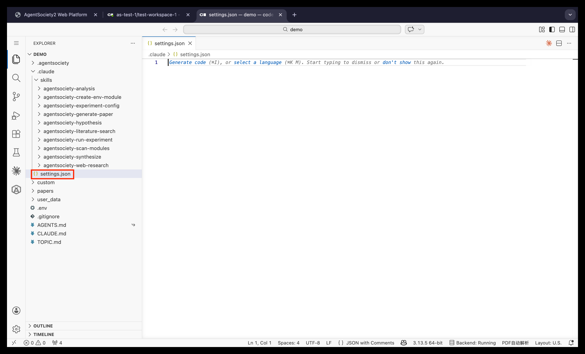

推荐的研究流程
~~~~~~~~~~~~~~

我们推荐按以下顺序进行研究，但每个阶段都可以随时回退或跳过：

.. code-block:: text

   初始化研究话题 → 文献检索 → 假设管理 → 实验配置
        │
        ▼
   运行实验 → 数据分析 → 综合报告 → 论文生成（可选）

各阶段说明见 :doc:`skills`。

工作区目录结构
~~~~~~~~~~~~~~

随着研究推进，工作区会逐步形成以下结构（无需手动创建）：

.. code-block:: text

   工作区/
   ├── TOPIC.md                          # 研究叙事中心文档
   ├── .env                              # 环境配置
   ├── papers/
   │   ├── literature_index.json         # 文献索引
   │   └── literature/                   # 文献摘要
   ├── user_data/                        # 用户数据
   ├── datasets/                         # 数据集
   ├── hypothesis_1/
   │   ├── HYPOTHESIS.md                 # 假设描述
   │   ├── SIM_SETTINGS.json             # 模块配置
   │   ├── experiment_1/                 # 实验 1（对照组）
   │   │   ├── init/
   │   │   │   ├── init_config.json      # 智能体与环境配置
   │   │   │   └── steps.yaml            # 仿真步骤
   │   │   └── run/                      # 运行产出
   │   └── experiment_2/                 # 实验 2（处理组）
   ├── presentation/                     # 分析报告
   │   └── hypothesis_1/
   │       └── experiment_1/
   │           ├── report.md
   │           ├── report.html
   │           └── charts/
   ├── synthesis/                        # 综合报告
   └── custom/                           # 自定义模块
       └── envs/

.. _user-guide-faq:

常见问题
--------

code-server 显示 unhealthy
~~~~~~~~~~~~~~~~~~~~~~~~~~~~

初次创建工作空间时，后端服务可能正在启动中。稍等片刻后刷新页面，等待状态变为绿色的 "Running"。如果持续出现，可以尝试重启工作区。

打开 code-server 后显示 502 错误
~~~~~~~~~~~~~~~~~~~~~~~~~~~~~~~~~~

后端服务未正确启动，请耐心等待后刷新页面。如果问题持续存在，请查看后端日志或联系平台管理员。

本地 Python 环境路径问题
~~~~~~~~~~~~~~~~~~~~~~~~~~

在线平台预装了 Python 环境，本地使用时（尤其是通过 uv 创建的虚拟环境），需要在高级配置中指定正确的 Python 路径：

.. code-block:: bash

   source .venv/bin/activate
   which python3

将输出的路径填入配置向导"后端服务"步骤的 Python 路径字段。

实验运行失败
~~~~~~~~~~~~

常见原因：

- **LLM API 连接失败**：检查 ``.env`` 中的 API 配置是否正确
- **模块实例化失败**：检查 ``init_config.json`` 中的参数是否与模块要求一致
- **内存不足**：减少智能体数量或仿真步数

更多 CLI 使用方法见 :doc:`cli`，研究技能详见 :doc:`skills`。
